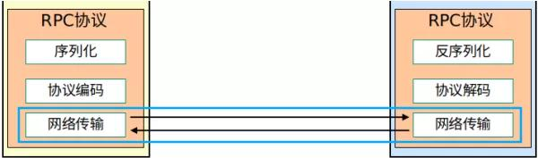
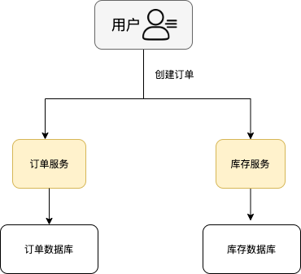
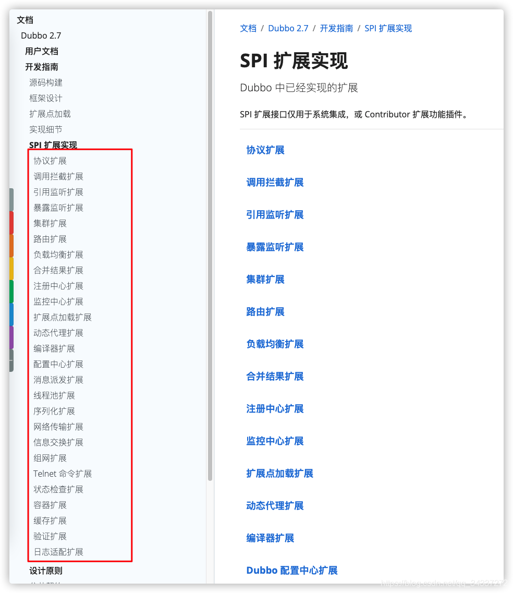
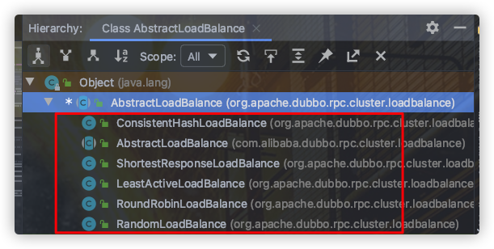
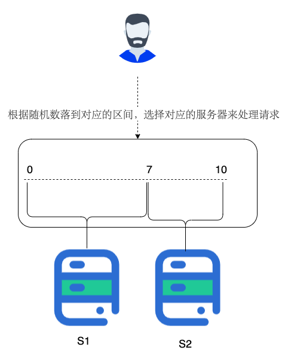
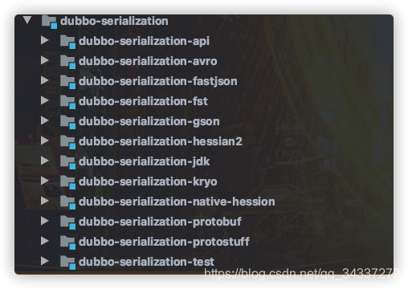
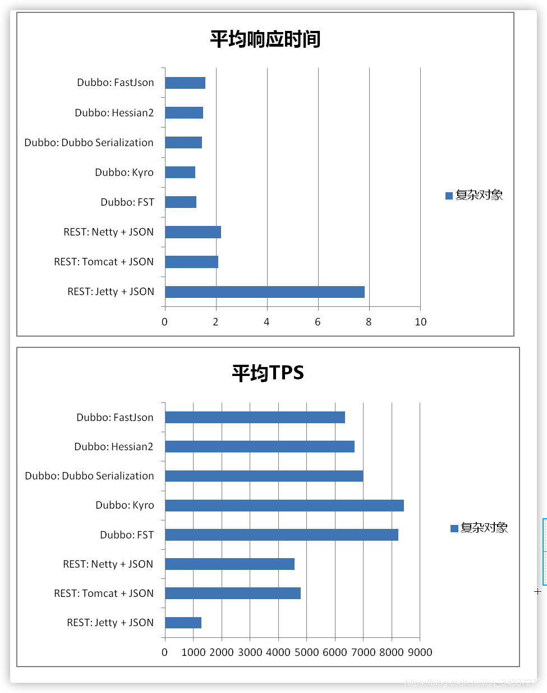

# Dubbo 知识点介绍


## 一、RPC基础

### 1. 何为 RPC?

**RPC（Remote Procedure Call）** 即远程过程调用，通过名字我们就能看出 RPC 关注的是远程调用而非本地调用。

**为什么要 RPC ？**

> 因为，两个不同的服务器上的服务提供的方法**不在一个内存空间**，所以，需要通过==网络编程==才能传递方法调用所需要的==参数==。并且，方法调用的结果也需要通过==网络编程==来接收。但是，如果我们自己手动网络编程来实现这个调用过程的话工作量是非常大的，因为，我们需要考虑**底层传输方式（TCP还是UDP）、序列化方式**等等方面。

**RPC 能帮助我们做什么呢？ **

> 简单来说，通过 RPC 可以帮助我们调用远程计算机上某个服务的方法，这个过程就像调用本地方法一样简单。并且！我们不需要了解底层网络编程的具体细节。
>
> 举个例子：两个不同的服务 A、B 部署在两台不同的机器上，服务 A 如果想要调用服务 B 中的某个方法的话就可以通过 RPC 来做。

一言蔽之：**RPC 的出现就是为了让你调用远程方法像调用本地方法一样简单。让分布式或者微服务系统中不同服务之间的调用像本地调用一样简单。**

### 2. RPC 的原理是什么?

为了能够帮助小伙伴们理解 RPC 原理，我们可以将整个 RPC的 核心功能看作是下面👇 6 个部分实现的：

1. **客户端（服务消费端）** ：调用远程方法的一端。
2. **客户端 Stub（桩）** ： 这其实就是一代理类。代理类主要做的事情很简单，就是把你调用方法、类、方法参数等信息传递到服务端。
3. **网络传输** ： 网络传输就是你要把你调用的方法的信息比如说参数啊这些东西传输到服务端，然后服务端执行完之后再把返回结果通过网络传输给你传输回来。网络传输的实现方式有很多种比如最近基本的 Socket或者性能以及封装更加优秀的 Netty（推荐）。
4. **服务端 Stub（桩）** ：这个桩就不是代理类了。我觉得理解为桩实际不太好，大家注意一下就好。这里的服务端 Stub 实际指的就是接收到客户端执行方法的请求后，去指定对应的方法然后返回结果给客户端的类。
5. **服务端（服务提供端）** ：提供远程方法的一端。

具体原理图如下，后面我会串起来将整个RPC的过程给大家说一下。

[

1. 服务消费端（client）以本地调用的方式调用远程服务；
2. 客户端 Stub（client stub） 接收到调用后负责将方法、参数等组装成能够进行网络传输的消息体**（序列化）**：`RpcRequest`；
3. 客户端 Stub（client stub） 找到远程服务的地址，并将消息发送到服务提供端；
4. 服务端 Stub（桩）收到消息将消息**反序列化**为Java对象: `RpcRequest`；
5. 服务端 Stub（桩）根据`RpcRequest`中的类、方法、方法参数等信息调用本地的方法；
6. 服务端 Stub（桩）得到方法执行结果并将组装成能够进行网络传输的消息体：`RpcResponse`**（序列化）**发送至消费方；
7. 客户端 Stub（client stub）接收到消息并将消息**反序列化**为Java对象: `RpcResponse` ，这样也就得到了最终结果。over!

相信小伙伴们看完上面的讲解之后，已经了解了 RPC 的原理。下面再贴一个网上的时序图，辅助理解：


所以，要实现一个 RPC 框架，只需要把以下三点实现了就基本完成了：

- **Call ID 映射**：可以直接使用函数字符串，也可以使用整数 ID。映射表一般就是一个哈希表。
- **序列化反序列化**：可以自己写，也可以使用 Protobuf 或者 FlatBuffers 之类的。
- **网络传输库**：可以自己写 Socket，或者用 Asio，ZeroMQ，Netty 之类。

详情看：https://blog.csdn.net/weichi7549/article/details/107721623

### 3. 常见的 RPC 框架总结

- **RMI（JDK自带）：** JDK自带的RPC，有很多局限性，不推荐使用。
- **Dubbo:** Dubbo是 阿里巴巴公司开源的一个高性能优秀的服务框架，使得应用可通过高性能的 RPC 实现服务的输出和输入功能，可以和 Spring框架无缝集成。目前 Dubbo 已经成为 Spring Cloud Alibaba 中的官方组件。
- **gRPC** ：gRPC是可以在任何环境中运行的现代开源高性能RPC框架。它可以通过可插拔的支持来有效地连接数据中心内和跨数据中心的服务，以实现负载平衡，跟踪，运行状况检查和身份验证。它也适用于分布式计算的最后一英里，以将设备，移动应用程序和浏览器连接到后端服务。是 Google 公布的开源软件，基于 **HTTP 2.0 协议**，并支持常见的众多编程语言。RPC 框架是基于 HTTP 协议实现的，底层使用到了 **Netty 框架**的支持。
- **Hessian：** Hessian是一个轻量级的remotingonhttp工具，使用简单的方法提供了RMI的功能。 相比WebService，Hessian更简单、快捷。采用的是**二进制RPC协议**，因为采用的是二进制协议，所以它很适合于发送二进制数据。
- **Thrift：** Apache Thrift是Facebook开源的跨语言的RPC通信框架，目前已经捐献给Apache基金会管理，由于其跨语言特性和出色的性能，在很多互联网公司得到应用，有能力的公司甚至会基于thrift研发一套分布式服务框架，增加诸如服务注册、服务发现等功能。

### 4. 既有 HTTP，为啥用 RPC 进行服务调用?

- **RPC 只是一种设计而已**

  > RPC 只是一种概念、一种设计，就是为了解决 **不同服务之间的调用问题**, 它一般会包含有 ==**传输协议**== 和 ==**序列化协议**== 这两个。但是，**HTTP 是一种传输协议**，**RPC 可以把 HTTP 作为一种传输协议**（比如 gRPC 使用 HTTP 2.0 协议传输），本身还会**封装一层 RPC 框架的应用层协议**，不同语言之间调用需要**依赖 RPC 协议**（需要跨语言 RPC 库实现，比如 Thrift）。
  >
  > ==RPC框架可以使用 HTTP协议作为传输协议或者直接使用TCP作为传输协议，使用不同的协议一般也是为了适应不同的场景==。

  > 
  >
  > 在 RPC 中可选的网络传输方式有多种，可以选择 TCP 协议、UDP 协议、HTTP 协议。每一种协议对整体的性能和效率都有不同的影响，如何选择一个正确的网络传输协议呢?首先要搞明白各种传输协议在 RPC 中的工作方式。
  >
  > 1. **基于 TCP 协议的 RPC 调用**
  >
  >    由服务的调用方与服务的提供方建立 Socket 连接，并由服务的调用方通过 Socket 将需要调用的接口名称、方法名称和参数序列化后传递给服务的提供方，服务的提供方反序列化后再利用反射调用相关的方法。最后将结果返回给服务的调用方，整个基于 TCP 协议的 RPC 调用大致如此。
  >
  >    但是在实例应用中则会进行一系列的封装，如 RMI 便是在 TCP 协议上传递可序列化的 Java 对象。
  >
  > 2. **基于 HTTP 协议的 RPC 调用**
  >
  >    该方法更像是**访问网页**一样，只是它的返回结果更加单一简单。
  >
  >    其大致流程为：由服务的调用者向服务的提供者发送请求，这种请求的方式可能是 GET、POST、PUT、DELETE 等中的一种，服务的提供者可能会根据不同的请求方式做出不同的处理，或者某个方法只允许某种请求方式。
  >
  >    而调用的具体方法则是**根据 URL 进行方法调用**，而方法所需要的参数可能是对服务调用方传输过去的 XML 数据或者 JSON 数据解析后的结果。最后返回 JOSN 或者 XML 的数据结果。
  >
  >    由于目前有很多开源的 Web 服务器，如 Tomcat，所以其实现起来更加容易，就像做 Web 项目一样。
  >
  > 3. 两种方式对比
  >
  >    - 基于 TCP 的协议实现的 RPC 调用
  >      - **优点**：由于 TCP 协议处于协议栈的下层，能够更加灵活地对协议字段进行定制，减少网络开销，提高性能，实现更大的吞吐量和并发数。
  >      - **缺点**：但是需要更多关注底层复杂的细节，实现的代价更高。同时对不同平台，如安卓，iOS 等，需要重新开发出不同的工具包来进行请求发送和相应解析，工作量大，难以快速响应和满足用户需求。
  >
  >    - 基于 HTTP 协议实现的 RPC 调用
  >      - **优点**：可以使用 JSON 和 XML 格式的请求或响应数据。而 JSON 和 XML 作为通用的格式标准(使用 HTTP 协议也需要序列化和反序列化，不过这不是该协议下关心的内容，成熟的 Web 程序已经做好了序列化内容)，开源的解析工具已经相当成熟，在其上进行二次开发会非常便捷和简单。
  >      - **缺点**：但是由于 HTTP 协议是上层协议，发送包含同等内容的信息，使用 HTTP 协议传输所占用的字节数会比使用 TCP 协议传输所占用的字节数更高。因此在同等网络下，通过 HTTP 协议传输相同内容，效率会比基于 TCP 协议的数据效率要低，信息传输所占用的时间也会更长，当然压缩数据，能够缩小这一差距。

- **一个常见的错误观点**

  很多文章中还会提到说 HTTP 协议相较于自定义 TCP 报文协议，增加的开销在于连接的建立与断开，但是这个观点已经被否认，下面截取自知乎中一个回答，原回答地址：https://www.zhihu.com/question/41609070/answer/191965937。

  > 首先要否认一点 HTTP 协议相较于自定义 TCP 报文协议，增加的开销在于连接的建立与断开。HTTP 协议是支持连接池复用的，也就是建立一定数量的连接不断开，并不会频繁的创建和销毁连接。二一要说的是 HTTP 也可以使用 Protobuf 这种二进制编码协议对内容进行编码，因此二者最大的区别还是在传输协议上。

- **RPC框架功能更齐全**

  成熟的 RPC框架还提供好了“**服务自动注册与发现**”、"**智能负载均衡**"、“**可视化的服务治理和运维**”、“**运行期流量调度**”等等功能，这些也算是选择 RPC 进行服务注册和发现的一方面原因吧！

### 5. RPC框架 和 Restful API 的对比

当我们提到使用 `RPC框架` 的时候，是否有去思考过，`为什么要使用 RPC框架？` 每个服务提供 `RESTful API` 接口，不是也能够完成服务间通信吗？

这里就需要进行对比 `RPC` 和 `RESTful` 的区别了:

- **数据报文小&传输效率快**：`RPC`简化了传输协议中一些必要的头部信息，或者使用 HTTP2 协议，也可以很好的减少报文的体积，提高传输效率。
- **开发成本低**：例如 `Dubbo`框架，封装好了服务间调用的逻辑(如：`反射`，`建连`和`超时控制`等)，只需要开发相应的`接口`和`数据模型`即可。
- **服务治理**: 在分布式场景下，我们的服务提供者不止一台，那么就涉及到 `服务健康`，`负载均衡`和`服务流控`等情况需要处理，而这部分能力在`rpc & 注册中心` 的架构下，都已经满足了。

说完优点后，再来分析一下，`RPC的缺点`:

- **耦合性强**：相较于 `RESTful`而言，`RPC` 框架在跨语言的场景下实现比较困难。并且`版本依赖`比较强。服务脱离了当前`内网环境`后，无法正常提供服务,迁移成本高。而REST 在跨语言调用的时候，**REST 风格直接把 HTTP 作为应用协议**（直接和服务打交道），不同语言之间调用比较方便。
- **内网调用**：`RPC`更适合内网传输，在公网环境下，显得没那么安全。

**总结**

- RPC 主要用于公司内部的服务调用，性能消耗低，传输效率高。

- Restful 主要用于对外的异构环境，浏览器接口调用，App 接口调用，第三方接口调用等。

- RPC 使用场景(大型的网站，内部子系统较多、接口非常多的情况下适合使用 RPC)：
  - 长链接。不必每次通信都要像 HTTP 一样去 3 次握手，减少了网络开销。
  - 注册发布机制。RPC 框架一般都有注册中心，有丰富的监控管理;发布、下线接口、动态扩展等，对调用方来说是无感知、统一化的操作。
  - 安全性，没有暴露资源操作。
  - 微服务支持。就是最近流行的服务化架构、服务化治理，RPC 框架是一个强力的支撑。

## 二、Dubbo基础

### 1. 什么是 Dubbo?

[Apache Dubbo](https://github.com/apache/incubator-dubbo) (incubating) |ˈdʌbəʊ| 是一款**高性能、轻量级的开源 Java RPC 框架**。

根据 [Dubbo 官方文档](https://dubbo.apache.org/zh/)的介绍，Dubbo 提供了六大核心能力

1. 面向接口代理的高性能RPC调用。
2. 智能容错和负载均衡。
3. 服务自动注册和发现。
4. 高度可扩展能力。
5. 运行期流量调度。
6. 可视化的服务治理与运维。


简单来说就是： **Dubbo 不光可以帮助我们调用远程服务，还提供了一些其他开箱即用的功能比如智能负载均衡。**

Dubbo 是由阿里开源，后来加入了 Apache 。正式由于 Dubbo 的出现，才使得越来越多的公司开始使用以及接受分布式架构。

### 2. 为什么要用 Dubbo?

随着互联网的发展，网站的规模越来越大，用户数量越来越多。单一应用架构 、垂直应用架构无法满足我们的需求，这个时候分布式服务架构就诞生了。

分布式服务架构下，**系统被拆分成不同的服务比如短信服务、安全服务，每个服务独立提供系统的某个核心服务**。

==我们可以使用 **Java RMI（Java Remote Method Invocation）、Hessian这种支持远程调用的框架**来简单地**暴露和引用远程服务**。但是！当服务越来越多之后，服务调用关系越来越**复杂**。当应用访问压力越来越大后，负载均衡以及服务监控的需求也迫在眉睫。我们可以用 F5 这类硬件来做负载均衡，但这样增加了成本，并且存在单点故障的风险。==

不过，Dubbo 的出现让上述问题得到了解决。**Dubbo 帮助我们解决了什么问题呢？**

1. **负载均衡** ： 同一个服务部署在不同的机器时该调用那一台机器上的服务。
2. **服务调用链路生成** ： 随着系统的发展，服务越来越多，服务间依赖关系变得错踪复杂，甚至分不清哪个应用要在哪个应用之前启动，架构师都不能完整的描述应用的架构关系。Dubbo 可以为我们解决服务之间互相是如何调用的。
3. **服务访问压力以及时长统计、资源调度和治理** ：基于访问压力实时管理集群容量，提高集群利用率。
4. ......


另外，Dubbo 除了能够应用在==**分布式系统**==中，也可以应用在现在比较火的==**微服务系统**==中。

不过，由于 Spring Cloud 在微服务中应用更加广泛，所以，我觉得一般我们提 Dubbo 的话，大部分是分布式系统的情况。

**我们刚刚提到了分布式这个概念，下面再给大家介绍一下什么是分布式？为什么要分布式？**


## 三、分布式基础

### 1. 什么是分布式?

分布式或者说 SOA 分布式重要的就是**面向服务**，说简单的分布式就是我们**把整个系统拆分成不同的服务，然后将这些服务放在不同的服务器上减轻单体服务的压力，以提高并发量和性能**。

> 比如电商系统可以简单地拆分成订单系统、商品系统、登录系统等等，拆分之后的每个服务可以部署在不同的机器上，如果某一个服务的访问量比较大的话也可以将这个服务同时部署在多台机器上。



### 2. 为什么要分布式?

- 从开发角度来讲单体应用的代码都集中在一起，而分布式系统的代码根据业务被拆分。所以，每个团队可以负责一个服务的开发，这样提升了**开发效率**。

- 另外，代码根据业务拆分之后更加便于**维护和扩展**。

- 另外，我觉得将系统拆分成分布式之后不光便于系统扩展和维护，更能**提高整个系统的性能**。你想一想嘛？把整个系统拆分成不同的服务/系统，然后每个服务/系统 单独部署在一台服务器上，是不是很大程度上提高了系统性能呢？


## 四、Dubbo 架构

### 1. Dubbo 架构中的核心角色有哪些？

[官方文档中的框架设计章节](https://dubbo.apache.org/zh/docs/v2.7/dev/design/) 已经介绍的非常详细了，我这里把一些比较重要的点再提一下。


上述节点简单介绍以及他们之间的关系：

- **Container：** 服务运行容器，负责加载、运行服务提供者。必须。
- **Provider：** 暴露服务的服务提供方，会向注册中心注册自己提供的服务。必须。
- **Consumer：** 调用远程服务的服务消费方，会向注册中心订阅自己所需的服务。必须。
- **Registry：** 服务注册与发现的注册中心。注册中心会返回服务提供者地址列表给消费者。非必须。
- **Monitor：** 统计服务的调用次数和调用时间的监控中心。服务消费者和提供者会定时发送统计数据到监控中心。 非必须。

### 2. Dubbo 中的 Invoker 概念了解么？

`Invoker` 是 Dubbo 领域模型中非常重要的一个概念，你如果阅读过 Dubbo 源码的话，你会无数次看到这玩意。就比如下面我要说的负载均衡这块的源码中就有大量 `Invoker` 的身影。

简单来说，`Invoker` 就是 Dubbo 对远程调用的抽象。


按照 Dubbo 官方的话来说，`Invoker` 分为

- 服务提供 `Invoker`
- 服务消费 `Invoker`

假如我们需要调用一个远程方法，我们需要动态代理来屏蔽远程调用的细节吧！我们屏蔽掉的这些细节就依赖对应的 `Invoker` 实现， `Invoker` 实现了真正的远程服务调用。

### 3. Dubbo 的工作原理了解么？

下图是 Dubbo 的整体设计，从下至上分为十层，各层均为单向依赖。

> 左边淡蓝背景的为服务消费方使用的接口，右边淡绿色背景的为服务提供方使用的接口，位于中轴线上的为双方都用到的接口。


- **config 配置层**：Dubbo相关的配置。支持代码配置，同时也支持基于 Spring 来做配置，以 `ServiceConfig`, `ReferenceConfig` 为中心
- **proxy 服务代理层**：调用远程方法像调用本地的方法一样简单的一个关键，真实调用过程依赖代理类，以 `ServiceProxy` 为中心。
- **registry 注册中心层**：封装服务地址的注册与发现。
- **cluster 路由层**：封装多个提供者的路由及负载均衡，并桥接注册中心，以 `Invoker` 为中心。
- **monitor 监控层**：RPC 调用次数和调用时间监控，以 `Statistics` 为中心。
- **protocol 远程调用层**：封装 RPC 调用，以 `Invocation`, `Result` 为中心。
- **exchange 信息交换层**：封装请求响应模式，同步转异步，以 `Request`, `Response` 为中心。
- **transport 网络传输层**：抽象 mina 和 netty 为统一接口，以 `Message` 为中心。
- **serialize 数据序列化层** ：对需要在网络传输的数据进行序列化。

### 4. Dubbo 的 SPI 机制了解么？ 如何扩展 Dubbo 中的默认实现？

SPI（Service Provider Interface） 机制被大量用在开源项目中，它可以帮助我们动态寻找服务/功能（比如负载均衡策略）的实现。

SPI 的具体原理是这样的：我们将接口的实现类放在配置文件中，我们在程序运行过程中读取配置文件，通过反射加载实现类。这样，我们可以在运行的时候，动态替换接口的实现类。和 IoC 的解耦思想是类似的。

Java 本身就提供了 SPI 机制的实现。不过，Dubbo 没有直接用，而是对 Java原生的 SPI机制进行了增强，以便更好满足自己的需求。

**那我们如何扩展 Dubbo 中的默认实现呢？**

比如说我们想要实现自己的负载均衡策略，我们创建对应的实现类 `XxxLoadBalance` 实现 `LoadBalance` 接口或者 `AbstractLoadBalance` 类。

```java
package com.xxx;
 
import org.apache.dubbo.rpc.cluster.LoadBalance;
import org.apache.dubbo.rpc.Invoker;
import org.apache.dubbo.rpc.Invocation;
import org.apache.dubbo.rpc.RpcException; 
 
public class XxxLoadBalance implements LoadBalance {
    public <T> Invoker<T> select(List<Invoker<T>> invokers, Invocation invocation) throws RpcException {
        // ...
    }
}
```

我们将这个是实现类的路径写入到`resources` 目录下的 `META-INF/dubbo/org.apache.dubbo.rpc.cluster.LoadBalance`文件中即可。

```
src
 |-main
    |-java
        |-com
            |-xxx
                |-XxxLoadBalance.java (实现LoadBalance接口)
    |-resources
        |-META-INF
            |-dubbo
                |-org.apache.dubbo.rpc.cluster.LoadBalance (纯文本文件，内容为：xxx=com.xxx.XxxLoadBalance)
```

org.apache.dubbo.rpc.cluster.LoadBalance（整个为文件名）

```yaml
xxx=com.xxx.XxxLoadBalance
```

其他还有很多可供扩展的选择，你可以在[官方文档@SPI扩展实现](https://dubbo.apache.org/zh/docs/v2.7/dev/impls/)这里找到。



### 5. Dubbo 的微内核架构了解吗？

Dubbo 采用 微内核（Microkernel） + 插件（Plugin） 模式，简单来说就是微内核架构。微内核只负责组装插件。

**何为微内核架构呢？** 《软件架构模式》 这本书是这样介绍的：

> 微内核架构模式（有时被称为插件架构模式）是实现基于产品应用程序的一种自然模式。基于产品的应用程序是已经打包好并且拥有不同版本，可作为第三方插件下载的。然后，很多公司也在开发、发布自己内部商业应用像有版本号、说明及可加载插件式的应用软件（这也是这种模式的特征）。微内核系统可让用户添加额外的应用如插件，到核心应用，继而提供了可扩展性和功能分离的用法。

微内核架构包含两类组件：**核心系统（core system）** 和 **插件模块（plug-in modules）**。


核心系统提供系统所需核心能力，插件模块可以扩展系统的功能。因此， 基于微内核架构的系统，非常易于扩展功能。

我们常见的一些IDE，都可以看作是基于微内核架构设计的。绝大多数 IDE比如IDEA、VSCode都提供了插件来丰富自己的功能。

正是因为Dubbo基于微内核架构，才使得我们可以随心所欲替换Dubbo的功能点。比如你觉得Dubbo 的序列化模块实现的不满足自己要求，没关系啊！你自己实现一个序列化模块就好了啊！

通常情况下，微核心都会采用 Factory、IoC、OSGi 等方式管理插件生命周期。Dubbo 不想依赖 Spring 等 IoC 容器，也不想自已造一个小的 IoC 容器（过度设计），因此采用了一种最简单的 Factory 方式管理插件 ：

- **JDK 标准的 SPI 扩展机制**（`java.util.ServiceLoader`）。

### 6. 关于Dubbo架构的一些自测小问题

- 注册中心的作用了解么？

  > 注册中心负责服务地址的注册与查找，相当于目录服务，服务提供者和消费者只在启动时与注册中心交互。

- 服务提供者宕机后，注册中心会做什么？

  > 注册中心会立即推送事件通知消费者。

- 监控中心的作用呢？

  > 监控中心负责统计各服务调用次数，调用时间等。

- 注册中心和监控中心都宕机的话，服务都会挂掉吗？

  > 不会。两者都宕机也不影响已运行的提供者和消费者，消费者在本地缓存了提供者列表。注册中心和监控中心都是可选的，服务消费者可以直连服务提供者。


## 五、Dubbo 的负载均衡策略

### 1. 什么是负载均衡？

先来看一下稍微官方点的解释。下面这段话摘自维基百科对负载均衡的定义：

> 负载均衡改善了跨多个计算资源（例如计算机，计算机集群，网络链接，中央处理单元或磁盘驱动）的工作负载分布。负载平衡旨在优化资源使用，最大化吞吐量，最小化响应时间，并避免任何单个资源的过载。使用具有负载平衡而不是单个组件的多个组件可以通过冗余提高可靠性和可用性。负载平衡通常涉及专用软件或硬件。

**上面讲的大家可能不太好理解，再用通俗的话给大家说一下。**

我们的系统中的某个服务的访问量特别大，我们将这个服务部署在了多台服务器上，当客户端发起请求的时候，多台服务器都可以处理这个请求。那么，如何正确选择处理该请求的服务器就很关键。假如，你就要一台服务器来处理该服务的请求，那该服务部署在多台服务器的意义就不复存在了。负载均衡就是为了避免单个服务器响应同一请求，容易造成服务器宕机、崩溃等问题，我们从负载均衡的这四个字就能明显感受到它的意义。

### 2. Dubbo 提供的负载均衡策略有哪些？

在集群负载均衡时，Dubbo 提供了多种均衡策略，默认为 `random` 随机调用。我们还可以自行扩展负载均衡策略（参考Dubbo SPI机制）。

在 Dubbo 中，所有负载均衡实现类均继承自 `AbstractLoadBalance`，该类实现了 `LoadBalance` 接口，并封装了一些公共的逻辑。

```java
public abstract class AbstractLoadBalance implements LoadBalance {

    static int calculateWarmupWeight(int uptime, int warmup, int weight) {
    }

    @Override
    public <T> Invoker<T> select(List<Invoker<T>> invokers, URL url, Invocation invocation) {
    }

    protected abstract <T> Invoker<T> doSelect(List<Invoker<T>> invokers, URL url, Invocation invocation);


    int getWeight(Invoker<?> invoker, Invocation invocation) {

    }
}
```

`AbstractLoadBalance` 的实现类有下面这些：



官方文档对负载均衡这部分的介绍非常详细，推荐小伙伴们看看，地址：https://dubbo.apache.org/zh/docs/v2.7/dev/source/loadbalance/#m-zhdocsv27devsourceloadbalance 。

#### RandomLoadBalance

根据权重随机选择（对加权随机算法的实现）。这是Dubbo默认采用的一种负载均衡策略。

`RandomLoadBalance` 具体的实现原理非常简单，假如有两个提供相同服务的服务器 S1,S2，S1的权重为7，S2的权重为3。

我们把这些权重值分布在坐标区间会得到：S1->[0, 7) ，S2->(7, 10]。我们生成[0, 10) 之间的随机数，随机数落到对应的区间，我们就选择对应的服务器来处理请求。



`RandomLoadBalance` 的源码非常简单，简单花几分钟时间看一下。

> 以下源码来自 Dubbo master 分支上的最新的版本 2.7.9。

```java
public class RandomLoadBalance extends AbstractLoadBalance {

    public static final String NAME = "random";

    @Override
    protected <T> Invoker<T> doSelect(List<Invoker<T>> invokers, URL url, Invocation invocation) {

        int length = invokers.size();
        boolean sameWeight = true;
        int[] weights = new int[length]; 
        int totalWeight = 0;
        // 下面这个for循环的主要作用就是计算所有该服务的提供者的权重之和 totalWeight（），
        // 除此之外，还会检测每个服务提供者的权重是否相同
        for (int i = 0; i < length; i++) {
            int weight = getWeight(invokers.get(i), invocation);
            totalWeight += weight;
            weights[i] = totalWeight;
            if (sameWeight && totalWeight != weight * (i + 1)) {
                sameWeight = false;
            }
        }
        if (totalWeight > 0 && !sameWeight) {
            // 随机生成一个 [0, totalWeight) 区间内的数字
            int offset = ThreadLocalRandom.current().nextInt(totalWeight);
            // 判断会落在哪个服务提供者的区间
            for (int i = 0; i < length; i++) {
                if (offset < weights[i]) {
                    return invokers.get(i);
                }
            }
  
        return invokers.get(ThreadLocalRandom.current().nextInt(length));
    }

}
```

#### LeastActiveLoadBalance

`LeastActiveLoadBalance` 直译过来就是**最小活跃数负载均衡**。

这个名字起得有点不直观，不仔细看官方对活跃数的定义，你压根不知道这玩意是干嘛的。

我这么说吧！初始状态下所有服务提供者的活跃数均为 0（每个服务提供者的中特定方法都对应一个活跃数，我在后面的源码中会提到），每收到一个请求后，对应的服务提供者的活跃数 +1，当这个请求处理完之后，活跃数 -1。

因此，**Dubbo 就认为谁的活跃数越少，谁的处理速度就越快，性能也越好，这样的话，我就优先把请求给活跃数少的服务提供者处理。**

**如果有多个服务提供者的活跃数相等怎么办？**

很简单，那就再走一遍 `RandomLoadBalance` 。

```java
public class LeastActiveLoadBalance extends AbstractLoadBalance {

    public static final String NAME = "leastactive";

    @Override
    protected <T> Invoker<T> doSelect(List<Invoker<T>> invokers, URL url, Invocation invocation) {
        int length = invokers.size();
        int leastActive = -1;
        int leastCount = 0;
        int[] leastIndexes = new int[length];
        int[] weights = new int[length];
        int totalWeight = 0;
        int firstWeight = 0;
        boolean sameWeight = true;
        // 这个 for 循环的主要作用是遍历 invokers 列表，找出活跃数最小的 Invoker
        // 如果有多个 Invoker 具有相同的最小活跃数，还会记录下这些 Invoker 在 invokers 集合中的下标，并累加它们的权重，比较它们的权重值是否相等
        for (int i = 0; i < length; i++) {
            Invoker<T> invoker = invokers.get(i);
            // 获取 invoker 对应的活跃(active)数
            int active = RpcStatus.getStatus(invoker.getUrl(), invocation.getMethodName()).getActive();
            int afterWarmup = getWeight(invoker, invocation);
            weights[i] = afterWarmup;
            if (leastActive == -1 || active < leastActive) {
                leastActive = active;
                leastCount = 1;
                leastIndexes[0] = i;
                totalWeight = afterWarmup;
                firstWeight = afterWarmup;
                sameWeight = true;
            } else if (active == leastActive) {
                leastIndexes[leastCount++] = i;
                totalWeight += afterWarmup;
                if (sameWeight && afterWarmup != firstWeight) {
                    sameWeight = false;
                }
            }
        }
       // 如果只有一个 Invoker 具有最小的活跃数，此时直接返回该 Invoker 即可
        if (leastCount == 1) {
            return invokers.get(leastIndexes[0]);
        }
        // 如果有多个 Invoker 具有相同的最小活跃数，但它们之间的权重不同
        // 这里的处理方式就和  RandomLoadBalance 一致了
        if (!sameWeight && totalWeight > 0) {
            int offsetWeight = ThreadLocalRandom.current().nextInt(totalWeight);
            for (int i = 0; i < leastCount; i++) {
                int leastIndex = leastIndexes[i];
                offsetWeight -= weights[leastIndex];
                if (offsetWeight < 0) {
                    return invokers.get(leastIndex);
                }
            }
        }
        return invokers.get(leastIndexes[ThreadLocalRandom.current().nextInt(leastCount)]);
    }
}
```

活跃数是通过 `RpcStatus` 中的一个 `ConcurrentMap` 保存的，根据 URL 以及服务提供者被调用的方法的名称，我们便可以获取到对应的活跃数。也就是说服务提供者中的每一个方法的活跃数都是互相独立的。

```java
public class RpcStatus {
    
    private static final ConcurrentMap<String, ConcurrentMap<String, RpcStatus>> METHOD_STATISTICS =
            new ConcurrentHashMap<String, ConcurrentMap<String, RpcStatus>>();

   public static RpcStatus getStatus(URL url, String methodName) {
        String uri = url.toIdentityString();
        ConcurrentMap<String, RpcStatus> map = METHOD_STATISTICS.computeIfAbsent(uri, k -> new ConcurrentHashMap<>());
        return map.computeIfAbsent(methodName, k -> new RpcStatus());
    }
    public int getActive() {
        return active.get();
    }

}
```

#### ConsistentHashLoadBalance

`ConsistentHashLoadBalance` 小伙伴们应该也不会陌生，在分库分表、各种集群中就经常使用这个负载均衡策略。

`ConsistentHashLoadBalance` 即**一致性Hash负载均衡策略**。 `ConsistentHashLoadBalance` 中没有权重的概念，具体是哪个服务提供者处理请求是由你的请求的参数决定的，也就是说相同参数的请求总是发到同一个服务提供者。


另外，Dubbo 为了避免数据倾斜问题（节点不够分散，大量请求落到同一节点），还引入了虚拟节点的概念。通过虚拟节点可以让节点更加分散，有效均衡各个节点的请求量。


官方有详细的源码分析：https://dubbo.apache.org/zh/docs/v2.7/dev/source/loadbalance/#23-consistenthashloadbalance 。这里还有一个相关的 [PR#5440](https://github.com/apache/dubbo/pull/5440) 来修复老版本中 ConsistentHashLoadBalance 存在的一些Bug。感兴趣的小伙伴，可以多花点时间研究一下。我这里不多分析了，这个作业留给你们！

#### RoundRobinLoadBalance

加权轮询负载均衡。

轮询就是把请求依次分配给每个服务提供者。加权轮询就是在轮询的基础上，让更多的请求落到权重更大的服务提供者上。比如假如有两个提供相同服务的服务器 S1,S2，S1的权重为7，S2的权重为3。

如果我们有 10 次请求，那么 7 次会被 S1处理，3次被 S2处理。

但是，如果是 `RandomLoadBalance` 的话，很可能存在10次请求有9次都被 S1 处理的情况（概率性问题）。

Dubbo 中的 `RoundRobinLoadBalance` 的代码实现被修改重建了好几次，Dubbo-2.6.5 版本的 `RoundRobinLoadBalance` 为平滑加权轮询算法。

## 六、Dubbo序列化协议

### 1. Dubbo 支持哪些序列化方式呢？



Dubbo 支持多种序列化方式：**JDK自带的序列化**、**hessian2**、**JSON**、**Kryo**、**FST**、**Protostuff**，**ProtoBuf**等等。

Dubbo 默认使用的序列化方式是 **hession2**。

### 2. 谈谈你对这些序列化协议了解？

一般我们不会直接使用 JDK 自带的序列化方式。主要原因有两个：

1. **不支持跨语言调用** : 如果调用的是其他语言开发的服务的时候就不支持了。
2. **性能差** ：相比于其他序列化框架性能更低，主要原因是序列化之后的字节数组体积较大，导致传输成本加大。

JSON 序列化由于性能问题，我们一般也不会考虑使用。

像 Protostuff，ProtoBuf、hessian2这些都是跨语言的序列化方式，如果有跨语言需求的话可以考虑使用。

Kryo和FST这两种序列化方式是 Dubbo 后来才引入的，性能非常好。不过，这两者都是专门针对 Java 语言的。Dubbo 官网的一篇文章中提到说推荐使用 Kryo 作为生产环境的序列化方式。(文章地址：https://dubbo.apache.org/zh/docs/v2.7/user/references/protocol/rest/)

[](https://camo.githubusercontent.com/1ca4330de9ad7f88ef928f1b85b936af4a4aa4500a36f63c9575835a0c93fe83/68747470733a2f2f6d792d626c6f672d746f2d7573652e6f73732d636e2d6265696a696e672e616c6979756e63732e636f6d2f323032302d382f35363965353431612d323262322d343834362d616130372d3061643437396630373434302e706e67)

Dubbo 官方文档中还有一个关于这些[序列化协议的性能对比图](https://dubbo.apache.org/zh/docs/v2.7/user/serialization/#m-zhdocsv27userserialization)可供参考。



------


# 阅读原文

- [Dubbo 常见问题总结](https://github.com/Snailclimb/JavaGuide/blob/master/docs/system-design/distributed-system/rpc/Dubbo.md)
- [服务之间的调用为啥不直接用 HTTP 而用 RPC？](https://github.com/Snailclimb/JavaGuide/blob/master/docs/system-design/distributed-system/rpc/服务之间的调用为啥不直接用HTTP而用RPC.md)