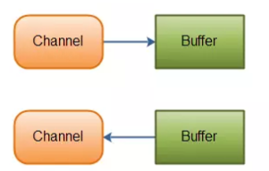
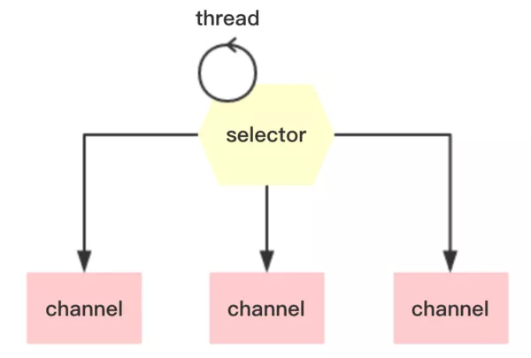
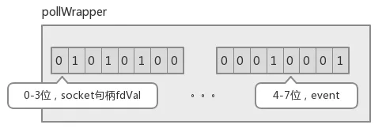

# Java NIO浅析

NIO（Non-blocking I/O，在Java领域，也称为New I/O），是一种同步非阻塞的I/O模型，也是I/O多路复用的基础，已经被越来越多地应用到大型应用服务器，成为解决高并发与大量连接、I/O处理问题的有效方式。

那么NIO的本质是什么样的呢？它是怎样与事件模型结合来解放线程、提高系统吞吐的呢？

本文会从传统的阻塞I/O和线程池模型面临的问题讲起，然后对比几种常见I/O模型，一步步分析NIO怎么利用事件模型处理I/O，解决线程池瓶颈处理海量连接，包括利用面向事件的方式编写服务端/客户端程序。最后延展到一些高级主题，如Reactor与Proactor模型的对比、Selector的唤醒、Buffer的选择等。

注：本文的代码都是伪代码，主要是为了示意，不可用于生产环境。

## 一、服务端

### 1. 传统的服务器端同步阻塞I/O处理

让我们先回忆一下传统的服务器端同步阻塞I/O处理（也就是BIO，Blocking I/O）的经典编程模型：

```java
{
 ExecutorService executor = Excutors.newFixedThreadPollExecutor(100);//线程池

 ServerSocket serverSocket = new ServerSocket();
 serverSocket.bind(8088);
 while(!Thread.currentThread.isInturrupted()){//主线程死循环等待新连接到来
 Socket socket = serverSocket.accept();
 executor.submit(new ConnectIOnHandler(socket));//为新的连接创建新的线程
}

class ConnectIOnHandler extends Thread{
    private Socket socket;
    public ConnectIOnHandler(Socket socket){
       this.socket = socket;
    }
    public void run(){
      while(!Thread.currentThread.isInturrupted()&&!socket.isClosed()){死循环处理读写事件
          String someThing = socket.read()....//读取数据
          if(someThing!=null){
             ......//处理数据
             socket.write()....//写数据
          }

      }
    }
}
```

这是一个经典的每连接每线程的模型，之所以使用多线程，主要原因在于socket.accept()、socket.read()、socket.write()三个主要函数都是**同步阻塞**的，当一个连接在处理I/O的时候，系统是阻塞的，如果是单线程的话必然就挂死在那里；但CPU是被释放出来的，开启多线程，就可以让CPU去处理更多的事情。其实这也是所有使用多线程的本质： 1. 利用多核。 2. 当I/O阻塞系统，但CPU空闲的时候，可以利用多线程使用CPU资源。

现在的多线程一般都使用线程池，可以让线程的创建和回收成本相对较低。在活动连接数不是特别高（小于单机1000）的情况下，这种模型是比较不错的，可以让每一个连接专注于自己的I/O并且编程模型简单，也不用过多考虑系统的过载、限流等问题。线程池本身就是一个天然的漏斗，可以缓冲一些系统处理不了的连接或请求。

不过，这个模型最本质的问题在于，严重依赖于线程。但线程是很”贵”的资源，主要表现在： 

1. 线程的创建和销毁成本很高，在Linux这样的操作系统中，线程本质上就是一个进程。创建和销毁都是重量级的系统函数。 
2. 线程本身占用较大内存，像Java的线程栈，一般至少分配512K～1M的空间，如果系统中的线程数过千，恐怕整个JVM的内存都会被吃掉一半。 
3. 线程的切换成本是很高的。操作系统发生线程切换的时候，需要保留线程的上下文，然后执行系统调用。如果线程数过高，可能执行线程切换的时间甚至会大于线程执行的时间，这时候带来的表现往往是系统load偏高、CPU sy使用率特别高（超过20%以上)，导致系统几乎陷入不可用的状态。 
4. 容易造成锯齿状的系统负载。因为系统负载是用活动线程数或CPU核心数，一旦线程数量高但外部网络环境不是很稳定，就很容易造成大量请求的结果同时返回，激活大量阻塞线程从而使系统负载压力过大。

所以，当面对十万甚至百万级连接的时候，传统的BIO模型是无能为力的。随着移动端应用的兴起和各种网络游戏的盛行，百万级长连接日趋普遍，此时，必然需要一种更高效的I/O处理模型。

很多刚接触NIO的人，第一眼看到的就是Java相对晦涩的API，比如：Channel，Selector，Socket什么的；然后就是一坨上百行的代码来演示NIO的服务端Demo……瞬间头大有没有？

我们不管这些，抛开现象看本质，先分析下NIO是怎么工作的。

### 2. 常见I/O模型对比

所有的系统I/O都分为两个阶段：**等待就绪**和**操作**。举例来说，**读函数，分为等待系统可读和真正的读**；同理，**写函数分为等待网卡可以写和真正的写**。

需要说明的是**等待就绪的阻塞是不使用CPU的，是在“空等”**；而**真正的读写操作的阻塞是使用CPU的，真正在”干活”**，而且这个过程非常快，属于memory copy，带宽通常在1GB/s级别以上，可以理解为**基本不耗时**。

下图是几种常见I/O模型的对比：


以socket.read()为例子：

传统的BIO里面socket.read()，如果TCP RecvBuffer里没有数据，函数会一直阻塞，直到收到数据，返回读到的数据。

**对于NIO，如果TCP RecvBuffer有数据，就把数据从网卡读到内存，并且返回给用户；反之则直接返回0，永远不会阻塞。**

最新的AIO(Async I/O)里面会更进一步：不但等待就绪是非阻塞的，就连数据从网卡到内存的过程也是异步的。

换句话说，BIO里用户最关心“我要读”，NIO里用户最关心”我可以读了”，在AIO模型里用户更需要关注的是“读完了”。

NIO一个重要的特点是：**socket主要的读、写、注册和接收函数，在等待就绪阶段都是非阻塞的，真正的I/O操作是同步阻塞的（消耗CPU但性能非常高）**。

### 3. 如何结合事件模型使用NIO同步非阻塞特性

回忆BIO模型，**之所以需要多线程，是因为在进行I/O操作的时候，一是没有办法知道到底能不能写、能不能读，只能”傻等”**，即使通过各种估算，算出来操作系统没有能力进行读写，也没法在socket.read()和socket.write()函数中返回，**这两个函数无法进行有效的中断**。所以除了多开线程另起炉灶，没有好的办法利用CPU。

**NIO的读写函数可以立刻返回**，这就给了我们不开线程利用CPU的最好机会：**如果一个连接不能读写（socket.read()返回0或者socket.write()返回0），我们可以把这件事记下来，记录的方式通常是在Selector上注册标记位，然后切换到其它就绪的连接（channel）继续进行读写。**

下面具体看下如何利用事件模型单线程处理所有I/O请求：

- NIO的主要事件有几个：**读就绪**、**写就绪**、**有新连接到来**。
- 我们首先需要注册当这几个事件到来的时候所**对应的处理器**。
- 然后在合适的时机告诉**事件选择器**：我对这个事件感兴趣。对于写操作，就是写不出去的时候对写事件感兴趣；对于读操作，就是完成连接和系统没有办法承载新读入的数据的时；对于accept，一般是服务器刚启动的时候；而对于connect，一般是connect失败需要重连或者直接异步调用connect的时候。
- 其次，**用一个死循环选择就绪的事件，会执行系统调用（Linux 2.6之前是select、poll，2.6之后是epoll，Windows是IOCP），还会阻塞的等待新事件的到来。新事件到来的时候，会在selector上注册标记位，标示可读、可写或者有连接到来**。
- 注意：==**select是阻塞的**==，无论是通过操作系统的通知（epoll）还是不停的轮询(select，poll)，这个函数是阻塞的。所以你可以放心大胆地在一个while(true)里面调用这个函数而不用担心CPU空转。

所以我们的程序大概的模样是：

```java
interface ChannelHandler{
    void channelReadable(Channel channel);
    void channelWritable(Channel channel);
}
class Channel{
    Socket socket;
    Event event;//读，写或者连接
}

//IO线程主循环:
class IoThread extends Thread{
    public void run(){
        Channel channel;
        while(channel=Selector.select()){//选择就绪的事件和对应的连接
            if(channel.event==accept){
                registerNewChannelHandler(channel);//如果是新连接，则注册一个新的读写处理器
            }
            if(channel.event==write){
                getChannelHandler(channel).channelWritable(channel);//如果可以写，则执行写事件
            }
            if(channel.event==read){
                getChannelHandler(channel).channelReadable(channel);//如果可以读，则执行读事件
            }
        }
    }
    Map<Channel，ChannelHandler> handlerMap;//所有channel的对应事件处理器
}
```

这个程序很简短，也是最简单的**Reactor模式：注册所有感兴趣的事件处理器，单线程轮询选择就绪事件，执行事件处理器。**

### 4. 优化线程模型

由上面的示例我们大概可以总结出NIO是怎么解决掉线程的瓶颈并处理海量连接的：

- NIO由原来的阻塞读写（占用线程）变成了**单线程轮询事件**，**找到可以进行读写的网络描述符进行读写**。除了**事件的轮询是阻塞**的（<u>没有可干的事情必须要阻塞</u>），剩余的I/O操作都是纯CPU操作，没有必要开启多线程。

- 并且由于线程的节约，**连接数大的时候因为线程切换带来的问题也随之解决，进而为处理海量连接提供了可能**。

单线程处理I/O的效率确实非常高，没有线程切换，只是拼命的读、写、选择事件。但现在的服务器，一般都是多核处理器，如果能够利用多核心进行I/O，无疑对效率会有更大的提高。

==仔细分析一下我们需要的线程，其实主要包括以下几种：==

1. **事件分发器或者选择器**，单线程选择就绪的事件。 

   选择器用于使用**单个线程**处理多个通道。因此，它需要较少的线程来处理这些通道。线程之间的切换对于操作系统来说是昂贵的。 因此，为了提高系统效率选择器是有用的。

   

   NIO 通过Channel（通道） 进行读写。通道是双向的，可读也可写，而流的读写是单向的。无论读写，通道只能和Buffer交互。因为 Buffer，通道可以异步地读写。

   

2. **I/O处理器**，包括connect、read、write等，这种纯CPU操作，一般开启CPU核心个线程就可以。 

3.  **业务线程**，在处理完I/O后，业务一般还会有自己的业务逻辑，有的还会有其他的阻塞I/O，如DB操作，RPC等。只要有阻塞，就需要单独的线程。

Java的Selector对于Linux系统来说，有一个致命限制：**同一个channel的select不能被并发的调用**。因此，如果有多个I/O线程，必须保证：**一个socket只能属于一个IOThread，而一个IOThread可以管理多个socket**。（防止发生并发操作问题）

另外**连接的处理和读写的处理通常可以选择分开，这样对于海量连接的注册和读写就可以分发**。虽然read()和write()是比较高效无阻塞的函数，但毕竟会占用CPU，如果面对更高的并发则无能为力。


## 二、客户端

通过上面的分析，可以看出NIO在==**服务端**==对于解放线程，优化I/O和处理海量连接方面，确实有自己的用武之地。那么在==**客户端上，NIO又有什么使用场景呢?**==

常见的客户端BIO+连接池模型，可以建立n个连接，然后当某一个连接被I/O占用的时候，可以使用其他连接来提高性能。

但多线程的模型面临和服务端相同的问题：**如果指望增加连接数来提高性能，则连接数又受制于线程数、线程很贵、无法建立很多线程，则性能遇到瓶颈。**

### 1. 每连接顺序请求的Redis

对于Redis来说，由于**服务端是全局串行**的，能够保证**同一连接的所有请求与返回顺序一致**。这样客户端可以使用**单线程＋队列**，把请求数据缓冲。然后pipeline发送，返回future，然后channel可读时，直接在队列中把future取回来，done()就可以了。

伪代码如下：

```java
class RedisClient Implements ChannelHandler{
    private BlockingQueue CmdQueue;
    private EventLoop eventLoop;
    private Channel channel;
    class Cmd{
        String cmd;
        Future result;
    }
    public Future get(String key){
        Cmd cmd= new Cmd(key);
        queue.offer(cmd);
        eventLoop.submit(new Runnable(){
            List list = new ArrayList();
            queue.drainTo(list);
            if(channel.isWritable()){
                channel.writeAndFlush(list);
            }
        });
    }
    public void ChannelReadFinish(Channel channel，Buffer Buffer){
        List result = handleBuffer();//处理数据
        //从cmdQueue取出future，并设值，future.done();
    }
    public void ChannelWritable(Channel channel){
        channel.flush();
    }
}
```

这样做，能够充分的**利用pipeline来提高I/O能力，同时获取异步处理能力**。

### 2. 多连接短连接的HttpClient

类似于竞对抓取的项目，往往需要建立无数的HTTP短连接，然后抓取，然后销毁，当需要单机抓取上千网站线程数又受制的时候，怎么保证性能呢?

- **何不尝试NIO，单线程进行连接、写、读操作？**如果连接、读、写操作系统没有能力处理，简单的注册一个事件，等待下次循环就好了。

- **如何存储不同的请求/响应呢？**由于http是无状态没有版本的协议，又没有办法使用队列，好像办法不多。比较笨的办法是对于不同的socket，直接存储socket的引用作为map的key。

### 3. 常见的RPC框架，如Thrift，Dubbo

这种框架内部一般维护了请求的协议和请求号，可以维护一个以请求号为key，结果的result为future的map，结合NIO+长连接，获取非常不错的性能。


## 三、Proactor与Reactor

一般情况下，**I/O 复用机制**需要**事件分发器（event dispatcher）**。 事件分发器的作用，**即将那些读写事件源分发给各读写事件的处理者**，就像送快递的在楼下喊: 谁谁谁的快递到了， 快来拿吧！

开发人员在开始的时候**需要在分发器那里注册感兴趣的事件，并提供相应的处理者（event handler)，或者是回调函数**；**事件分发器在适当的时候，会将请求的事件分发给这些handler或者回调函数**。

涉及到事件分发器的两种模式称为**Reactor**和**Proactor**：

-  **Reactor模式是基于同步I/O的**。在Reactor模式中，事件分发器等待某个事件或者可应用或个操作的状态发生（比如文件描述符可读写，或者是socket可读写），事件分发器就把这个事件传给事先注册的事件处理函数或者回调函数，由后者来做实际的读写操作。
- **Proactor模式是和异步I/O相关的。**在Proactor模式中，事件处理者（或者代由事件分发器发起）直接发起一个异步读写操作（相当于请求），而实际的工作是由操作系统来完成的。发起时，需要提供的参数包括用于存放读到数据的缓存区、读的数据大小或用于存放外发数据的缓存区，以及这个请求完后的回调函数等信息。事件分发器得知了这个请求，它默默等待这个请求的完成，然后转发完成事件给相应的事件处理者或者回调。举例来说，在Windows上事件处理者投递了一个异步IO操作（称为overlapped技术），事件分发器等IO Complete事件完成。这种异步模式的典型实现是基于操作系统底层异步API的，所以我们可称之为“系统级别”的或者“真正意义上”的异步，因为具体的读写是由操作系统代劳的。

举个例子，将有助于理解Reactor与Proactor二者的差异，以读操作为例（写操作类似）。

1. 在Reactor中实现读：
   - 注册读就绪事件和相应的事件处理器。
   - 事件分发器等待事件。
   - 事件到来，激活分发器，分发器调用事件对应的处理器。
   - 事件处理器完成实际的读操作，处理读到的数据，注册新的事件，然后返还控制权。

2. 在Proactor中实现读：
   - 处理器发起异步读操作（注意：操作系统必须支持异步IO）。在这种情况下，处理器无视IO就绪事件，它关注的是完成事件。
   - 事件分发器等待操作完成事件。
   - 在分发器等待过程中，操作系统利用并行的内核线程执行实际的读操作，并将结果数据存入用户自定义缓冲区，最后通知事件分发器读操作完成。
   - 事件分发器呼唤处理器。
   - 事件处理器处理用户自定义缓冲区中的数据，然后启动一个新的异步操作，并将控制权返回事件分发器。

可以看出，两个模式的相同点，都是对某个I/O事件的事件通知（即告诉某个模块，这个I/O操作可以进行或已经完成)。在结构上，两者也有相同点：事件分发器负责提交IO操作（异步)、查询设备是否可操作（同步)，然后当条件满足时，就回调handler；

不同点在于，异步情况下（Proactor)，当回调handler时，表示I/O操作已经完成；同步情况下（Reactor)，回调handler时，表示I/O设备可以进行某个操作（can read 或 can write)。


## 四、Buffer的选择

通常情况下，操作系统的一次**写操作**分为两步： 

1. 将数据从用户空间拷贝到系统空间。 
2. 从系统空间往网卡写。

同理，**读操作**也分为两步： 

1. 将数据从网卡拷贝到系统空间； 
2. 将数据从系统空间拷贝到用户空间。

对于NIO来说，缓存的使用可以使用`DirectByteBuffer`和`HeapByteBuffer`：

- 如果使用了`DirectByteBuffer`，一般来说可以减少一次系统空间到用户空间的拷贝。但Buffer创建和销毁的成本更高，更不宜维护，通常会用内存池来提高性能。

- 如果数据量比较小的中小应用情况下，可以考虑使用`heapBuffer`；反之可以用`directBuffer`。

使用==**NIO != 高性能**==，当连接数<1000，并发程度不高或者局域网环境下NIO并没有显著的性能优势。

NIO并没有完全屏蔽平台差异，它仍然是基于各个操作系统的I/O系统实现的，差异仍然存在。使用NIO做网络编程构建事件驱动模型并不容易，陷阱重重。

推荐大家使用成熟的NIO框架，如Netty，MINA等。解决了很多NIO的陷阱，并屏蔽了操作系统的差异，有较好的性能和编程模型。


## 总结

最后总结一下到底NIO给我们带来了些什么：

> - 事件驱动模型
> - 避免多线程
> - 单线程处理多任务
> - 非阻塞I/O，I/O读写不再阻塞，而是返回0
> - 基于block的传输，通常比基于流的传输更高效
> - 更高级的IO函数，zero-copy
> - IO多路复用大大提高了Java网络应用的可伸缩性和实用性

## 阅读原文

- 美团技术团队：Java NIO浅析    https://tech.meituan.com/2016/11/04/nio.html


------

==**追加：**==**Java NIO 核心部分介绍**


# 深入浅出NIO之Channel、Buffer和Selector

## 一、前言

Java NIO 由以下几个核心部分组成： 

1 、Buffer

2、Channel 

3、Selector

传统的IO操作面向数据流，意味着每次从流中读一个或多个字节，直至完成，数据没有被缓存在任何地方。

NIO操作**面向缓冲区**，数据从Channel读取到Buffer缓冲区，随后在Buffer中处理数据。


下文着重介绍Channel和Buffer的概念以及在文件读写方面的应用和内部实现原理，以及Selector实现原理。

## 二、Buffer

> A buffer is a linear, finite sequence of elements of a specific primitive type.
>
> 缓冲区是特定原始类型元素的线性有限序列。

一块缓存区，内部使用字节数组存储数据，并维护几个特殊变量，实现数据的反复利用。 

**buffer的工作机制：**

- **mark**：初始值为-1，用于备份当前的position; 

- **position**：初始值为0，position表示当前可以写入或读取数据的位置，当写入或读取一个数据后，position向前移动到下一个位置； 

- **limit**：写模式下，limit表示最多能往Buffer里写多少数据，等于capacity值；读模式下，limit表示最多可以读取多少数据。 

  `limit <= capacity`

- **capacity**：缓存数组大小


1. 当我们刚开始初始化这个buffer数组的时候，开始默认是这样的：

   

2. 但是当你往buffer数组中开始写入的时候几个字节的时候（此时为**写模式**）就会变成下面的图，position会移动你数据的结束的下一个位置：

   

3. 如果这个时候你需要把buffer中的数据写到channel管道中，我们就需要用==buffer.flip()==方法，将Buffer从**写模式**变成**读模式**：

   

   此时底层操作系统就可以从缓冲区中正确读取这 5 个字节数据发送出去了。

4. 当我们又需要写数据时，需要再调一下 ==clear()==方法。缓冲区的索引状态又回到初始位置。

- **mark()**：把当前的position赋值给mark

```java
public final Buffer mark() {    
    mark = position;    
    return this;
}
```

- **reset()**：把mark值还原给position

```java
public final Buffer reset() {    
    int m = mark;    
    if (m < 0)        
        throw new InvalidMarkException();    
    position = m;    
    return this;
}
```

- **clear()**：一旦读完Buffer中的数据，需要让Buffer准备好再次被写入，clear会恢复状态值，但不会擦除数据。

```java
public final Buffer clear() {    
    position = 0;    
    limit = capacity;    
    mark = -1;    
    return this;
}
```

- **flip()**：Buffer有两种模式，**写模式和读模式**，flip后Buffer**从写模式变成读模式**。

```java
public final Buffer flip() {    
    limit = position;    
    position = 0;    
    mark = -1;    
    return this;
}
```

- **rewind()**：重置position为0，从头读写数据。

```java
public final Buffer rewind() {    
    position = 0;    
    mark = -1;    
    return this;
}
```

目前Buffer的实现类有以下几种：

- ByteBuffer
- CharBuffer
- DoubleBuffer
- FloatBuffer
- IntBuffer
- LongBuffer
- ShortBuffer
- MappedByteBuffer


###  ByteBuffer

ByteBuffer的实现类包括`HeapByteBuffer`和`DirectByteBuffer`两种。

#### HeapByteBuffer

```java
public static ByteBuffer allocate(int capacity) {
    if (capacity < 0)    
        throw new IllegalArgumentException();   
    return new HeapByteBuffer(capacity, capacity);
}

HeapByteBuffer(int cap, int lim) { 
    super(-1, 0, lim, cap, new byte[cap], 0);
}
```

HeapByteBuffer通过初始化字节数组hd，在**虚拟机堆上申请内存空间**。

#### DirectByteBuffer

```java
public static ByteBuffer allocateDirect(int capacity) { 
    return new DirectByteBuffer(capacity);
}

DirectByteBuffer(int cap) {    
    super(-1, 0, cap, cap);    
    boolean pa = VM.isDirectMemoryPageAligned();  
    int ps = Bits.pageSize();  
    long size = Math.max(1L, (long)cap + (pa ? ps : 0));
    Bits.reserveMemory(size, cap);  
    long base = 0;   
    try {     
        base = unsafe.allocateMemory(size);  
    } catch (OutOfMemoryError x) {       
        Bits.unreserveMemory(size, cap);     
        throw x;   
    }    
    unsafe.setMemory(base, size, (byte) 0); 
    if (pa && (base % ps != 0)) {       
        // Round up to page boundary      
        address = base + ps - (base & (ps - 1));   
    } else {      
        address = base;   
    }    
    cleaner = Cleaner.create(this, new Deallocator(base, size, cap));  
    att = null;
}
```

DirectByteBuffer通过 `unsafe.allocateMemory` **在物理内存中申请地址空间（非 jvm 堆内存）**，并在ByteBuffer的 address 变量中维护指向该内存的地址。 `unsafe.setMemory(base, size, (byte) 0)` 方法把新申请的内存数据清零。

对于NIO来说，缓存的使用可以使用`DirectByteBuffer`和`HeapByteBuffer`：

- 如果使用了`DirectByteBuffer`，一般来说可以减少一次系统空间到用户空间的拷贝。但`DirectByteBuffer`创建和销毁的成本更高，更不宜维护，通常会用**内存池**来提高性能。

- 如果数据量比较小的中小应用情况下，可以考虑使用`heapBuffer`；反之可以用`directBuffer`。


## 三、Channel

> A channel represents an open connection to an entity such as a hardware device, a file, a network socket, or a program component that is capable of performing one or more distinct I/O operations, for example reading or writing.
>
> 通道表示与实体的开放连接，例如硬件设备、文件、网络套接字或能够执行一个或多个不同 I/O 操作（例如读取或写入）的程序组件。

NIO 把它支持的 I/O 对象抽象为 Channel，Channel又称“通道”，类似于原I/O中的流（Stream），但有所区别： 

1、流是单向的，通道是双向的，可读可写。 

2、流读写是阻塞的，通道可以异步读写。 

3、流中的数据可以选择性的先读到缓存中，通道的数据总是要先读到一个缓存中，或从缓存中写入，如下所示：


目前已知Channel的实现类有：

- FileChannel
- DatagramChannel
- SocketChannel
- ServerSocketChannel

#### FileChannel

> A channel for reading, writing, mapping, and manipulating a file. 
>
> 一个用来写、读、映射和操作文件的通道。

FileChannel 的 read、write 和 map 通过其实现类 FileChannelImpl 实现。

##### 1. read实现

```java
public int read(ByteBuffer dst) throws IOException {   
    ensureOpen();   
    if (!readable)   
        throw new NonReadableChannelException(); 
    synchronized (positionLock) {    
        int n = 0;       
        int ti = -1;    
        try {         
            begin();      
            ti = threads.add();        
            if (!isOpen())           
                return 0;          
            do {          
                n = IOUtil.read(fd, dst, -1, nd);   
            } while ((n == IOStatus.INTERRUPTED) && isOpen());       
            return IOStatus.normalize(n);    
        } finally {       
            threads.remove(ti);        
            end(n > 0);         
            assert IOStatus.check(n);    
        }   
    }
}
```

FileChannelImpl 的 read 方法通过 IOUtil 的 read 实现：

```java
static int read(FileDescriptor fd, ByteBuffer dst, long position, NativeDispatcher nd) IOException { 
    if (dst.isReadOnly())      
        throw new IllegalArgumentException("Read-only buffer");    
    if (dst instanceof DirectBuffer)     
        return readIntoNativeBuffer(fd, dst, position, nd); 
    // Substitute a native buffer  替换本地缓冲区 
    ByteBuffer bb = Util.getTemporaryDirectBuffer(dst.remaining());  
    try {       
        int n = readIntoNativeBuffer(fd, bb, position, nd);  
        bb.flip();
        if (n > 0)
            dst.put(bb);
        return n; 
    } finally {   
        Util.offerFirstTemporaryDirectBuffer(bb);  
    }
}
```

通过上述实现可以看出，基于 channel 的文件数据**读取步骤**如下： 

1、申请一块和缓存同大小的DirectByteBuffer bb。 

2、读取数据到缓存bb，底层由NativeDispatcher的read实现。 

3、把bb的数据读取到dst（用户定义的缓存，在jvm中分配内存）。 

**read方法导致数据复制了两次**。


##### 2. write实现

```java
public int write(ByteBuffer src) throws IOException {    
    ensureOpen();    
    if (!writable)        
        throw new NonWritableChannelException();    
    synchronized (positionLock) {        
        int n = 0;        
        int ti = -1;        
        try {            
            begin();           
            ti = threads.add();            
            if (!isOpen())                
                return 0;            
            do {                
                n = IOUtil.write(fd, src, -1, nd);            
            } while ((n == IOStatus.INTERRUPTED) && isOpen());           
            return IOStatus.normalize(n);      
        } finally {      
            threads.remove(ti);  
            end(n > 0);            
            assert IOStatus.check(n);        
        }    
    }
}
```

和read实现一样，FileChannelImpl的 write 方法通过 IOUtil 的 write 实现：

```java
static int write(FileDescriptor fd, ByteBuffer src, long position, NativeDispatcher nd) throws IOException {
    if (src instanceof DirectBuffer)        
        return writeFromNativeBuffer(fd, src, position, nd);  
    // Substitute a native buffer    
    int pos = src.position();    
    int lim = src.limit();    
    assert (pos <= lim);    
    int rem = (pos <= lim ? lim - pos : 0);    
    ByteBuffer bb = Util.getTemporaryDirectBuffer(rem);
    try {
        bb.put(src);
        bb.flip();
        // Do not update src until we see how many bytes were written
        src.position(pos);
        int n = writeFromNativeBuffer(fd, bb, position, nd);
        if (n > 0) {         
            // now update src      
            src.position(pos + n); 
        }      
        return n;   
    } finally {    
        Util.offerFirstTemporaryDirectBuffer(bb);   
    }
}
```

通过上述实现可以看出，基于channel的文件数据**写入步骤**如下： 

1、申请一块DirectByteBuffer，bb大小为byteBuffer中的limit - position。 

2、复制byteBuffer中的数据到bb中。 

3、把数据从bb中写入到文件，底层由NativeDispatcher的write实现，具体如下：

```java
private static int writeFromNativeBuffer(FileDescriptor fd, ByteBuffer bb, long position, NativeDispatcher nd)    throws IOException {    
    int pos = bb.position();    
    int lim = bb.limit();
    assert (pos <= lim);
    int rem = (pos <= lim ? lim - pos : 0);
    int written = 0;
    if (rem == 0)
        return 0; 
    if (position != -1) { 
        written = nd.pwrite(fd, ((DirectBuffer)bb).address() + pos, rem, position);    
    } else {       
        written = nd.write(fd, ((DirectBuffer)bb).address() + pos, rem);   
    }   
    if (written > 0)    
        bb.position(pos + written);  
    return written;
}
```

write方法也导致了数据复制了两次


## 四、Channel和Buffer示例

```java
File file = new RandomAccessFile("data.txt", "rw");
FileChannel channel = file.getChannel();
ByteBuffer buffer = ByteBuffer.allocate(48);
int bytesRead = channel.read(buffer); // 将数据写入到 buffer，并返回buffer中数据的字节大小
while (bytesRead != -1) {    
    System.out.println("Read " + bytesRead);
    buffer.flip(); // buffer 变成读模式
    while(buffer.hasRemaining()){
        System.out.print((char) buffer.get()); // 从buffer中读取数据
    }  
    buffer.clear(); 
    bytesRead = channel.read(buffer);
}
file.close();
```

注意 `buffer.flip()` 的调用，首先将数据写入到buffer，然后变成读模式，再从buffer中读取数据。


## 五、Selector

> 进行socket编程时，accept方法会一直阻塞，直到有客户端请求的到来，并返回socket进行相应的处理。整个过程是流水线的，处理完一个请求，才能去获取并处理后面的请求，当然也可以把获取socket和处理socket的过程分开，一个线程负责accept，一个线程池负责处理请求。
>
> 但NIO提供了更好的解决方案，**采用选择器（Selector）返回已经准备好的 socket，并按顺序处理，基于通道（Channel）和缓冲区（Buffer）来进行数据的传输。**

这里出来一个新概念，selector，具体是一个什么样的东西？

想想一个场景：在一个养鸡场，有这么一个人，每天的工作就是不停检查几个特殊的鸡笼，如果有鸡进来，有鸡出去，有鸡生蛋，有鸡生病等等，就把相应的情况记录下来，如果鸡场的负责人想知道情况，只需要询问那个人即可。

在这里，这个人就相当Selector，每个鸡笼相当于一个 SocketChannel，每个线程通过一个 Selector 可以管理多个 SocketChannel。



为了实现Selector管理多个SocketChannel，必须将具体的SocketChannel对象**注册**到Selector，并**声明需要监听的事件**（这样Selector才知道需要记录什么数据），一共有4种事件：

1、**connect**：客户端连接服务端事件，对应值为SelectionKey.OPCONNECT(8) 

2、**accept**：服务端接收客户端连接事件，对应值为SelectionKey.OPACCEPT(16) 

3、**read**：读事件，对应值为SelectionKey.OPREAD(1) 

4、**write**：写事件，对应值为SelectionKey.OPWRITE(4)

这个很好理解，每次请求到达服务器，都是从connect开始，connect成功后，服务端开始准备accept，准备就绪，开始读数据，并处理，最后写回数据返回。

所以，当SocketChannel有对应的事件发生时，Selector都可以观察到，并进行相应的处理。

### 1. 服务端代码

为了更好的理解，先看一段服务端的示例代码：

```java
// 创建ServerSocketChannel实例，并绑定指定端口
ServerSocketChannel serverChannel = ServerSocketChannel.open();
serverChannel.configureBlocking(false);
serverChannel.socket().bind(new InetSocketAddress(port));
// 创建Selector实例
Selector selector = Selector.open();
// 将serverSocketChannel注册到selector，并指定事件OP_ACCEPT，最底层的socket通过channel和selector建立关联； 
serverChannel.register(selector, SelectionKey.OP_ACCEPT);
while(true){    
    int n = selector.select();    // 如果底层有socket已经准备好,selector的select方法会返回socket的个数
    if (n == 0) 				  // 如果没有准备好的socket，select方法会被阻塞一段时间，并返回0
        continue; 
    // selectedKeys方法会返回socket对应的事件（connect、accept、read or write）
    Iterator ite = this.selector.selectedKeys().iterator(); 
    while(ite.hasNext()){        
        SelectionKey key = (SelectionKey)ite.next();    
        // 以下根据事件类型，进行不同的处理逻辑
        if (key.isAcceptable()){            
            SocketChannel clntChan = ((ServerSocketChannel) key.channel()).accept();            
            clntChan.configureBlocking(false);           
            // 将选择器注册到连接到的客户端信道，并指定该信道key值的属性为OP_READ，同时为该信道指定关联的附件           
            clntChan.register(key.selector(), SelectionKey.OP_READ, ByteBuffer.allocate(bufSize)); 
        }    
        if (key.isReadable()){    
            handleRead(key);   
        }    
        if (key.isWritable() && key.isValid()){  
            handleWrite(key);    
        }      
        if (key.isConnectable()){    
            System.out.println("isConnectable = true");       
        }      
        ite.remove(); 
    }
}
```

**服务端操作过程：**

1. 创建ServerSocketChannel实例，并绑定指定端口； 
2. 创建Selector实例； 
3. 将serverSocketChannel注册到selector，并指定事件OP_ACCEPT，最底层的socket通过channel和selector建立关联； 
4. 如果没有准备好的socket，select方法会被阻塞一段时间，并返回0； 
5. 如果底层有socket已经准备好，selector的select方法会返回socket的个数，而且selectedKeys方法会返回socket对应的事件（connect、accept、read or write）； 
6. 根据事件类型，进行不同的处理逻辑；

在步骤3中，selector只注册了serverSocketChannel的OPACCEPT事件 

1. 如果有客户端A连接服务，执行select方法时，可以通过serverSocketChannel获取客户端A的socketChannel，并在selector上注册socketChannel的OPREAD事件。 

2. 如果客户端A发送数据，会触发read事件，这样下次轮询调用select方法时，就能通过socketChannel读取数据，同时在selector上注册该socketChannel的OP_WRITE事件，实现服务器往客户端写数据。

### 2. Selector实现原理

SocketChannel、ServerSocketChannel和Selector的实例初始化都通过SelectorProvider类实现，其中Selector是整个NIO Socket的核心实现。

```java
public static SelectorProvider provider() {    
    synchronized (lock) {        
        if (provider != null)       
            return provider;      
        return AccessController.doPrivileged(new PrivilegedAction<SelectorProvider>() {              
            public SelectorProvider run() {        
                if (loadProviderFromProperty())      
                    return provider;            
                if (loadProviderAsService())      
                    return provider;               
                provider = sun.nio.ch.DefaultSelectorProvider.create();   
                return provider;           
            }              
        });   
    }
}
```

SelectorProvider在 windows 和 linux下有不同的实现，provider方法会返回对应的实现。

这里不禁要问，Selector是如何做到同时管理多个socket？

下面我们看看Selector的具体实现，Selector初始化时，会实例化PollWrapper、SelectionKeyImpl数组和Pipe。

```java
WindowsSelectorImpl(SelectorProvider sp) throws IOException {    
    super(sp);    
    pollWrapper = new PollArrayWrapper(INIT_CAP);
    wakeupPipe = Pipe.open();  
    wakeupSourceFd = ((SelChImpl)wakeupPipe.source()).getFDVal(); 
    // Disable the Nagle algorithm so that the wakeup is more immediate   
    SinkChannelImpl sink = (SinkChannelImpl)wakeupPipe.sink();    
    (sink.sc).socket().setTcpNoDelay(true); 
    wakeupSinkFd = ((SelChImpl)sink).getFDVal();   
    pollWrapper.addWakeupSocket(wakeupSourceFd, 0);
}
```

**pollWrapper**用Unsafe类申请一块物理内存pollfd，存放socket句柄fdVal和events，其中pollfd共8位，0-3位保存socket句柄，4-7位保存events。




 pollWrapper提供了fdVal和event数据的相应操作，如添加操作通过Unsafe的putInt和putShort实现。

```java
void putDescriptor(int i, int fd) {    
    pollArray.putInt(SIZE_POLLFD * i + FD_OFFSET, fd);
}

void putEventOps(int i, int event) { 
    pollArray.putShort(SIZE_POLLFD * i + EVENT_OFFSET, (short)event);
}
```

先看看 `serverChannel.register(selector,SelectionKey.OP_ACCEPT)`是如何实现的

```java
public final SelectionKey register(Selector sel, int ops, Object att) throws ClosedChannelException {
    synchronized (regLock) {        
        SelectionKey k = findKey(sel);        
        if (k != null) {            
            k.interestOps(ops);            
            k.attach(att);        
        }        
        if (k == null) {           
            // New registration      
            synchronized (keyLock) {   
                if (!isOpen())         
                    throw new ClosedChannelException(); 
                k = ((AbstractSelector)sel).register(this, ops, att);  
                addKey(k);       
            }       
        }       
        return k; 
    }
}
```

1. 如果该channel和selector已经注册过，则直接添加事件和附件。

2. 否则通过selector实现注册过程。

```java
protected final SelectionKey register(AbstractSelectableChannel ch, int ops, Object attachment) {   
    if (!(ch instanceof SelChImpl))   
        throw new IllegalSelectorException();  
    SelectionKeyImpl k = new SelectionKeyImpl((SelChImpl)ch, this);
    k.attach(attachment);
    synchronized (publicKeys) {   
        implRegister(k);    
    }   
    k.interestOps(ops); 
    return k;
}
protected void implRegister(SelectionKeyImpl ski) {  
    synchronized (closeLock) {    
        if (pollWrapper == null)        
            throw new ClosedSelectorException();  
        growIfNeeded();     
        channelArray[totalChannels] = ski;  
        ski.setIndex(totalChannels);        
        fdMap.put(ski);      
        keys.add(ski);       
        pollWrapper.addEntry(totalChannels, ski);     
        totalChannels++;   
    }
}
```

1. 以当前 channel 和 selector 为参数，初始化SelectionKeyImpl 对象selectionKeyImpl ，并添加附件attachment。 

2. 如果当前channel的数量totalChannels等于SelectionKeyImpl数组大小，对SelectionKeyImpl数组和pollWrapper进行扩容操作。 

3. 如果totalChannels % MAXSELECTABLEFDS == 0，则多开一个线程处理selector。 

4. pollWrapper.addEntry将把selectionKeyImpl中的socket句柄添加到对应的pollfd。 

5. k.interestOps(ops)方法最终也会把event添加到对应的pollfd。

所以，不管serverSocketChannel，还是socketChannel，在selector注册的事件，最终都保存在pollArray中。

接着，再来看看selector中的select是如何实现一次获取多个有事件发生的channel的，底层由selector实现类的doSelect方法实现，如下：

```java
 protected int doSelect(long timeout) throws IOException {    
     if (channelArray == null)         
         throw new ClosedSelectorException();   
     this.timeout = timeout; 
     // set selector timeout   
     processDeregisterQueue();     
     if (interruptTriggered) {    
         resetWakeupSocket();     
         return 0;   
     }       
     // Calculate number of helper threads needed for poll. If necessary    
     // threads are created here and start waiting on startLock     
     adjustThreadsCount();     
     finishLock.reset(); 
     // reset finishLock  
     // Wakeup helper threads, waiting on startLock, so they start polling.    
     // Redundant threads will exit here after wakeup.     
     startLock.startThreads();     
     // do polling in the main thread. Main thread is responsible for     
     // first MAX_SELECTABLE_FDS entries in pollArray.      
     try {       
         begin();      
         try {      
             subSelector.poll();    
         } catch (IOException e) {       
             finishLock.setException(e); // Save this exception   
         }         
         // Main thread is out of poll(). Wakeup others and wait for them    
         if (threads.size() > 0)     
             finishLock.waitForHelperThreads();          
     } finally {         
         end();      
     }    
     // Done with poll(). Set wakeupSocket to nonsignaled  for the next run.
     finishLock.checkForException();      
     processDeregisterQueue();      
     int updated = updateSelectedKeys();     
     // Done with poll(). Set wakeupSocket to nonsignaled  for the next run.   
     resetWakeupSocket();       
     return updated;    
 }
```

其中 subSelector.poll() 是select的核心，由native函数poll0实现，readFds、writeFds 和exceptFds数组用来保存底层select的结果，数组的第一个位置都是存放发生事件的socket的总数，其余位置存放发生事件的socket句柄fd。

```java
private final int[] readFds = new int [MAX_SELECTABLE_FDS + 1];
private final int[] writeFds = new int [MAX_SELECTABLE_FDS + 1];
private final int[] exceptFds = new int [MAX_SELECTABLE_FDS + 1];
private int poll() throws IOException{ 
    // poll for the main thread     
    return poll0(pollWrapper.pollArrayAddress, 
                 Math.min(totalChannels, MAX_SELECTABLE_FDS), 
                 readFds, writeFds, exceptFds, timeout);
}
```

执行 selector.select() ，poll0函数把指向socket句柄和事件的内存地址传给底层函数。 

1. 如果之前没有发生事件，程序就阻塞在select处，当然不会一直阻塞，因为epoll在timeout时间内如果没有事件，也会返回； 

2. 一旦有对应的事件发生，poll0方法就会返回； 
3. processDeregisterQueue方法会清理那些已经cancelled的SelectionKey； 
4. updateSelectedKeys方法统计有事件发生的SelectionKey数量，并把符合条件发生事件的SelectionKey添加到selectedKeys哈希表中，提供给后续使用。

在早期的JDK1.4和1.5 update10版本之前，**Selector基于select/poll模型实现，是基于IO复用技术的非阻塞IO，不是异步IO**。在JDK1.5 update10和linux core2.6以上版本，sun优化了Selctor的实现，**底层使用epoll替换了select/poll**。

#### read实现

通过遍历selector中的SelectionKeyImpl数组，获取发生事件的socketChannel对象，其中保存了对应的socket，实现如下

```java
public int read(ByteBuffer buf) throws IOException { 
    if (buf == null)       
        throw new NullPointerException();  
    synchronized (readLock) {       
        if (!ensureReadOpen())    
            return -1;   
        int n = 0;  
        try {       
            begin();       
            synchronized (stateLock) {       
                if (!isOpen()) {        
                    return 0;       
                }           
                readerThread = NativeThread.current();  
            }        
            for (;;) {   
                n = IOUtil.read(fd, buf, -1, nd);   
                if ((n == IOStatus.INTERRUPTED) && isOpen()) {    
                    // The system call was interrupted but the channel   
                    // is still open, so retry        
                    continue;          
                }           
                return IOStatus.normalize(n);   
            }     
        } finally {   
            readerCleanup();   
            // Clear reader thread       
            // The end method, which        
            end(n > 0 || (n == IOStatus.UNAVAILABLE));    
            // Extra case for socket channels: Asynchronous shutdown     
            synchronized (stateLock) {         
                if ((n <= 0) && (!isInputOpen))        
                    return IOStatus.EOF;     
            }       
            assert IOStatus.check(n);    
        }    
    }
}
```

最终通过Buffer的方式读取socket的数据。

#### wakeup实现

```java
public Selector wakeup() { 
    synchronized (interruptLock) {  
        if (!interruptTriggered) { 
            setWakeupSocket();     
            interruptTriggered = true;     
        }
    }  
    return this;
}
// Sets Windows wakeup socket to a signaled state.
private void setWakeupSocket() {  
    setWakeupSocket0(wakeupSinkFd);
}
private native void setWakeupSocket0(int wakeupSinkFd);
```

看来wakeupSinkFd这个变量是为wakeup方法使用的。 其中interruptTriggered为中断已触发标志，当pollWrapper.interrupt()之后，该标志即为true了；因为这个标志，连续两次wakeup，只会有一次效果。

### 3. epoll原理

epoll是Linux下的一种IO多路复用技术，可以非常高效的处理数以百万计的socket句柄。

三个epoll相关的系统调用：

- **int epollcreate(int size)**  epollcreate建立一个epoll对象。参数size是内核保证能够正确处理的最大句柄数，多于这个最大数时内核可不保证效果。 
- **int epollctl(int epfd, int op, int fd, struct epollevent event)**  epollctl可以操作epollcreate创建的epoll，如将socket句柄加入到epoll中让其监控，或把epoll正在监控的某个socket句柄移出epoll。
- **int epollwait(int epfd, struct epollevent events,int maxevents, int timeout)** epoll_wait在调用时，在给定的timeout时间内，所监控的句柄中有事件发生时，就返回用户态的进程。

epoll内部实现大概如下：

1. epoll初始化时，会向内核注册一个文件系统，用于存储被监控的句柄文件，调用epoll_create时，会在这个文件系统中创建一个file节点。同时epoll会开辟自己的内核高速缓存区，以红黑树的结构保存句柄，以支持快速的查找、插入、删除。还会再建立一个list链表，用于存储准备就绪的事件。
2. 当执行epoll_ctl时，除了把socket句柄放到epoll文件系统里file对象对应的红黑树上之外，还会给内核中断处理程序注册一个回调函数，告诉内核，如果这个句柄的中断到了，就把它放到准备就绪list链表里。所以，当一个socket上有数据到了，内核在把网卡上的数据copy到内核中后，就把socket插入到就绪链表里。
3. 当epoll_wait调用时，仅仅观察就绪链表里有没有数据，如果有数据就返回，否则就sleep，超时时立刻返回。


## 阅读原文

- 深入浅出NIO之Channel、Buffer：   https://mp.weixin.qq.com/s/_vcT6KJNgcy1FruhSlA5zg?
- 深入浅出NIO之Selector实现原理：   https://mp.weixin.qq.com/s/BZJiUMR60YwpW1krN3Me_g?

