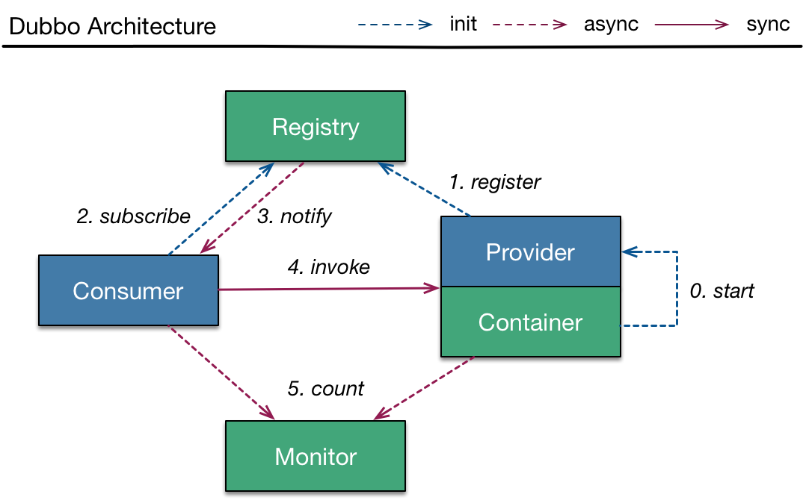
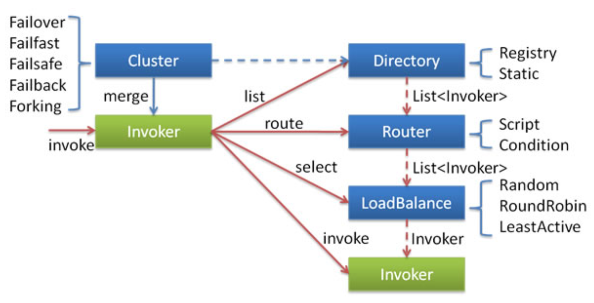
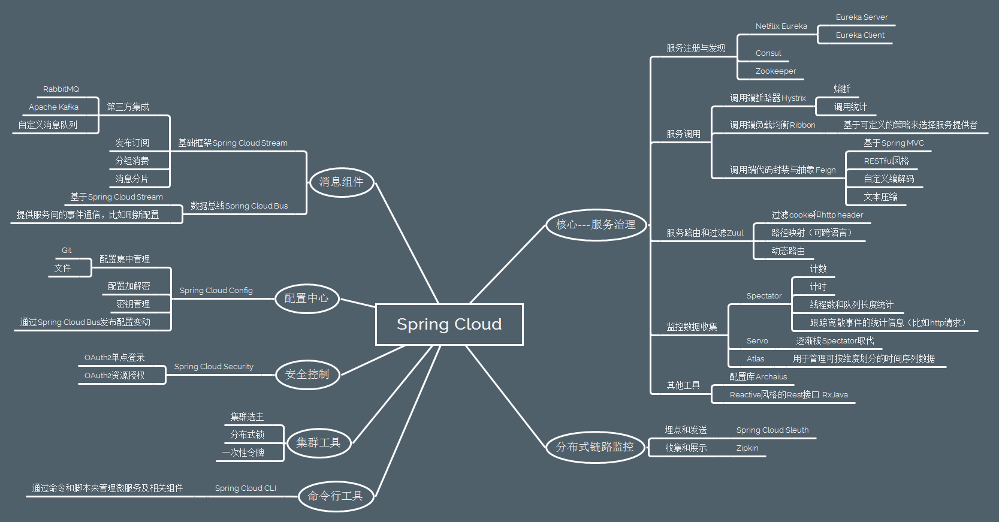
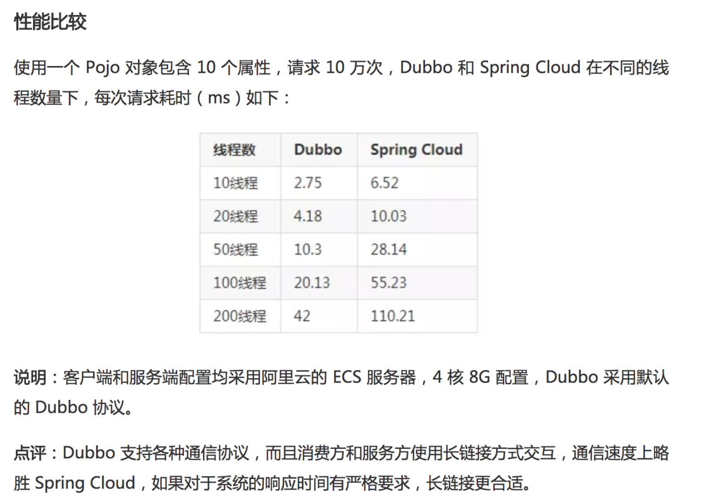
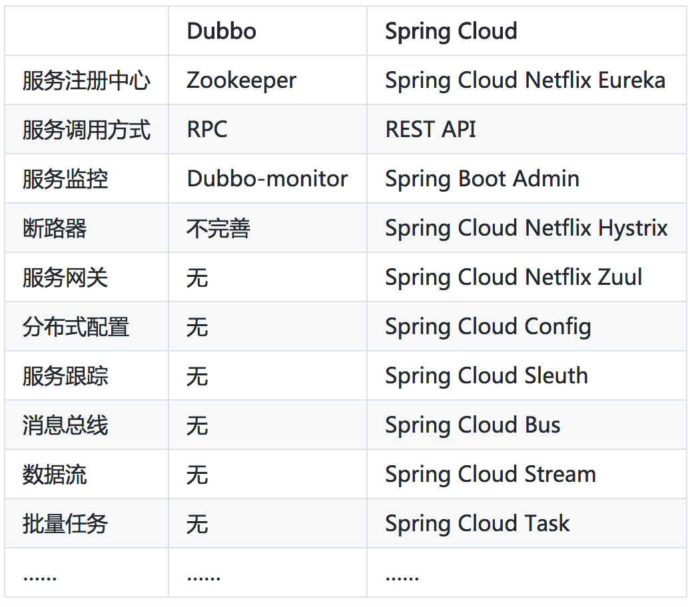

# Java 微服务框架选型（Dubbo 和 Spring Cloud？）

微服务（Microservices）是一种架构风格，一个大型复杂软件应用由一个或多个微服务组成。系统中的各个微服务可被独立部署，各个微服务之间是松耦合的。每个微服务仅关注于完成一件任务并很好地完成该任务。在所有情况下，每个任务代表着一个小的业务能力。

以往我们开发应用程序都是单体型（可以看作是一个怪兽👿），虽然开发和部署比较方便，但后期随着业务的不断增加，开发迭代和性能瓶颈等问题，将会困扰开发团队，微服务就是解决此问题的有效手段，市面上有很多的微服务框架，比如最著名的两个 Dubbo 和 Spring Cloud，我们该如何选择呢？

## 一、关于 RPC/gRPC/HTTP/REST

因为服务调用方式是 Dubbo 和 Spring Cloud 重要不同点，了解 RPC/gRPC/HTTP/REST 相关概念，有助于对比 Dubbo 和 Spring Cloud。

RPC 是远端过程调用，其调用协议通常**包含传输协议和编码协议**。

HTTP 严格来说跟 RPC 不是一个层级的概念，**HTTP 本身也可以作为 RPC 的传输层协议**。

传输协议包含: 如著名的 [**gRPC**](https://grpc.io/) 使用的 **HTTP 2.0 协议**，也有如 **Dubbo** 一类的**自定义报文的 TCP 协议**。编码协议包含: 如基于文本编码的 XML Json，也有二进制编码的 ProtoBuf Binpack 等。

所谓的效率优势是针对 HTTP 1.1 协议来讲的，HTTP 2.0 协议已经优化编码效率问题，像 gRPC 这种 RPC 库使用的就是 HTTP 2.0 协议。

在跨语言调用的时候，**REST 风格直接把 HTTP 作为应用协议**（直接和服务打交道），不同语言之间调用比较方便。

而 **RPC 可以把 HTTP 作为一种传输协议**（比如 gRPC 使用 HTTP 2.0 协议传输），本身还会**封装一层 RPC 框架的应用层协议**，不同语言之间调用需要**依赖 RPC 协议**（需要跨语言 RPC 库实现，比如 Thrift）。

问题：**为什么 Dubbo 比 Spring Cloud 性能要高一些？**

回答：**因为 Dubbo 采用单一长连接和 NIO 异步通讯（保持连接/轮询处理），使用自定义报文的 TCP 协议，并且序列化使用定制 Hessian2 框架，适合于小数据量大并发的服务调用，以及服务消费者机器数远大于服务提供者机器数的情况，但不适用于传输大数据的服务调用。而 Spring Cloud 直接使用 HTTP 协议（但也不是强绑定，也可以使用 RPC 库，或者采用 HTTP 2.0 + 长链接方式（Fegin 可以灵活设置））。**

另外，Martin Fowler 的 MicroServices 一文，**其定义的服务间通信是 HTTP 协议的 REST API**。

## 二、Dubbo 是什么？

https://github.com/apache/incubator-dubbo

Dubbo 是一个分布式服务框架，致力于提供高性能和透明化的 **RPC 远程服务调用方案**，以及 **SOA 服务治理方案**。简单的说，Dubbo 就是个服务框架，说白了就是个**远程服务调用的分布式框架**。

### 1. Dubbo 框架

模块注解：

- Provider: 暴露服务的**服务提供方**。
- Consumer: 调用远程服务的**服务消费方**。
- Registry: 服务注册与发现的**注册中心**。
- Monitor: 统计服务的调用次调和调用时间的**监控中心**。
- Container: 服务**运行容器**。

流程详解：

- 0 服务容器负责启动，加载，运行服务提供者（Standalone 容器）。
- 1 服务提供者在启动时，向注册中心注册自己提供的服务（Zookeeper/Redis）。
- 2 服务消费者在启动时，向注册中心订阅自己所需的服务。
- 3 注册中心返回服务提供者地址列表给消费者，如果有变更，注册中心将基于长连接推送变更数据给消费者。
- 4 服务消费者，从提供者地址列表中，基于软负载均衡算法，选一台提供者进行调用，如果调用失败，再选另一台调用。
- 5 服务消费者和提供者，在内存中累计调用次数和调用时间，定时每分钟发送一次统计数据到监控中心（根据数据可以动态调整权重）。

### 2. Dubbo 集群容错

面对服务消费方，当业务逻辑中需要调用一个服务时，真正调用的其实是 Dubbo 创建的一个 Proxy，该 Proxy 会把调用转化成调用指定的 Invoker（Cluster 将 Directory 中的多个 Invoker 伪装成一个 Invoker，对上层透明，伪装过程包含了容错逻辑，调用失败后，重试另一个（通过 LoadBalance），Invoker 封装了 Provider 地址及 Service 接口信息）。而在这一系列的委托调用的过程里就完成了服务治理的逻辑，最终完成调用。

### 3. Dubbo 特点

- **远程通讯**: 提供对多种基于长连接的 NIO 框架抽象封装（非阻塞 I/O 的通信方式，Mina/Netty/Grizzly），包括多种线程模型，序列化（Hessian2/ProtoBuf），以及“请求-响应”模式的信息交换方式。
- **集群容错**: 提供基于接口方法的透明远程过程调用（RPC），包括多协议支持（自定义 RPC 协议），以及软负载均衡（Random/RoundRobin），失败容错（Failover/Failback），地址路由，动态配置等集群支持。
- **自动发现**: 基于注册中心目录服务，使服务消费方能动态的查找服务提供方，使地址透明，使服务提供方可以平滑增加或减少机器。

### 4. Dubbo 发展历程

- 2008 年，阿里巴巴开始内部使用 Dubbo。
- 2009 年初，发布 1.0 版本。
- 2010 年初，发布 2.0 版本。
- **2011 年 10 月**，阿里巴巴宣布开源，版本为 2.0.7。
- 2012 年 3 月，发布 2.1.0 版本。
- 2013 年 3 月，发布 2.4.10 版本。
- **2014 年 10 月**，发布 2.3.11 版本，之后版本停滞。
- **2017 年 9 月**，阿里巴巴重启维护，重点升级所依赖 JDK 及组件版本，发布 2.5.4/5 版本。
- 2017 年 10 月，发布 2.5.6 版本。
- 2017 年 11 月，发布 2.5.7 版本，后期集成 Spring Boot。
- **2014 年 10 月**，当当网 Fork 了 Dubbo 版本，命名为 Dubbox-2.8.0，并支持 HTTP REST 协议。

Dubbo 负责人说明（重启维护是接受的采访）：

> 阿里内部使用 HSF，原因**业务属性**和**规模**有关。
> 这里就不得不提到目前的一些文章在谈到微服务的时候总是拿 Spring Cloud 和 Dubbo 来对比，需要强调的是 **Dubbo 未来的定位并不是要成为一个微服务的全面解决方案**，而是**专注在 RPC 领域**，成为微服务生态体系中的一个重要组件。至于大家关注的微服务化衍生出的服务治理需求，我们会在 Dubbo 积极适配开源解决方案，甚至启动独立的开源项目予以支持。
> 受众主要来自国内各友商以及个人开发者，希望将来能够将用户拓展到全球，代表国人在 RPC 领域与 **gRPC**（基于 HTTP 2.0）、Finagle 等竞争。

## 三、Spring Cloud 是什么？

https://github.com/spring-cloud

Spring Cloud 基于 Spring Boot，为微服务体系开发中的架构问题，提供了**一整套的解决方案**——服务注册与发现，服务消费，服务保护与熔断，网关，分布式调用追踪，分布式配置管理等。

> Spring Boot 是 Spring 的一套快速配置脚手架，使用默认大于配置的理念，用于快速开发单个微服务。

重点：

- **基于 Spring Boot**
- **云服务、分布式框架集合（众多）**

核心功能：

- 分布式/版本化配置
- 服务注册和发现
- 路由
- 服务和服务之间的调用
- 负载均衡
- 断路器
- 分布式消息传递

### 1. Spring Cloud 完整技术

### 2. Spring Cloud 组件架构

流程：

- 请求统一通过 API 网关（Zuul）来访问内部服务。
- 网关接收到请求后，从注册中心（Eureka）获取可用服务。
- 由 Ribbon 进行均衡负载后，分发到后端具体实例。
- 微服务之间通过 Feign 进行通信处理业务。
- Hystrix 负责处理服务超时熔断。
- Turbine 监控服务间的调用和熔断相关指标。

### 3. Spring Cloud工具框架

- **Spring Cloud Config 配置中心**，利用 Git 集中管理程序的配置。
- Spring Cloud Netflix 集成众多Netflix的开源软件。
- **Spring Cloud Netflix Eureka 服务中心**（类似于管家的概念，需要什么直接从这里取，就可以了），一个基于 REST 的服务，用于定位服务，以实现云端中间层服务发现和故障转移。
- **Spring Cloud Netflix Hystrix 熔断器**，容错管理工具，旨在通过熔断机制控制服务和第三方库的节点，从而对延迟和故障提供更强大的容错能力。
- **Spring Cloud Netflix Zuul 网关**，是在云平台上提供动态路由，监控，弹性，安全等边缘服务的框架。Web 网站后端所有请求的前门。
- Spring Cloud Netflix Archaius 配置管理 API，包含一系列配置管理API，提供动态类型化属性、线程安全配置操作、轮询框架、回调机制等功能。
- **Spring Cloud Netflix Ribbon 负载均衡**。
- **Spring Cloud Netflix Fegin REST客户端**。
- **Spring Cloud Bus 消息总线**，利用分布式消息将服务和服务实例连接在一起，用于在一个集群中传播状态的变化。
- Spring Cloud for Cloud Foundry 利用 Pivotal Cloudfoundry 集成你的应用程序。
- Spring Cloud Cloud Foundry Service Broker 为建立管理云托管服务的服务代理提供了一个起点。
- **Spring Cloud Cluster 集群工具**，基于 Zookeeper, Redis, Hazelcast, Consul 实现的领导选举和平民状态模式的抽象和实现。
- Spring Cloud Consul 基于 Hashicorp Consul 实现的服务发现和配置管理。
- **Spring Cloud Security 安全控制**，在 Zuul 代理中为 OAuth2 REST 客户端和认证头转发提供负载均衡。
- **Spring Cloud Sleuth 分布式链路监控**，SpringCloud 应用的分布式追踪系统，和 Zipkin，HTrace，ELK 兼容。
- Spring Cloud Data Flow 一个云本地程序和操作模型，组成数据微服务在一个结构化的平台上。
- **Spring Cloud Stream 消息组件**，基于 Redis，Rabbit，Kafka 实现的消息微服务，简单声明模型用以在 Spring Cloud 应用中收发消息。
- Spring Cloud Stream App Starters 基于 Spring Boot 为外部系统提供 Spring 的集成。
- Spring Cloud Task 短生命周期的微服务，为 Spring Booot 应用简单声明添加功能和非功能特性。
- Spring Cloud Task App Starters。
- Spring Cloud Zookeeper 服务发现和配置管理基于 Apache Zookeeper。
- Spring Cloud for Amazon Web Services 快速和亚马逊网络服务集成。
- Spring Cloud Connectors 便于PaaS应用在各种平台上连接到后端像数据库和消息经纪服务。
- Spring Cloud Starters （项目已经终止并且在 Angel.SR2 后的版本和其他项目合并）
- **Spring Cloud CLI 命令行工具**，插件用 Groovy 快速的创建 Spring Cloud 组件应用。

## 四、两者的对比

### 1. Dubbo 一些优点

- Dubbo 支持 **RPC 调用**，服务之间的调用性能会很好。
- **支持多种序列化协议**，如 Hessian、HTTP、WebService。
- **Dobbo Admin后台管理功能强大**，提供了路由规则、动态配置、访问控制、权重调节、均衡负载等功能。
- 在国内影响力比较大，**中文社区文档较为全面**。
- 阿里最近**重启维护**。

### 2. Dubbo 一些问题

- **Registry 严重依赖第三方组件**（zookeeper 或者 redis），当这些组件出现问题时，服务调用很快就会中断。
- Dubbo 只支持 RPC 调用。使得服务提供方（抽象接口）与调用方在代码上产生了**强依赖**，服务提供者需要不断将包含抽象接口的 jar 包打包出来供消费者使用。一旦打包出现问题，就会导致服务调用出错，并且以后发布部署会成很大问题（太强的依赖关系）。
- 另外，以后要兼容 .NET Core 服务，**Dubbo RPC 本身不支持跨语言**（可以用跨语言 RPC 框架解决，比如 Thrift、gRPC（重复封装了），或者自己再包一层 REST 服务，提供跨平台的服务调用实现，但相对麻烦很多）
- Dubbo **只是实现了服务治理**，其他微服务框架并未包含，如果需要使用，需要结合第三方框架实现（比如分布式配置用淘宝的 Diamond、服务跟踪用京东的 Hydra，但使用相对麻烦些），开发成本较高，且风险较大。
- 社区更新不及时（虽然最近在疯狂更新），但也难免阿里以后又不更新了，就尴尬了。
- 主要是国内公司使用，但阿里内部使用 HSF，相对于 Spring Cloud，企业应用会差一些。

### 3. Spring Cloud 的一些优点

- 有强大的 Spring 社区、Netflix 等公司支持，并且**开源社区贡献非常活跃**。
- **标准化**的将微服务的成熟产品和框架结合一起，Spring Cloud 提供**整套的微服务解决方案，开发成本较低，且风险较小**。
- **基于 Spring Boot**，具有简单配置、快速开发、轻松部署、方便测试的特点。
- 支持 REST 服务调用，相比于 RPC，更加**轻量化和灵活**（服务之间只依赖一纸契约，不存在代码级别的强依赖），有利于**跨语言服务的实现**，以及**服务的发布部署**。另外，结合 Swagger，也使得**服务的文档一体化**。
- 提供了 Docker 及 Kubernetes 微服务编排支持。
- 国内外企业应用非常多，经受了大公司的应用考验（比如 Netfilx 公司），以及强大的开源社区支持。

### 4. Spring Cloud 的一些问题

- 支持 REST 服务调用，可能因为**接口定义过轻**，导致定义文档与实际实现不一致导致服务集成时的问题（可以使用统一文档和版本管理解决，比如 Swagger）。
- 另外，**REST 服务调用性能会比 RPC 低一些**（但也不是强绑定）
- Spring Cloud 整合了大量组件，**相关文档比较复杂**，需要针对性的进行阅读。

### 5. 服务调用方式的不同

Spring Cloud 抛弃了 Dubbo 的 RPC 通信，采用的是基于 HTTP 的 REST 方式。严格来说，这两种方式各有优劣。虽然从一定程度上来说，后者牺牲了服务调用的性能，但也避免了上面提到的原生 RPC 带来的问题。而且 REST 相比 RPC 更为灵活，服务提供方和调用方的依赖只依靠一纸契约，不存在代码级别的强依赖，这在强调快速演化的微服务环境下，显得更加合适。

### 6. Dubbo 和 Spring Cloud 对比

==**Dubbo 专注 RPC 和服务治理，Spring Cloud 则是一个微服务架构生态。**==

### 7. ZooKeeper 和 Eureka 的区别

鉴于服务发现对服务化架构的重要性，Dubbo 实践通常以 ZooKeeper 为注册中心（Dubbo 原生支持的 Redis 方案需要服务器时间同步，且性能消耗过大）。针对分布式领域著名的 CAP 理论（C——数据一致性，A——服务可用性，P——服务对网络分区故障的容错性），Zookeeper 保证的是 CP ，但**对于服务发现而言，可用性比数据一致性更加重要，AP 胜过 CP，而 Eureka 设计则遵循 AP 原则**。
Spring Cloud 支持 Consul（CA）和 Zookeeper，但不推荐使用。

### 8. 网易考拉选型参考

当前开源上可选用的微服务框架主要有 Dubbo、Spring Cloud 等，鉴于 Dubbo 完备的功能和文档且在国内被众多大型互联网公司选用，考拉自然也选择了 Dubbo 作为服务化的基础框架。**其实相比于 Dubbo，Spring Cloud 可以说是一个更完备的微服务解决方案，它从功能性上是 Dubbo 的一个==超集==，个人认为从选型上对于一些中小型企业 Spring Cloud 可能是一个更好的选择**。提起 Spring Cloud，一些开发的第一印象是 HTTP + JSON 的 REST 通信，性能上难堪重用，其实这也是一种误读。微服务选型要评估以下几点：内部是否存在异构系统集成的问题；备选框架功能特性是否满足需求；HTTP 协议的通信对于应用的负载量会否真正成为瓶颈点（**Spring Cloud 也并不是和 HTTP + JSON 强制绑定的，如有必要 Thrift、ProtoBuf 等高效的 RPC、序列化协议同样可以作为替代方案**）；社区活跃度、团队技术储备等。作为已经没有团队持续维护的开源项目，**选择 Dubbo 框架内部就必须要组建一个维护团队**，先不论你要准备要集成多少功能做多少改造，作为一个支撑所有工程正常运转的基础组件，问题的及时响应与解答、重大缺陷的及时修复能力就已足够重要。

## 五、Dubbo 和 Spring Cloud 比喻

使用 Dubbo 构建的微服务架构就像**组装电脑**，各环节我们的选择自由度很高，但是最终结果很有可能因为一条内存质量不行就点不亮了，总是**让人不怎么放心**，但是如果你是一名高手，那这些都不是问题；而 Spring Cloud 就像**品牌机**，在 Spring Source 的整合下，做了大量的兼容性测试，保证了机器拥有更高的**稳定性**，但是如果要在使用非原装组件外的东西，就需要对其基础有足够的了解。

## 六、.NET Core的兼容方案

若使用 Spring Cloud，.NET Core 兼容 Spring Cloud 比较好实现，因为基于 REST 服务调用，可以自行实现其服务（Eureka 提供 REST API 进行服务注册），也已有成熟的开源框架如 [Steeltoe](http://steeltoe.io/)。

官方介绍：

> Steeltoe is an open source project that enables .NET developers to implement industry standard best practices when building resilient microservices for the cloud. The Steeltoe client libraries enable .NET Core and .NET Framework apps to **easily leverage Netflix Eureka, Hystrix, Spring Cloud Config Server, and Cloud Foundry services**.

## 七、关于 Service Mesh

2017 年底，**非侵入式**的 Service Mesh 技术从萌芽到走向了成熟。

Service Mesh 又译作“服务网格”，作为**服务间通信的基础设施层**。

如果用一句话来解释什么是 Service Mesh，可以将它比作是应用程序或者说微服务间的 TCP/IP，**负责服务之间的网络调用、限流、熔断和监控**。对于编写应用程序来说一般无须关心 TCP/IP 这一层（比如通过 HTTP 协议的 RESTful 应用），同样使用 Service Mesh 也就无须关系服务之间的那些原来是通过应用程序或者其他框架实现的事情，比如 Spring Cloud、OSS，现在只要交给 Service Mesh 就可以了。

- **Linkerd**（https://github.com/linkerd/linkerd）：第一代 Service Mesh，2016 年 1 月 15 日首发布，业界第一个 Service Mesh 项目，由 Buoyant 创业小公司开发（前 Twitter 工程师），2017 年 7 月 11 日，宣布和 Istio 集成，成为 Istio 的数据面板。
- **Envoy**（https://github.com/envoyproxy/envoy）：第一代 Service Mesh，2016 年 9 月 13 日首发布，由 Matt Klein 个人开发（Lyft 工程师），之后默默发展，版本较稳定。
- **Istio**（https://github.com/istio/istio）：第二代 Service Mesh，2017 年 5 月 24 日首发布，由 Google、IBM 和 Lyft 联合开发，只支持 Kubernetes 平台，2017 年 11 月 30 日发布 0.3 版本，开始支持非 Kubernetes 平台，之后稳定的开发和发布。
- **Conduit**（https://github.com/runconduit/conduit）：第二代 Service Mesh，2017 年 12 月 5 日首发布，由 Buoyant 公司开发（借鉴 Istio 整体架构，部分进行了优化），对抗 Istio 压力山大，也期待 Buoyant 公司的毅力。
- **nginMesh**（https://github.com/nginmesh/nginmesh）：2017 年 9 月首发布，由 Nginx 开发，定位是作为 Istio 的服务代理，也就是替代 Envoy，思路跟 Linkerd 之前和 Istio 集成很相似，极度低调，GitHub 上的 star 也只有不到 100。
- **Kong**（https://github.com/Kong/kong）：比 nginMesh 更加低调，默默发展中。

## 八、总结

关于 Dubbo 和 Spring Cloud 的相关概念和对比，上面已经叙述的很清楚了，我个人比较**倾向于 Spring Cloud**，原因就是**真正的微服务框架、提供整套的组件支持、使用简单方便、强大的社区支持**等等，另外，因为考虑到 .NET/.NET Core 的兼容处理，RPC 并不能很好的实现跨语言（需要借助跨语言库，比如 gRPC、Thrift，但因为 Dubbo 本身就是“gRPC”，在 Dubbo 之上再包一层 gRPC，有点重复封装了），而 HTTP REST 本身就是**支持跨语言实现**，所以，Spring Cloud 这一点还是非常好的（Dubbox 也支持，但性能相比要差一些）。

但凡事无绝对，每件事物有好的地方也有不好的地方，总的来说，Dubbo 和 Spring Cloud 的主要不同体现在两个方面：**服务调用方式不同**和**专注点不同（生态不同）**。

最后，关于 Service Mesh，因为是很新的概念（去年年底才火起来），相关的框架并未真正用于生产环境，所以这边就不考虑了，但以后可能会发展的非常好。

# 阅读原文

- [Java 微服务框架选型（Dubbo 和 Spring Cloud？）](https://www.cnblogs.com/xishuai/p/dubbo-and-spring-cloud.html)

