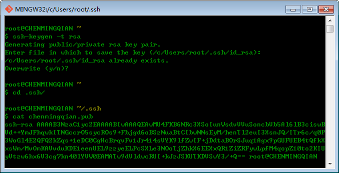
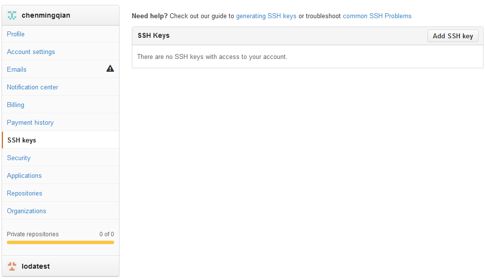
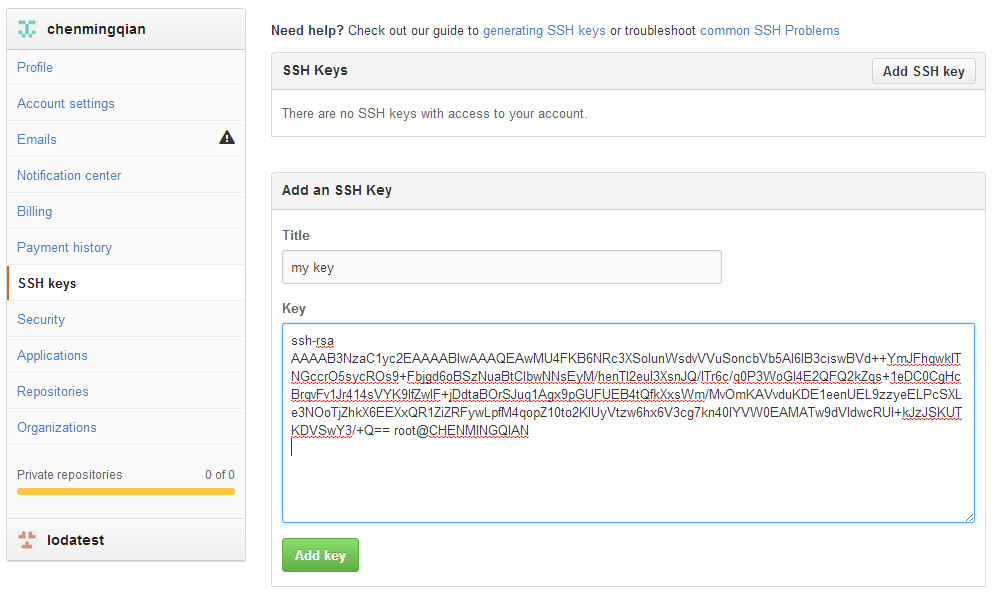
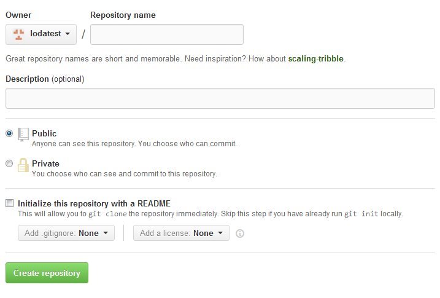
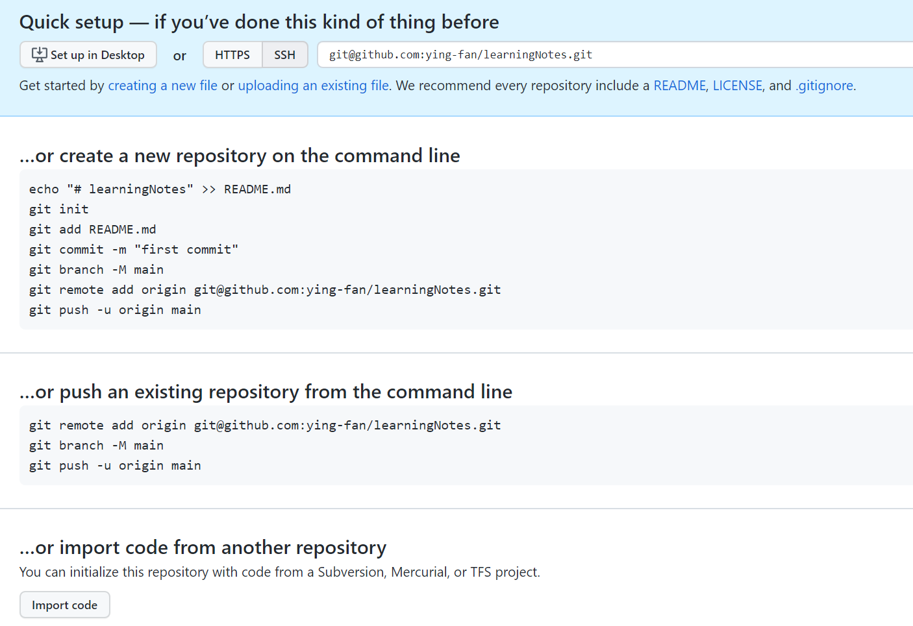
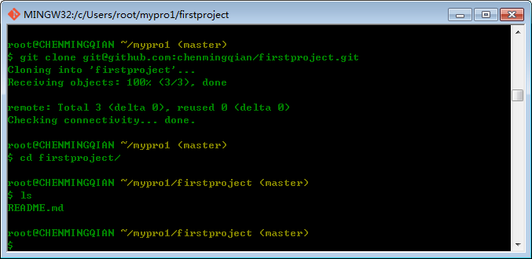
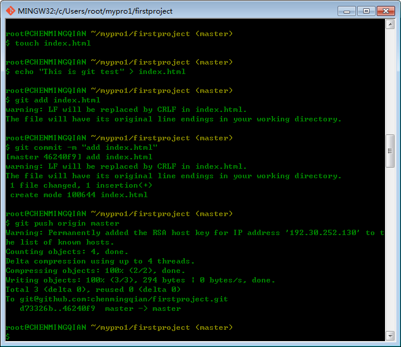
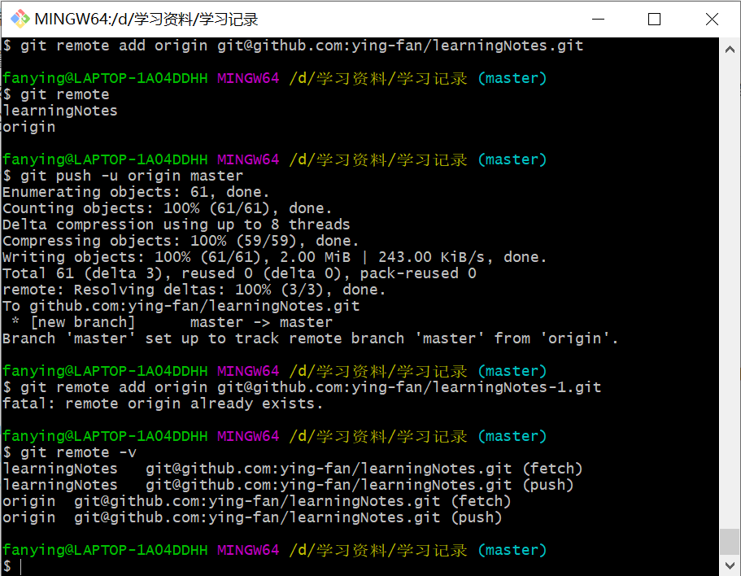

## Git 简单教程

### 三、Git 远程仓库与 GitHub 使用详解

我们可以找台服务器自己搭建Git服务器，也可以不需要自己搭建Git服务器，便可获得Git远程仓库。这就是我们本节所要讲解的内容，那么下面我们先来认识一下 GitHub 吧。

#### 1. 配置 GitHub

- 在克隆版本库之前我们要做什么呢？我们首先得生成**公钥**，然后复制到 GitHub上然后我们才能**无密码登录**。如下图：



- 下面我们将生成的公钥复制到 GitHub 中，如下图：



- 点击 “Add ssh key”，如下图：



- 点击 “Add key”即可


#### 2. 新建 Git 仓库

- 点击“New repository”创建一个版本库，如下图：



- 填写一下仓库名称，写一些描述，勾选上初始化仓库README即可，创建成功后，显示如下信息：



#### 3. 推送本地仓库到远程仓库（※※）

好了，到这里我们的第一个版本库就创建完成了，下面我们要做什么呢？如上图所示，我们可以：

1. 既可以：用本地客户端**克隆**一份：`git clone git@github.com:~~.git` ，然后新建页面**推送**到远程 GitHub 中

   

   

2. 也可以：使用命令行来**将本地目录上的文件推送到 GitHub** 上的存储库（repository）中

   ```bash
   mkdir 学习笔记                     # 创建目录 （如果有就不用创建）
   cd 学习笔记						   # 进入目录
   echo "# learningNotes" >> README.md  # 创建 README.md 文件并写入内容
   git init						  # 初始化为本地仓库
   git add README.md				  # 添加文件
   git commit -m "first commit"      # 提交并备注信息
   git branch -M main				  # 将本地仓库的当前分支命名为 main
   
   # 如果本地仓库已存在，直接输入下面命令
   # 提交到 Github
   # 将 GitHub上创建的repository的url（git@github.com:ying-fan/learningNotes.git） 取别名为 origin（也可以取其他名称，如learningNotes）
   git remote add origin git@github.com:ying-fan/learningNotes.git 
   git push -u origin main # 将本地仓库分支main 推送到远程仓库origin中（GitHub上）
   ```

#### 4. 参与 GitHub 中其它开源项目

访问其它开源项目的主页，**点“Fork”**就在自己的账号下克隆了一个仓库，然后，从**自己的账号下clone**。

**注意：**clone仓库一定要从自己的账号下克隆，这样你才能推送修改。如果从其它开源项目的作者的仓库地址克隆，因为没有权限，你将不能推送修改。如果你想修复开源项目的一个`bug`或者新增一个功能，我想说你现在就可以开始开发了，开发完成后**往自己的仓库推送**。如果你希望开源项目的官方库能接受你的修改，你就可以在GitHub上发起一个`pull request`。当然，官方是否接受你的`pull request`就不一定了。嘿嘿！

------

#### 5. Git 远程仓库相关命令

- 添加远程库

  要添加一个新的远程仓库，可以指定一个简单的名字，以便将来引用,命令格式如下：

  ```bash
  git remote add [shortname] [url] # 例如：git remote add origin git@github.com:ying-fan/learningNotes.git
  # 注意：url 必须是已经在 GitHub 上创建好的仓库地址（见3.2）
  ```

- 查看当前的远程库

  要查看当前配置有哪些远程仓库，可以用命令：

  ```bash
  git remote
  git remote -v # 执行时加上 -v 参数，你还可以看到每个别名的实际链接地址。
  ```

- 提取远程仓库

  Git 有两个命令用来提取远程仓库的更新。

  1. 从远程仓库下载新分支与数据： `git fetch [alias]` 。该命令执行完后需要执行 `git merge` 远程分支到你所在的分支。
  2. 从远端仓库提取数据并尝试合并到当前分支：`git merge [alias]/[branch]`

  假设你配置好了一个远程仓库，并且你想要提取更新的数据，你可以首先执行 `**git fetch [alias]**` 告诉 Git 去获取它有你没有的数据，然后你可以执行 `**git merge [alias]/[branch]**` 以将服务器上的任何更新（假设有人这时候推送到服务器了）合并到你的当前分支。

  ```bash
  git fetch origin master # 从名为 origin 的远程上拉取名为 master 的分支到本地分支 origin/master 中。
  git merge origin/master # 合并名为 origin/master 的分支到当前所在分支
  
  $ git fetch origin
  remote: Counting objects: 3, done.
  remote: Compressing objects: 100% (2/2), done.
  remote: Total 3 (delta 0), reused 0 (delta 0), pack-reused 0
  Unpacking objects: 100% (3/3), done.
  From github.com:tianqixin/runoob-git-test
     0205aab..febd8ed  master     -> origin/master
  # 以上信息"0205aab..febd8ed master -> origin/master" 说明 master 分支已被更新，我们可以使用以下命令将更新同步到本地：
  $ git merge origin/master
  Updating 0205aab..febd8ed
  Fast-forward
   README.md | 1 +
   1 file changed, 1 insertion(+)
  ```

- 推送到远程仓库 (见3.3)

  推送你的新分支与数据到某个远端仓库命令:

  ```bash
  git push [alias] [branch]
  git push origin master # 推送本地的 master 分支到远程 origin
  
  # 以上命令将你的 [branch] 分支推送成为 [alias] 远程仓库上的 [branch] 分支，实例如下。
  $ touch runoob-test.txt      # 添加文件
  $ git add runoob-test.txt 
  $ git commit -m "添加到远程"
  master 69e702d] 添加到远程
   1 file changed, 0 insertions(+), 0 deletions(-)
   create mode 100644 runoob-test.txt
  
  $ git push origin master    # 推送到 Github
  ```

  

- 删除远程仓库

  删除远程仓库你可以使用命令：`git remote rm [别名]`

  ```bash
  $ git remote -v
  origin    git@github.com:tianqixin/runoob-git-test.git (fetch)
  origin    git@github.com:tianqixin/runoob-git-test.git (push)
  
  # 添加仓库 origin2
  $ git remote add origin2 git@github.com:tianqixin/runoob-git-test.git
  
  $ git remote -v
  origin    git@github.com:tianqixin/runoob-git-test.git (fetch)
  origin    git@github.com:tianqixin/runoob-git-test.git (push)
  origin2    git@github.com:tianqixin/runoob-git-test.git (fetch)
  origin2    git@github.com:tianqixin/runoob-git-test.git (push)
  
  # 删除仓库 origin2
  $ git remote rm origin2
  $ git remote -v
  origin    git@github.com:tianqixin/runoob-git-test.git (fetch)
  origin    git@github.com:tianqixin/runoob-git-test.git (push)
  ```

  

