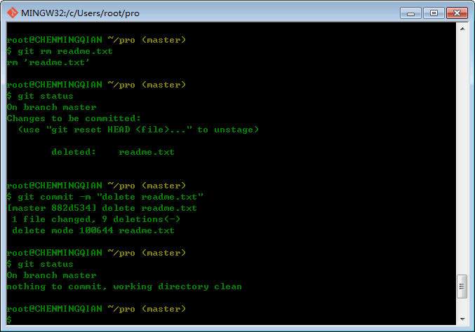

## Git 简单教程

[阅读原文](https://blog.51cto.com/freeloda/1413506)

### 一、Git 本地仓库（Repository）详解

#### 1. 基本配置

Git是**分布式控制系统**，所以，每个客户端都必须设置：**你的名字和邮箱**。这样才容易区分是哪个用户提交的Git版本。

```bash
$ git config --global user.name "Your Name"
$ git config --global user.email “email@example.com”

$ git config --global user.name "fanying"
$ git config --global user.email “18166435855@163.com”
```

大家可以看到 `git config` 后面接的是 `--global` 参数，这表示你的机器上所有的 Git 仓库都会使用这个配置，但你也可以对不同的仓库指定不同的用户名和邮箱。

#### 2. 创建本地仓库（Repository）

- ==版本库又称仓库==

  版本库或者是仓库，英文名 Repository，其实啊说白了就是一个**目录**而且，<u>这个目录中的所以文件都被 git 管理而且，不管你做什么操作都会被记录</u>，包括：增加、删除、修改文件等，都会被记录下来，以便后来跟踪与修改相关记录，甚至被还原。好了，下面我们就在我们客户端（我这里演示的是Windows客户端，其它客户端操作一样）中创建一个版本库：

  

  大家可以看到我们在`/c/Users/root/`下创建一个空目录`pro`即可`project`简写。还有一点需要说明的在Windows系统中目录名称尽量不要使用中文，不然可能会出现各种奇怪问题。

- ==目录变成仓库==

  

  执行 `git init` 命令，即可`Initialized empty Git repository in c:/Users/root/pro/.git/`，初始化一个空目录，路径为`c:/Users/root/pro/.git/`。大家可以看到`pro`目录中生成了一个隐藏目录 `.git`目录，进入目录中大家可以看到里面有很多文件，没事不要修改或者改动里机的文件，这里面的文件就是控制和管理版本库的。

- ==向本地仓库中增加文件==

  下面我们向版本库中增加文件，需要注意的是，在版本库中只能跟踪和管理文本文件，比`txt`文件、`js`文件、`php`文件、`java`文件等，所有的程序代码都可以的。但是像视频、图片等这些二进制文件，虽然能由git管理，但是只能记录大小，无法跟踪具体修改了什么。下面我们来增加一个`readme.txt`文件，其内容如下：

  

  **注意：**新建的`readme.txt`文件，一定要在`pro`目录，不然git无法管理这里文件。

- ==把个文件放到版本库==


#### 3. 创建本地仓库命令小结

- ==git status 命令==

  我们先用`git status`命令查看一下，如上图。大家可以看到 git 记录我们新增加一个文件`readme.txt`，并且提示这个文件还没有被提交。下面我们用`git add`命令提交一下。

- ==git add 命令==

  `git add` 命令是告诉 git，我们要把什么文件提交到仓库中去，大家可以看我们执行`git add readme.txt`命令后，没有任何提示。那就说明我们提交完成了。下面我们通过`git commit`命令，将`readme.txt`文件提交到版本库中。

- ==git commit 命令==

  ```bash
  $ git commit -m "add readme.txt"
  [master (root-commit) e5d662b] add readme. 
  1 file changed, 3 insertions(+) 
  create mode 100644 readme.txt1.2.3.4.
  ```

  大家可以看到我们用`git commit`命令提交`readme.txt`文件，给出的提示是  `1 file changed, 3 insertions(+)`，一个文件改变，插入了三行内容。与我们上面增加三行内容一致。嘿嘿！下面我们简单的说明一下`git commit`命令，其中的参数`-m`后面输入的是本次提交的版本说明，可以输入任意内容，但需要说明的是，最好写有意义的说明，便于以后查看。

- ==git status 命令==

  最后我们再用`git status`命令查看一下版本库的状态，提示没有任何内容需要提交说明我们向版本库增加文件成功了。

- ==git diff 命令==

  我们想看看具体修改了什么内容怎么办呢？这个时候我们需要`git diff`命令出场了，查看一下工作区与版本库里面的区别，如下图：

  

  提交修改和提交新文件一致，也是两步，先add，再commit。

  

- 初始化一个 Git 仓库，使用`git init`命令

- 添加文件到本地 Git 仓中，分为两步：
  - 使用 `git add` 命令，注意，可以多次使用，添加多个文件
  - 使用 `git commit` 命令，完成添加。

  为什么`Git`添加文件需要两步呢？一步`add`，一步`commit`。嘿嘿，因为`commit`命令可以一次提交多个文件，所以你可以多次使用add命令呢。下面是个案例：（我们也经常这么用）

```bash
$ git add file1.php
$ git add file2.php
$ git add file3.php
$ git commit –m “add file1.php file2.php file3.php”
```

#### 4. 版本回滚

我们不断的修改并提交到本地的版本库中。一会你测试的时候发现前修改的版本有问题想回滚到前面的版本，或者你误删除了一些文件，想回到上一个`commit`中去，然后继续工作。我们应该怎么办呢？在Git版本控制中，我们所有的操作都是有历史记录的，我们用**`git log`**命令查看一下（如下图）：


或者 如果你发现内容太多，可以用这个命令查看:**git log --pretty=oneline**（如下图）：


*上面你看到的一大串数字，其实是 commit id(即，版本号)，和 svn 不一样，Git的 commit id 不是1,2,3……这样的递数字，而是用 SHA1计算出来的哈希数，用16进制表示。（因为 Git是分布式管理系统，这样使得版本号不冲突）*

Git的当前是在哪个版本，在Git中我们用`HEAD`表示当前版本，也就是我们最新提交的`”749f84ccb87……ff2q6ad“`，上一个版本就应该这么表示`”HEAD^“`，再上一个版本就这样表示`”HEAD^^“`，当然如果有几十个版本或者1000个版本，我们还要写1000个^，这是不可能的，所以哟。我们写成这样`HEAD~1000`。好了，现在我们就用 ==**git reset**== 命令，将我们的版本回退到`”add readme.txt“`中吧，如下图：


有个问题哦，有没有发现我们最后提交的那个版本不见了，如上图。现在只有三个版本了，这说明什么问题呢？举个简单的例子说明一下，就好比你从现在回到了18世界，想再回到21世界已经回不去了，那应该怎么办呢？只要我们找到最新版本的commit id，我这里新版本的commit id是`”749f84ccb87……ff2q6ad“`，于是就可以回到未来的某个版本，就好比我们知道现在的时间，就能回到现在。下面我们来演示一下（如下图）：


好了，大家可以看到我们又回到最新版本。现在你回退到某个版本中，已经关掉了`Git bash`。但是呢，你又后悔了，想恢复到新版本中，但是呢？你又找不到 commit id了，那又该怎么办呢？在Git中，我们当时用==git reset --hard HEAD^^^==，回退到某一版本时，再想恢复到最新版，必须有commit id才行，这时我们已经关闭了Git bash。在Git中提供了一个 **git reflog** 命令，是用来记录你每一次执行的命令，下面我们来演示一下（如下图）：


#### 5. 工作区、提交区/暂存区（stage/index）、版本库


- **工作区**就是我们**开发目录**了，在电脑中是可能看到的，比如我们上面演示的pro目录，就是一个工作区。

- 工作区中有个隐藏的目录“.git”，这个不是工作区，这个就是**Git的版本库**。

  

- 在“.git”目录中有很多文件，其中一个重要的文件**index**，就是我们说的**提交区/暂存区（stage/index）**。

==三者之间关系==：


在上图中，我们可以看到部分 Git 命令是如何影响工作区和暂存区（stage/index）的。

- 图中左侧为工作区，右侧为版本库。在版本库中标记为 "index" 的区域是暂存区（stage/index），标记为 "master" 的是 master 分支所代表的目录树（关于分支问题在下面的文章中会详解）。
- 图中我们可以看出此时 "HEAD" 实际是指向 master 分支的一个“指针”。所以，图示的命令中出现 HEAD 的地方可以用 master 来替换（HEAD的概念我们在后面的文章中也会详解）。
- 图中的 objects 标识的区域为 Git 的对象库，实际位于 ".git/objects" 目录下。
- 当对工作区新增或修改的文件执行 **"git add"** 命令时，暂存区的目录树被更新，同时工作区新增或修改的文件内容被写入到对象库中的一个新的对象中，而该对象的ID被记录在暂存区的文件索引中。（如上图）
- 当执行提交操作 **"git commit"** 时，暂存区的目录树写到版本库的对象库（objects）中，master 分支会做相应的更新。即 master 指向的目录树就是提交时暂存区的目录树。（如上图）
- 当执行 **"git reset HEAD"** 命令时，暂存区的目录树会被重写，被 master 分支指向的目录树所替换，但是工作区不受影响。 当执行 **"git rm --cached <file>"** 命令时，会直接从暂存区删除文件，工作区则不做出改变。
- 当执行 "**git checkout .**" 或者 "**git checkout -- <file>**" 命令时，会用暂存区全部或指定的文件替换工作区的文件。这个操作很危险，会清除工作区中未添加到暂存区的改动。
- 当执行 "**git checkout HEAD .**" 或者 "**git checkout HEAD <file>**" 命令时，会用 HEAD 指向的 master 分支中的全部或者部分文件替换暂存区和以及工作区中的文件。这个命令也是极具危险性的，因为不但会清除工作区中未提交的改动，也会清除暂存区中未提交的改动。

#### 6. 修改管理

当你用 **git add** 命令后，在**工作区**的修改被放入**暂存区**，准备提交；然后 **git commit** 负责把**暂存区**的修改提交到**版本库**；

**注意：**每次修改，如果不add到暂存区，那就不会加入到commit中。

==取消（撤消）修改：==

- 当你对工作区中的文件进行了修改，但还**没有提交到暂存区**中去，可以使用 git restore <file>命令：

  

  上图显示 Git 会告诉你有个文件被修改，你有两个选择，一个用 **git add 提交到暂存区**，另一个是用 **git restore** 可以丢弃工作区的修改（丢弃了就找不回来了）。

- 当你已经把错误修改文件从**工作区提交到暂存区**中去，可以使用 **git restore --staged <file>**可以把暂存区中的修改撤消掉，重新放回工作区（此时你可以对工作区中的错误进行修改了），如下图：（当然，你也可以使用 `git commit -m "xiugai"` 将暂存区的修改的进行提交到版本库中）


- 不但改错了东西，还**从暂存区提交到了版本库**，可以通过第4节的**版本回滚**来回退到上一个版本。（但一旦你把错误提交推送到远程版本库，则就不能回滚了）

==总结：==

- 当你改乱了工作区某个文件的内容，想直接丢弃工作区的修改时，用命令 **git checkout -- file** 或者 **git restore file**。
- 当你不但改乱了工作区某个文件的内容，还添加到了暂存区时，想丢弃修改，分两步，第一步用命令 **git reset HEAD file** 或者 **git restore --staged file**，就回到了第1步，第二步按第1步进行操作，就是执行一下 **git checkout -- file** 或者 **git restore file**。
- 已经提交了不合适的修改到版本库时，想要撤销本次提交，参考我们前面讲解的版本回退，不过前提是没有推送到远程库。

#### 7. 文件删除

一般我们直接在目录中把没用的文件删了，或者用rm命令删了，下面我们来演示一下：


大家可以看到，我们用 `git status` 查看一下状态，现在我们有两个选择，一个是从版本库中删除该文件，就 `git rm` 命令删除掉并用 `git commit` 提交，另一种情况删错了，因为**版本库**里还有所以可以很容易的恢复。下面我们来演示一下情况1：



下面我们来看一下情况2：（这里的 **git checkout -- <file>** 与 上面的 **git restore <file>** 一样）


------

### 二、Git 分支管理详解

####  Todo

[阅读原文](https://blog.51cto.com/freeloda/1417525)

------

### 三、Git 远程仓库与 GitHub 使用详解

我们可以找台服务器自己搭建Git服务器，也可以不需要自己搭建Git服务器，便可获得Git远程仓库。这就是我们本节所要讲解的内容，那么下面我们先来认识一下 GitHub 吧。

#### 1. 配置 GitHub

- 在克隆版本库之前我们要做什么呢？我们首先得生成**公钥**，然后复制到 GitHub上然后我们才能**无密码登录**。如下图：


- 下面我们将生成的公钥复制到 GitHub 中，如下图：


- 点击 “Add ssh key”，如下图：


- 点击 “Add key”即可


#### 2. 新建 Git 仓库

- 点击“New repository”创建一个版本库，如下图：


- 填写一下仓库名称，写一些描述，勾选上初始化仓库README即可，创建成功后，显示如下信息：


#### 3. 推送本地仓库到远程仓库（※※）

好了，到这里我们的第一个版本库就创建完成了，下面我们要做什么呢？如上图所示，我们可以：

1. 既可以：用本地客户端**克隆**一份：`git clone git@github.com:~~.git` ，然后新建页面**推送**到远程 GitHub 中

   

   

2. 也可以：使用命令行来**将本地目录上的文件推送到 GitHub** 上的存储库（repository）中

   ```bash
   mkdir 学习笔记                     # 创建目录 （如果有就不用创建）
   cd 学习笔记						   # 进入目录
   echo "# learningNotes" >> README.md  # 创建 README.md 文件并写入内容
   git init						  # 初始化为本地仓库
   git add README.md				  # 添加文件
   git commit -m "first commit"      # 提交并备注信息
   git branch -M main				  # 将本地仓库的当前分支命名为 main
   
   # 如果本地仓库已存在，直接输入下面命令
   # 提交到 Github
   # 将 GitHub上创建的repository的url（git@github.com:ying-fan/learningNotes.git） 取别名为 origin（也可以取其他名称，如learningNotes）
   git remote add origin git@github.com:ying-fan/learningNotes.git 
   git push -u origin main # 将本地仓库分支main 推送到远程仓库origin中（GitHub上）
   ```

#### 4. 参与 GitHub 中其它开源项目

访问其它开源项目的主页，**点“Fork”**就在自己的账号下克隆了一个仓库，然后，从**自己的账号下clone**。

**注意：**clone仓库一定要从自己的账号下克隆，这样你才能推送修改。如果从其它开源项目的作者的仓库地址克隆，因为没有权限，你将不能推送修改。如果你想修复开源项目的一个`bug`或者新增一个功能，我想说你现在就可以开始开发了，开发完成后**往自己的仓库推送**。如果你希望开源项目的官方库能接受你的修改，你就可以在GitHub上发起一个`pull request`。当然，官方是否接受你的`pull request`就不一定了。嘿嘿！

------

#### 5. Git 远程仓库相关命令

- 添加远程库

  要添加一个新的远程仓库，可以指定一个简单的名字，以便将来引用,命令格式如下：

  ```bash
  git remote add [shortname] [url] # 例如：git remote add origin git@github.com:ying-fan/learningNotes.git
  # 注意：url 必须是已经在 GitHub 上创建好的仓库地址（见3.2）
  ```

- 查看当前的远程库

  要查看当前配置有哪些远程仓库，可以用命令：

  ```bash
  git remote
  git remote -v # 执行时加上 -v 参数，你还可以看到每个别名的实际链接地址。
  ```

- 拉取远程仓库

  Git 有两个命令用来提取远程仓库的更新。

  1. 从远程仓库下载新分支与数据： `git fetch [alias]` 。该命令执行完后需要执行 `git merge` 远程分支到你所在的分支。
  2. 从远端仓库提取数据并尝试合并到当前分支：`git merge [alias]/[branch]`

  假设你配置好了一个远程仓库，并且你想要提取更新的数据，你可以首先执行 `**git fetch [alias]**` 告诉 Git 去获取它有你没有的数据，然后你可以执行 `**git merge [alias]/[branch]**` 以将服务器上的任何更新（假设有人这时候推送到服务器了）合并到你的当前分支。

  ```bash
  git fetch origin master # 从名为 origin 的远程上拉取名为 master 的分支到本地分支 origin/master 中。
  git merge origin/master # 合并名为 origin/master 的分支到当前所在分支
  
  $ git fetch origin
  remote: Counting objects: 3, done.
  remote: Compressing objects: 100% (2/2), done.
  remote: Total 3 (delta 0), reused 0 (delta 0), pack-reused 0
  Unpacking objects: 100% (3/3), done.
  From github.com:tianqixin/runoob-git-test
     0205aab..febd8ed  master     -> origin/master
  # 以上信息"0205aab..febd8ed master -> origin/master" 说明 master 分支已被更新，我们可以使用以下命令将更新同步到本地：
  $ git merge origin/master
  Updating 0205aab..febd8ed
  Fast-forward
   README.md | 1 +
   1 file changed, 1 insertion(+)
  ```

- 推送到远程仓库 (见3.3)

  推送你的新分支与数据到某个远端仓库命令:

  ```bash
  git push [alias] [branch]
  git push origin master # 推送本地的 master 分支到远程 origin
  
  # 以上命令将你的 [branch] 分支推送成为 [alias] 远程仓库上的 [branch] 分支，实例如下。
  $ touch runoob-test.txt      # 添加文件
  $ git add runoob-test.txt 
  $ git commit -m "添加到远程"
  master 69e702d] 添加到远程
   1 file changed, 0 insertions(+), 0 deletions(-)
   create mode 100644 runoob-test.txt
  
  $ git push origin master    # 推送到 Github
  ```

  

- 删除远程仓库

  删除远程仓库你可以使用命令：`git remote rm [别名]`

  ```bash
  $ git remote -v
  origin    git@github.com:tianqixin/runoob-git-test.git (fetch)
  origin    git@github.com:tianqixin/runoob-git-test.git (push)
  
  # 添加仓库 origin2
  $ git remote add origin2 git@github.com:tianqixin/runoob-git-test.git
  
  $ git remote -v
  origin    git@github.com:tianqixin/runoob-git-test.git (fetch)
  origin    git@github.com:tianqixin/runoob-git-test.git (push)
  origin2    git@github.com:tianqixin/runoob-git-test.git (fetch)
  origin2    git@github.com:tianqixin/runoob-git-test.git (push)
  
  # 删除仓库 origin2
  $ git remote rm origin2
  $ git remote -v
  origin    git@github.com:tianqixin/runoob-git-test.git (fetch)
  origin    git@github.com:tianqixin/runoob-git-test.git (push)
  ```


### 四、总结

```bash
mkdir 学习笔记                     # 创建目录 （如果有就不用创建）
cd 学习笔记						   # 进入目录
echo "# learningNotes" >> README.md  # 创建 README.md 文件并写入内容
git init						  # 初始化为本地仓库
git add README.md				  # 添加文件
git commit -m "first commit"      # 提交并备注信息
git branch -M main				  # 将本地仓库的当前分支命名为 main

git log
git log --pretty=oneline # 查看操作历史记录
git reflog 				 # 是用来记录你每一次执行的命令

# 版本回滚
git reset --hard HEAD^^^ # HEAD 为当前指向版本， HEAD^^^为回退3个版本
git reset --hard [commit id] # 回退到指定版本号

# 修改管理
git restore <file> # 如果文件未提交到暂存区（未执行 git add），使用该命令将使得该文件所有修改撤销（修改撤销了就不可返回）
git restore --staged <file> # 如果文件提交到暂存区（已经执行 git add），该命令将使得该文件从暂存区撤回
# 如果文件提交到版本库（git add，git commit），则使用版本回滚

# 文件删除
rm -rf abc.txt
git rm abc.txt
git commit -m "删除abc.txt"

# 文件删除后想找回
rm -rf abc.txt
git restore abc.txt

rm -rf abc.txt
git rm abc.txt
git restore --staged abc.txt
git restore abc.txt
# 或者 版本回滚

# 如果本地仓库已存在，直接输入下面命令
# 提交到 Github
# 将 GitHub上创建的repository的url（git@github.com:ying-fan/learningNotes.git） 取别名为 origin（也可以取其他名称，如learningNotes）
git remote add origin git@github.com:ying-fan/learningNotes.git 
git push -u origin main # 将本地仓库分支main 推送到远程仓库origin中（GitHub上）
 
```

