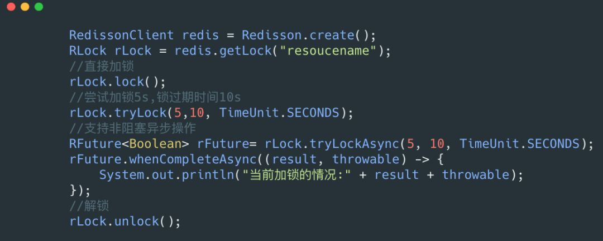

## 分布式锁


​		对于锁大家肯定不会陌生，在 Java 中 synchronized 关键字和 ReentrantLock 可重入锁在我们的代码中是经常见的，一般我们用其在多线程环境中控制对资源的并发访问。

但是随着分布式的快速发展，本地的加锁往往不能满足我们的需要，在我们的分布式环境中上面加锁的方法就会失去作用。

> `本地加锁`在`分布式`情况下会带来数据不一致的问题：比如服务 A 获取数据后，更新缓存 key =100，服务 B 不受服务 A 的锁限制，并发去更新缓存 key = 99，最后的结果可能是 99 或 100，但这是一种未知的状态，**与期望结果不一致**。流程图如下所示：


基于上面本地锁的问题，我们需要一种支持**分布式集群环境**下的锁：查询 DB 时，只有一个线程能访问，其他线程都需要等待第一个线程释放锁资源后，才能继续执行。

于是人们为了在分布式环境中也能实现本地锁的效果，也是纷纷各出其招，今天让我们来聊一聊一般分布式锁实现的套路。

### 一、为何需要分布式锁

Martin Kleppmann 是英国剑桥大学的分布式系统的研究员，之前和 Redis 之父 Antirez 进行过关于 RedLock(红锁，后续有讲到)是否安全的激烈讨论。

==Martin 认为一般我们使用分布式锁有两个场景：==

- **效率：**使用分布式锁可以避免不同节点重复相同的工作，这些工作会浪费资源。*比如用户付了钱之后有可能不同节点会发出多封短信。*
- **正确性：**加分布式锁同样可以避免破坏正确性的发生，如果两个节点在同一条数据上面操作，*比如多个节点机器对同一个订单操作不同的流程有可能会导致该笔订单最后状态出现错误，造成损失。*

### 二、分布式锁的一些特点

当我们确定了在不同节点上需要分布式锁，那么我们需要了解分布式锁到底应该有哪些特点？

==分布式锁的特点如下：==

- **互斥性：**和我们本地锁一样互斥性是最基本，但是分布式锁需要保证在不同节点的不同线程的互斥。
- **可重入性：**同一个节点上的同一个线程如果获取了锁之后那么也可以再次获取这个锁。
- **锁超时：**和本地锁一样支持锁超时，防止死锁。
- **高效，高可用：**加锁和解锁需要高效，同时也需要保证高可用防止分布式锁失效，可以增加降级。
- **支持阻塞和非阻塞：**和 ReentrantLock 一样支持 lock 和 trylock 以及 tryLock(long timeOut)。
- **支持公平锁和非公平锁(可选)：**公平锁的意思是按照请求加锁的顺序获得锁，非公平锁就相反是无序的。这个一般来说实现的比较少。

### 三、常见的分布式锁

我们了解了一些特点之后，我们一般实现**分布式锁**有以下几个方式：

- **MySQL**
- **ZK**
- **Redis**
- **自研分布式锁：如谷歌的 Chubby。**

下面分开介绍一下这些分布式锁的实现原理。

#### 1. **MySQL**

首先来说一下 MySQL 分布式锁的实现原理，相对来说这个比较容易理解，毕竟数据库和我们开发人员在平时的开发中息息相关。

==对于分布式锁我们可以创建一个锁表：==


前面我们所说的 `lock()`，`trylock(long timeout)`，`trylock()` 这几个方法可以用下面的伪代码实现。

##### (1) lock()

lock 一般是阻塞式的获取锁，意思就是不获取到锁誓不罢休，那么我们可以写一个死循环来执行其操作：


`mysqlLock.lcok()` 内部是一个 `sql`，为了达到可重入锁的效果，我们应该先进行查询，如果有值，需要比较 `node_info` 是否一致。

这里的 `node_info` 可以用机器 `IP` 和线程名字来表示，如果一致就加可重入锁 `count `的值，如果不一致就返回 false。如果没有值就直接插入一条数据。

伪代码如下：


需要注意的是这一段代码需要加**事务**，必须要保证这一系列操作的**原子性**。

##### **(2) tryLock() 和 tryLock(long timeout)**

`tryLock() `是非阻塞获取锁，如果获取不到就会马上返回，代码如下：


`tryLock(long timeout)` 实现如下：


`mysqlLock.lock()` 和上面一样，但是要注意的是 `select … for update` 这个是阻塞的获取行锁，如果同一个资源并发量较大还是有可能会退化成阻塞的获取锁。

##### (3) unlock()

`unlock` 的话如果这里的 `count` 为 1 那么可以删除，如果大于 1 那么需要减去 1。


##### (4) 锁超时

我们有可能会遇到我们的机器节点挂了，那么这个锁就不会得到释放，我们可以启动一个定时任务，通过计算一般我们处理任务的时间，比如是 5ms，那么我们可以稍微扩大一点，当这个锁超过 20ms 没有被释放我们就可以认定是节点挂了然后将其直接释放。

##### (5) MySQL 小结

- **适用场景：**MySQL 分布式锁一般适用于资源不存在数据库，如果数据库存在比如订单，可以直接对这条数据加行锁，不需要我们上面多的繁琐的步骤。

  比如一个订单，我们可以用 ``select * from order_table where id = 'xxx' for update`` 进行加行锁，那么其他的事务就不能对其进行修改。

- **优点：**理解起来简单，不需要维护额外的第三方中间件(比如 Redis，ZK)。

- **缺点：**虽然容易理解但是实现起来较为繁琐，需要自己考虑锁超时，加事务等等。性能局限于数据库，一般对比缓存来说性能较低。对于高并发的场景并不是很适合。

##### 补充：乐观锁

前面我们介绍的都是悲观锁，这里想额外提一下乐观锁，在我们实际项目中也是经常实现乐观锁，因为我们加行锁的性能消耗比较大，通常我们对于一些竞争不是那么激烈。

但是其又需要保证我们并发的顺序执行使用乐观锁进行处理，我们可以对我们的表加一个**版本号字段**。

那么我们查询出来一个版本号之后，`update` 或者 `delete` 的时候需要依赖我们查询出来的版本号，判断当前数据库和查询出来的版本号是否相等，如果相等那么就可以执行，如果不等那么就不能执行。

这样的一个策略很像我们的 **CAS(Compare And Swap)**，比较并交换是一个原子操作。这样我们就能避免加 `select * for update` 行锁的开销。

#### 2. ZooKeeper

ZooKeeper 也是我们常见的实现分布式锁方法，相比于数据库如果没了解过 ZooKeeper 可能上手比较难一些。

ZooKeeper 是**以 Paxos 算法为基础的分布式应用程序协调服务**。ZK 的数据节点和**文件目录**类似，所以我们可以用此特性实现分布式锁。

我们以某个资源为目录，然后这个目录下面的节点就是我们需要获取锁的客户端，未获取到锁的客户端注册需要注册 Watcher 到上一个客户端，可以用下图表示：


`/lock` 是我们用于加锁的目录，`/resource_name` 是我们锁定的资源，其下面的节点按照我们加锁的顺序排列。

##### (1) Curator

Curator 封装了 ZooKeeper 底层的 API，使我们更加容易方便的对 ZooKeeper 进行操作，并且它封装了分布式锁的功能，这样我们就不需要在自己实现了。

Curator 实现了可重入锁（InterProcessMutex），也实现了不可重入锁（InterProcessSemaphoreMutex）。在可重入锁中还实现了读写锁。

##### (2) InterProcessMutex

InterProcessMutex 是 Curator 实现的可重入锁，我们可以通过下面的一段代码实现我们的可重入锁：


我们利用 acuire 进行加锁，release 进行解锁。

**加锁的流程具体如下：**

- **首先进行可重入的判定：**这里的可重入锁记录在 `ConcurrentMap<Thread, LockData>threadData` 这个 Map 里面。

  如果 `threadData.get(currentThread)`是有值的那么就证明是可重入锁，然后记录就会加 1。

  我们之前的 MySQL 其实也可以通过这种方法去优化，可以不需要`count`字段的值，将这个维护在本地可以提高性能。

- **然后在我们的资源目录下创建一个节点：**比如这里创建一个 `/0000000002` 这个节点，这个节点需要设置为 `EPHEMERAL_SEQUENTIAL` 也就是临时节点并且有序。

- 获取当前目录下所有子节点，判断自己的节点是否位于子节点第一个。

- 如果是第一个，则获取到锁，那么可以返回。

- 如果不是第一个，则证明前面已经有人获取到锁了，那么需要获取自己节点的前一个节点。

  `/0000000002` 的前一个节点是 `/0000000001`，我们获取到这个节点之后，再上面注册 Watcher（这里的 Watcher 其实调用的是 `object.notifyAll()`，用来解除阻塞）。

- **object.wait(timeout) 或 object.wait()：**进行阻塞等待，这里和我们第 5 步的 Watcher 相对应。

**解锁的具体流程：**

- 首先进行可重入锁的判定：如果有可重入锁只需要次数减 1 即可，减 1 之后加锁次数为 0 的话继续下面步骤，不为 0 直接返回。
- 删除当前节点。
- 删除 `threadDataMap` 里面的可重入锁的数据。

##### (3) 读写锁

Curator 提供了读写锁，其实现类是 InterProcessReadWriteLock，这里的每个节点都会加上前缀：

```java
private static final String READ_LOCK_NAME  = "__READ__";
private static final String WRITE_LOCK_NAME = "__WRIT__";
```

根据不同的前缀区分是读锁还是写锁，对于读锁，如果发现前面有写锁，那么需要将 Watcher 注册到和自己最近的写锁。写锁的逻辑和我们之前分析的依然保持不变。

##### (4) 锁超时

ZooKeeper **不需要配置锁超时**，由于我们设置节点是临时节点，我们的每个机器维护着一个 ZK 的 **Session**，通过这个 Session，ZK 可以判断机器是否宕机。

如果我们的机器挂掉的话，那么这个临时节点对应的就会被删除，所以我们不需要关心锁超时。

##### (4) ZK 小结

- **优点：**ZK 可以不需要关心锁超时时间，实现起来有现成的第三方包，比较方便，并且支持读写锁，ZK 获取锁会按照加锁的顺序，所以其是公平锁。对于高可用利用 ZK 集群进行保证。
- **缺点：**ZK 需要额外维护，增加维护成本，性能和 MySQL 相差不大，依然比较差。并且需要开发人员了解 ZK 是什么。


#### 3. Redis

大家在网上搜索分布式锁，恐怕最多的实现就是 Redis 了，Redis 因为其性能好，实现起来简单所以让很多人都对其十分青睐。

##### (1) Redis 分布式锁简单实现

熟悉 Redis 的同学那么肯定对 `setNx(set if not exist)` 方法不陌生，如果不存在则更新，其可以很好的用来实现我们的分布式锁。

对于某个资源加锁我们只需要：

```
setNx resourceName value
```

这里有个问题，加锁了之后如果机器宕机那么这个锁就不会得到释放所以会加入过期时间，加入过期时间需要和 `setNx` 同一个原子操作。

在 Redis 2.8 之前我们需要使用 Lua 脚本达到我们的目的，但是 Redis 2.8 之后 Redis 支持 `nx` 和 `ex` 操作是同一原子操作。

```
set resourceName value ex 5 nx
```


==**详情看《分布式锁的实现之Redis篇》**==

##### (2) Redission

Javaer 都知道 Jedis，Jedis 是 Redis 的 Java 实现的客户端，其 API 提供了比较全面的 Redis 命令的支持。Redission 也是 Redis 的客户端，相比于 Jedis 功能简单。Jedis 简单使用阻塞的 I/O 和 Redis 交互，Redission 通过 **Netty 支持非阻塞 I/O**。Jedis 最新版本 2.9.0 是 2016 年的快 3 年了没有更新，而 Redission 最新版本是 2018 年 10 月更新。

Redission 封装了锁的实现，其继承了` java.util.concurrent.locks.Lock` 的接口，让我们像操作我们的本地 Lock 一样去操作 Redission 的 Lock。

下面介绍一下其如何实现分布式锁：



Redission 不仅提供了 Java 自带的一些方法（lock，tryLock），还提供了**异步加锁**，对于异步编程更加方便。

由于内部源码较多，就不贴源码了，这里用文字叙述来分析它是如何加锁的，这里分析一下 **tryLock 方法**：

1. **尝试加锁：**首先会尝试进行加锁，由于需要兼容老版本的 Redis，所以不能直接使用 `ex`，`nx` 原子操作的 API，那么就只能使用 Lua 脚本，相关的 Lua 脚本如下：

   

   可以看见它并没有使用我们的 `sexNx` 来进行操作，而是使用的 `hash` 结构，我们的每一个需要锁定的资源都可以看做是一个 `HashMap`，锁定资源的**节点信息是 Key**，**锁定次数是 Value**。

   通过这种方式可以很好的实现可重入的效果，只需要对 Value 进行加 1 操作，就能进行可重入锁。*当然这里也可以用之前我们说的本地计数进行优化。*

2. 如果尝试加锁**失败**，**判断是否超时**，如果超时则返回 false。
3. 如果加锁**失败**之后，**没有超时**，那么需要在名字为 `redisson_lock__channel+lockName` 的 `channel` 上进行**订阅**，用于**订阅解锁消息，然后一直阻塞直到超时，或者有解锁消息**。
4. 重试步骤 1，2，3，直到最后获取到锁，或者某一步获取锁超时。

对于我们的 unlock 方法比较简单也是通过 lua 脚本进行解锁，**如果是可重入锁，只是减 1**。如果是**非加锁线程解锁，那么解锁失败**。


Redission 还有公平锁的实现，对于公平锁其利用了 list 结构和 hashset 结构分别用来保存我们排队的节点，和我们节点的过期时间，用这两个数据结构帮助我们实现公平锁，这里就不展开介绍了，有兴趣可以参考源码。

**相关阅读：《[分布式锁中的王者方案 - Redisson](https://mp.weixin.qq.com/s/CbnPRfvq4m1sqo2uKI6qQw)》**

##### (3) RedLock

我们想象一个这样的场景当机器 A 申请到一把锁之后，如果 Redis 主机宕机了，这个时候从机并没有同步到这一把锁，那么机器 B 再次申请的时候就会再次申请到这把锁。

为了解决这个问题 Redis 作者提出了 **RedLock 红锁**的算法，在 Redission 中也对 RedLock 进行了实现。


通过上面的代码，我们需要实现多个 Redis 集群，然后进行红锁的加锁，解锁。

==具体的步骤如下：==

1. 首先生成多个 Redis 集群的 Rlock，并将其构造成 RedLock。
2. 依次循环对三个集群进行加锁，加锁的过程和 3.2 里面一致。
3. 如果循环加锁的过程中加锁失败，那么需要判断加锁失败的次数是否超出了最大值，这里的最大值是根据集群的个数，比如三个那么只允许失败一个，五个的话只允许失败两个，要保证多数成功。
4. 加锁的过程中需要判断是否加锁超时，有可能我们设置加锁只能用 3ms，第一个集群加锁已经消耗了 3ms 了。那么也算加锁失败。
5. 3，4 步里面加锁失败的话，那么就会进行解锁操作，解锁会对所有的集群在请求一次解锁。

可以看见 RedLock 基本原理是利用多个 Redis 集群，用多数的集群加锁成功，减少 Redis 某个集群出故障，造成分布式锁出现问题的概率。

##### (4) Redis 小结：

- **优点：**对于 Redis 实现简单，性能对比 ZK 和 MySQL 较好。如果不需要特别复杂的要求，自己就可以利用 `setNx` 进行实现，如果自己需要复杂的需求的话，可以利用或者借鉴 Redission。对于一些要求比较严格的场景可以使用 RedLock。
- **缺点：**需要维护 Redis 集群，如果要实现 RedLock 需要维护更多的集群。

------

### 四、分布式锁的安全问题

上面我们介绍过**红锁**，但是 Martin Kleppmann 认为其依然不安全。

有关于 Martin 反驳的几点，我认为其实不仅仅局限于 RedLock，前面说的算法基本都有这个问题，下面我们来讨论一下这些问题。

#### 1. 长时间的 GC pause

熟悉 Java 的同学肯定对 GC 不陌生，在 GC 的时候会发生 STW（stop-the-world：`GC事件发生过程中，会产生应用程序的停顿。停顿产生时整个应用程序线程都会被暂停，没有任何响应, 有点像卡死的感觉`）。

例如 CMS 垃圾回收器，它会有两个阶段进行 STW 防止引用继续进行变化。那么有可能会出现下面图(引用至 Martin 反驳 Redlock 的文章)中这个情况：


client1 获取了锁并且设置了锁的超时时间，但是 client1 之后出现了 STW，这个 STW 时间比较长，导致分布式锁进行了释放。client2 获取到了锁，这个时候 client1 恢复了锁，那么就会出现 client1，2 同时获取到锁，这个时候分布式锁不安全问题就出现了。

这个不仅仅局限于 RedLock，对于我们的 ZK，MySQL 一样的有同样的问题。

对于这个问题可以看见基本所有的都会出现问题，Martin 给出了一个解法，对于 ZK 这种他会生成一个**自增的序列**，那么我们真正进行**对资源操作的时候，需要判断当前序列是否是最新，有点类似于乐观锁**。

当然这个解法 Redis 作者进行了反驳，你既然都能生成一个自增的序列了那么你完全不需要加锁了，也就是可以按照类似于 MySQL 乐观锁的解法去做。

我自己认为这种解法增加了复杂性，当我们对资源操作的时候需要增加判断序列号是否是最新，无论用什么判断方法都会增加复杂度，后面会介绍谷歌的 Chubby 提出了一个更好的方案。


#### 2. 时钟发生跳跃

对于 Redis 服务器如果其时间发生了跳跃，肯定会影响我们锁的过期时间。

那么我们的锁过期时间就不是我们预期的了，也会出现 client1 和 client2 获取到同一把锁，也会出现不安全，这个对于 MySQL 也会出现。但是 ZK 由于没有设置过期时间，那么发生跳跃也不会受影响。

Martin 觉得 RedLock 不安全很大的原因也是因为时钟的跳跃，因为**锁过期强依赖于时间**，但是 ZK 不需要依赖时间，**依赖每个节点的 Session**。

Redis 作者也给出了解答，对于时间跳跃分为**人为调整**和 **NTP 自动调整**：

- **人为调整：**人为调整影响的完全可以人为不调整，这个是处于可控的。
- **NTP 自动调整：**这个可以通过一定的优化，把跳跃时间控制在可控范围内，虽然会跳跃，但是是完全可以接受的。


#### 3. 长时间的网络 I/O

这个问题和我们的 GC 的 STW 很像，也就是我们这个获取了锁之后我们进行网络调用，其调用时间由可能比我们锁的过期时间都还长，那么也会出现不安全的问题，这个 MySQL 也会有，ZK 也不会出现这个问题。

这一块不是他们讨论的重点，我自己觉得，对于这个问题的优化可以<u>控制网络调用的超时时间，把所有网络调用的超时时间相加</u>。

那么我们锁过期时间其实应该大于这个时间，当然也可以通过**优化网络调用**比如**串行改成并行，异步化**等。


### 五、Chubby 的一些优化

大家搜索 ZK 的时候，会发现他们都写了 ZK 是 Chubby 的开源实现，Chubby 内部工作原理和 ZK 类似。但是 Chubby 的定位是分布式锁和 ZK 有点不同。

Chubby 也是使用**自增序列**的方案用来解决分布式不安全的问题，但是它提供了多种校验方法：

- **CheckSequencer()：**调用 Chubby 的 API 检查此时这个序列号是否有效。

- 访问资源服务器检查，判断当前资源服务器最新的序列号和我们的序列号的大小。

- **lock-delay：**为了防止我们校验的逻辑入侵我们的资源服务器，其提供了一种方法当客户端失联的时候，并不会立即释放锁，而是在一定的时间内(默认 1min)阻止其他客户端拿去这个锁。

  那么也就是给予了一定的 buffer 等待 STW 恢复，而我们的 GC 的 STW 时间如果比 1min 还长那么你应该检查你的程序，而不是怀疑你的分布式锁了。


### 六、小结

本文主要讲了多种分布式锁的实现方法，以及它们的一些优缺点。最后也说了一下关于分布式锁的安全的问题。

对于不同的业务需要的安全程度完全不同，我们需要根据自己的业务场景，通过不同的维度分析，选取最适合自己的方案。


### 阅读原文

- 搞懂“分布式锁”，看这篇文章就对了： https://mp.weixin.qq.com/s/hoZB0wdwXfG3ECKlzjtPdw 