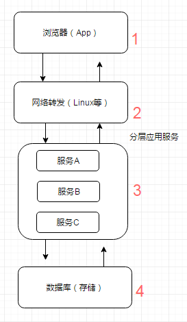
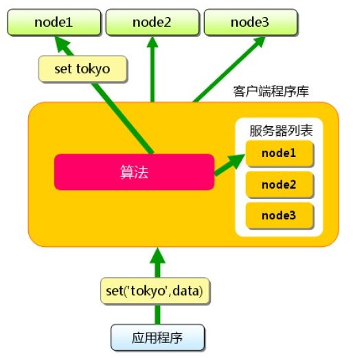
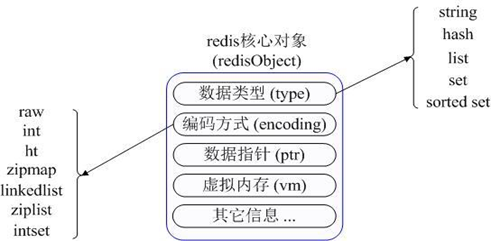

# 缓存的那些事

## 前言

在互联网高速发展的今天，缓存技术被广泛地应用。无论业内还是业外，只要是提到性能问题，大家都会脱口而出“用缓存解决”。

这种说法带有片面性，甚至是一知半解，但是作为专业人士的我们，需要对缓存有更深、更广的了解。

缓存技术存在于应用场景的方方面面。从浏览器请求，到反向代理服务器，从进程内缓存到分布式缓存。其中缓存策略，算法也是层出不穷，今天就带大家走进缓存。

## 一、为什么要用缓存

缓存对于每个开发者来说是相当熟悉了，为了提高程序的性能我们会去加缓存，例如一个网站，需要提高性能，我们通过会将部分数据放入缓存中，来提高访问速度，代替数据库承担存储的工作。

**那么哪些数据适合放入缓存中呢？**

- 即时性。例如查询最新的物流状态信息。
- 数据一致性要求不高。例如门店信息，修改后，数据库中已经改了，5 分钟后缓存中才是最新的，但不影响功能使用。
- 访问量大且更新频率不高。比如首页的广告信息，访问量，但是不会经常变化。

当我们想要查询数据时，使用缓存的流程如下：


## 二、什么地方加缓存——多级缓存结构

但是在什么地方可以加缓存呢？

> 缓存可以放在浏览器，可以放在反向代理服务器，还可以放在应用程序进程内，同时可以放在分布式缓存系统中。


> 从用户请求数据到数据返回，数据经过了浏览器，CDN，代理服务器，应用服务器，以及数据库各个环节。每个环节都可以运用缓存技术。
>
> 从浏览器/客户端开始请求数据，通过 HTTP 配合 CDN 获取数据的变更情况，到达代理服务器（Nginx）可以通过反向代理获取静态资源。
>
> 再往下来到应用服务器可以通过进程内（堆内）缓存，分布式缓存等递进的方式获取数据。如果以上所有缓存都没有命中数据，才会回源到数据库。
>
> 缓存的请求顺序是：**用户请求** → **HTTP 缓存** → **CDN 缓存** → **代理服务器缓存** → **进程内缓存** → **分布式缓存** → **数据库**。

看来在技术的架构每个环节都可以加入缓存，接下来看看每个环节是如何应用缓存技术的。

### 1. HTTP缓存

当用户通过浏览器请求服务器的时候，会发起 HTTP 请求，如果对每次 HTTP 请求进行缓存，那么可以减少应用服务器的压力。

当第一次请求的时候，浏览器本地缓存库没有缓存数据，会从服务器取数据，并且放到浏览器的缓存库中，下次再进行请求的时候会根据缓存的策略来读取本地或者服务的信息。


一般信息的传递通过 HTTP 请求头 Header 来传递。目前比较常见的缓存方式有两种，分别是：

- **强制缓存**
- **对比缓存**

#### 1.1. 强制缓存

当浏览器本地缓存库保存了缓存信息，在缓存数据未失效的情况下，可以直接使用缓存数据。否则就需要重新获取数据。

这种缓存机制看上去比较直接，那么如何判断缓存数据是否失效呢？这里需要关注 HTTP Header 中的两个字段 `Expires` 和 `Cache-Control`：

- `Expires` 为**服务端返回的过期时间**，客户端第一次请求服务器，服务器会返回资源的过期时间。如果客户端再次请求服务器，会把请求时间与过期时间做比较。如果请求时间小于过期时间，那么说明缓存没有过期，则可以直接使用本地缓存库的信息。反之，说明数据已经过期，必须从服务器重新获取信息，获取完毕又会更新最新的过期时间。

  > 这种方式在 HTTP 1.0 用的比较多，到了 HTTP 1.1 会使用 `Cache-Control` 替代。

- `Cache-Control` 中有个 `max-age` 属性，单位是秒，用来表示**缓存内容在客户端的过期时间**。例如：max-age 是 60 秒，当前缓存没有数据，客户端第一次请求完后，将数据放入本地缓存。那么在 60 秒以内客户端再发送请求，都不会请求应用服务器，而是从本地缓存中直接返回数据。如果两次请求相隔时间超过了 60 秒，那么就需要通过服务器获取数据。

#### 1.2. 对比缓存

对比缓存**需要对比前后两次的缓存标志来判断是否使用缓存**。浏览器第一次请求时，服务器会将缓存标识与数据一起返回，浏览器将二者备份至本地缓存库中。浏览器再次请求时，将备份的缓存标识发送给服务器。服务器根据缓存标识进行判断，如果判断数据没有发生变化，把判断成功的 304 状态码发给浏览器，这时浏览器就可以使用缓存的数据来。

> 服务器返回的就只是 Header，不包含 Body。

下面介绍两种**标识规则**：

##### 1.2.1 Last-Modified / If-Modified-Since 规则

在客户端第一次请求的时候，服务器会返回资源最后的修改时间，记作 `Last-Modified`。客户端将这个字段连同资源缓存起来。

当客户端再次请求服务器时，会把 `Last-Modified` 连同请求的资源一起发给服务器，这时 `Last-Modified` 会被命名为` If-Modified-Since`，存放的内容都是一样的。

服务器收到请求，会把 `If-Modified-Since` 字段与服务器上保存的 `Last-Modified` 字段作比较：

- 若服务器上的 `Last-Modified` 最后修改时间大于请求的 `If-Modified-Since`，说明资源被改动过，就会把资源（包括 Header + Body）重新返回给浏览器，同时返回状态码 200。
- 若资源的最后修改时间小于或等于 `If-Modified-Since`，说明资源没有改动过，只会返回 Header，并且返回状态码 304。浏览器接受到这个消息就可以使用本地缓存库的数据。


**注意：**`Last-Modified` 和 `If-Modified-Since` 指的是同一个值，只是在客户端和服务器端的叫法不同。

#### 1.2.2. ETag / If-None-Match 规则

客户端第一次请求的时候，服务器会给每个资源生成一个 **ETag 标记**。这个 ETag 是根据每个资源生成的唯一 Hash 串，资源如何发生变化 ETag 随之更改，之后将这个 ETag 返回给客户端，客户端把请求的资源和 ETag 都缓存到本地。


在浏览器第二次请求服务器相同资源时，会把资源对应的 ETag 一并发送给服务器。**在请求时 ETag 转化成 `If-None-Match`，但其内容不变**。

服务器收到请求后，会把 `If-None-Match` 与服务器上资源的 ETag 进行比较：

- 如果不一致，说明资源被改动过，则返回资源（Header+Body），返回状态码 200。
- 如果一致，说明资源没有被改过，则返回 Header，返回状态码 304。浏览器接受到这个消息就可以使用本地缓存库的数据。


**注意：**ETag 和 ·f-None-Match 指的是同一个值，只是在客户端和服务器端的叫法不同。

### 2. CDN 缓存

HTTP 缓存主要是对==**静态数据**==进行缓存，把从服务器拿到的数据缓存到客户端/浏览器。

如果在客户端和服务器之间再加上一层 CDN，可以让 CDN 为应用服务器提供缓存，如果在 CDN 上缓存，就不用再请求应用服务器了。并且 **HTTP 缓存提到的两种策略同样可以在 CDN 服务器执行**。

CDN 的全称是 `Content Delivery Network`，即**内容分发网络**。


让我们来看看CDN是如何工作的吧：

- 客户端发送 URL 给 DNS 服务器。

- DNS 通过域名解析，把请求指向 CDN 网络中的 DNS 负载均衡器。

- DNS 负载均衡器将最近 CDN 节点的 IP 告诉 DNS，DNS 告之客户端最新 CDN 节点的 IP。

- 客户端请求最近的 CDN 节点。

- CDN 节点从应用服务器获取资源返回给客户端，同时将**静态信息**缓存。

  > 注意：客户端下次互动的对象就是 CDN 缓存了，**CDN 可以和应用服务器同步缓存信息**。

CDN 接受客户端的请求，它就是离客户端最近的服务器，它后面会链接多台服务器，起到了**缓存**和**负载均衡**的作用。

### 3. 负载均衡缓存

说完客户端（HTTP）缓存和 CDN 缓存，我们离应用服务越来越近了，在到达应用服务之前，请求还要经过**负载均衡器**。

虽说它的主要工作是对应用服务器进行负载均衡，但是它也可以作缓存,可以把一些修改频率不高的数据缓存在这里。

> 例如：用户信息，配置信息。通过服务定期刷新这个缓存就行了。


以 Nginx 为例，我们看看它是如何工作的：

- 用户请求在达到应用服务器之前，会先访问 Nginx 负载均衡器，如果发现有缓存信息，直接返回给用户。
- 如果没有发现缓存信息，Nginx 回源到应用服务器获取信息。
- 另外，有一个缓存更新服务，定期把应用服务器中相对稳定的信息更新到 Nginx 本地缓存中。

### 4. 进程内缓存

通过了客户端，CDN，负载均衡器，我们终于来到了应用服务器。应用服务器上部署着一个个应用，这些应用以进程的方式运行着，那么在进程中的缓存是怎样的呢？

**进程内缓存**又叫**托管堆缓存**，以 Java 为例，这部分缓存**放在 JVM 的托管堆**上面，同时**会受到托管堆回收算法的影响**。由于其运行在内存中，对数据的响应速度很快，通常我们会把热点数据放在这里。在进程内缓存没有命中的时候，我们会去搜索进程外的缓存或者分布式缓存。

这种缓存的好处是**没有序列化和反序列化**，是最快的缓存。缺点是**缓存的空间不能太大，对垃圾回收器的性能有影响**。

> 目前比较流行的实现有 Ehcache、GuavaCache、Caffeine。这些架构可以很方便的把一些热点数据放到进程内的缓存中。
>
> ——==**结合本文第四节2.1 本地缓存**==

这里我们需要关注几个**缓存的回收策略**，具体的实现架构的回收策略会有所不同，但大致的思路都是一致的：

- **FIFO（First In First Out）**：先进先出算法，最先放入缓存的数据最先被移除。
- **LRU（Least Recently Used）**：最近最少使用算法，把最久没有使用过的数据移除缓存。
- **LFU（Least Frequently Used）**：最不常用算法，在一段时间内使用频率最小的数据被移除缓存。

在分布式架构的今天，**多应用中如果采用进程内缓存会存在数据一致性的问题**。这里推荐两个方案：

- 消息队列修改方案
- Timer 修改方案

#### 4.1. 消息队列修改方案

应用在修改完自身缓存数据和数据库数据之后，给消息队列发送数据变化通知，其他应用订阅了消息通知，在收到通知的时候修改缓存数据。（可以看第四节2.1.1 b）


#### 4.2. Timer 修改方案

为了避免耦合，降低复杂性，对“实时一致性”不敏感的情况下。每个应用都会启动一个 Timer，定时从数据库拉取最新的数据，更新缓存。

不过在有的应用更新数据库后，其他节点通过 Timer 获取数据之间，会读到脏数据。这里需要控制好 Timer 的频率，以及应用与对实时性要求不高的场景。


**进程内缓存有哪些使用场景呢？**

- 场景一：**只读数据**，可以考虑在进程启动时加载到内存。当然，把数据加载到类似 Redis 这样的进程外缓存服务也能解决这类问题。
- 场景二：**高并发**，可以考虑使用进程内缓存，例如：**秒杀**。

### 5. 分布式缓存

说完进程内缓存，自然就过度到进程外缓存了。与进程内缓存不同，进程外缓存在应用运行的进程之外，它拥有更大的缓存容量，并且可以部署到不同的物理节点，通常会用分布式缓存的方式实现。

分布式缓存是与应用分离的缓存服务，最大的特点是，**自身是一个独立的应用/服务，与本地应用隔离，多个应用可直接共享一个或者多个缓存应用/服务。**


既然是分布式缓存，缓存的数据会分布到不同的**缓存节点**上，每个缓存节点缓存的数据大小通常也是有限制的。

数据被缓存到不同的节点，为了能方便的访问这些节点，需要引入**缓存代理**，类似 Twemproxy。他会帮助请求找到对应的缓存节点。

同时如果缓存节点增加了，这个代理也会只能识别并且把新的缓存数据分片到新的节点，做横向的扩展。

为了提高缓存的可用性，会在原有的缓存节点上加入 **Master/Slave 的设计**。当缓存数据写入 Master 节点的时候，会同时同步一份到 Slave 节点。一旦 Master 节点失效，可以通过代理直接切换到 Slave 节点，这时 Slave 节点就变成了 Master 节点，保证缓存的正常工作。

每个缓存节点还会提供**缓存过期的机制**，并且会把缓存内容定期以**快照**的方式保存到文件上，方便缓存崩溃之后启动**预热加载**。

#### 5.1. 高性能

当缓存做成分布式的时候，数据会根据一定的规律分配到每个缓存应用/服务上。如果我们把这些缓存应用/服务叫做缓存节点，每个节点一般都可以缓存一定容量的数据，例如：Redis 一个节点可以缓存 2G 的数据。

如果需要缓存的数据量比较大就需要扩展多个缓存节点来实现，这么多的缓存节点，客户端的请求不知道访问哪个节点怎么办？缓存的数据又如何放到这些节点上？

缓存代理服务已经帮我们解决这些问题了，例如：Twemproxy 不但可以帮助缓存路由，同时可以管理缓存节点。

这里有介绍三种**缓存数据分片的算法**，有了这些算法缓存代理就可以方便的找到分片的数据了：

##### 5.1.1. 哈希算法

Hash 表是最常见的数据结构，实现方式是，对数据记录的关键值进行 Hash，然后再对需要分片的缓存节点个数进行取模得到的余数进行数据分配。

> 例如：有三条记录数据分别是 R1，R2，R3。他们的 ID 分别是 01，02，03，假设对这三个记录的 ID 作为关键值进行 Hash 算法之后的结果依旧是 01，02，03。
>
> 我们想把这三条数据放到三个缓存节点中，可以把这个结果分别对 3 这个数字取模得到余数，这个余数就是这三条记录分别放置的缓存节点。


Hash 算法是某种程度上的平均放置，策略比较简单，如果要增加缓存节点，对已经存在的数据会有较大的变动。

##### 5.1.2. 一致性哈希算法

一致性 Hash ：即将**数据**按照特征值映射到一个首尾相接的 Hash 环上；同时也将**缓存节点**映射到这个环上。

如果要缓存数据，通过数据的关键值（Key）在环上找到自己存放的位置。这些数据按照自身的 ID 取 Hash 之后得到的值按照顺序在环上排列。


如果这个时候要插入一条新的数据其 ID 是 115，那么就应该插入到如下图的位置。


同理如果要增加一个缓存节点 N4 150，也可以放到如下图的位置。


这种算法对于增加缓存数据，和缓存节点的开销相对比较小。

**详细可见：《[图解一致性哈希算法](https://segmentfault.com/a/1190000021199728)**》


##### 5.1.3. Range Based 算法

这种方式是按照关键值（例如 ID）将数据划分成不同的区间，每个缓存节点负责一个或者多个区间。跟一致性哈希有点像。

> 例如：存在三个缓存节点分别是 N1，N2，N3。他们用来存放数据的区间分别是，N1(0, 100]， N2(100, 200]， N3(300, 400]。
>
> 那么数据根据自己 ID 作为关键字做 Hash 以后的结果就会分别对应放到这几个区域里面了。

#### 5.2. 可用性

根据事物的两面性，在分布式缓存带来高性能的同时，我们也需要重视它的可用性。那么哪些潜在的风险是我们需要防范的呢？

##### 5.2.1. 缓存雪崩

当缓存失效、缓存过期被清除或者缓存更新的时候，请求是无法命中缓存的，这个时候请求会直接回源到数据库。

**什么是缓存雪崩？**

如果上述情况**频繁发生**或者**同时发生**的时候，就会造成大面积的请求直接到数据库，造成数据库访问瓶颈。我们称这种情况为**缓存雪崩**。

> 系统的缓存模块出了问题比如宕机导致不可用。造成系统的所有访问，都要走数据库。
>
> 还有一种缓存雪崩的场景是：**有一些被大量访问数据（热点缓存）在某一时刻大面积失效，导致对应的请求直接落到了数据库上。** 这样的情况，有下面几种解决办法：
>
> 举个例子 ：秒杀开始 12 个小时之前，我们统一存放了一批商品到 Redis 中，设置的缓存过期时间也是 12 个小时，那么秒杀开始的时候，这些秒杀的商品的访问直接就失效了。导致的情况就是，相应的请求直接就落到了数据库上，就像雪崩一样可怕。

**有哪些解决办法？**

从如下两方面来思考解决方案：

1. 缓存方面：
   - 避免缓存同时失效，**不同的 key 设置不同的超时时间**。比如 1-5 分钟随机，降低缓存的过期时间的重复率，避免发生缓存集体实效。
   - **增加互斥锁**，对缓存的更新操作进行加锁保护，保证只有一个线程进行缓存更新。缓存一旦失效可以通过缓存快照的方式迅速重建缓存。
   - 对缓存节点**增加主备机制**，当主缓存失效以后切换到备用缓存继续工作。

2. 设计方面，这里给出了几点建议供大家参考：
   - **熔断机制**：某个缓存节点不能工作的时候，需要通知缓存代理不要把请求路由到该节点，减少用户等待和请求时长。
   - **限流机制**：在接入层和代理层可以做限流，当缓存服务无法支持高并发的时候，前端可以把无法响应的请求放入到队列或者丢弃。
   - **隔离机制**：缓存无法提供服务或者正在预热重建的时候，把该请求放入队列中，这样该请求因为被隔离就不会被路由到其他的缓存节点。如此就不会因为这个节点的问题影响到其他节点。当缓存重建以后，再从队列中取出请求依次处理。

##### 5.2.2. 缓存穿透

缓存一般是 Key，Value 方式存在，一个 Key 对应的 Value 不存在时，请求会回源到数据库。

**什么是缓存穿透？**

- 缓存穿透说简单点就是大量请求的 key 根本不存在于缓存中，导致请求直接到了数据库上，根本没有经过缓存这一层。

  > 举个例子：某个黑客故意制造我们缓存中不存在的 key 发起大量请求，导致大量请求落到数据库。

**缓存穿透情况的处理流程是怎样的？**

如下图所示，用户的请求最终都要跑到数据库中查询一遍。


**有哪些解决办法？**

最基本的就是首先做好==**参数校验**==，**一些不合法的参数请求直接抛出异常信息返回给客户端**。比如查询的数据库 id 不能小于 0、传入的邮箱格式不对的时候直接返回错误消息给客户端等等。

**1）对结果 null 进行缓存，并加入短暂的过期时间**

如果缓存和数据库都查不到某个 key 的数据就写一个到缓存中去并设置过期时间（例如Redis，具体命令如下： `SET key value EX 10086`） 。这种方式可以**解决请求的 key 变化不频繁的情况**，如果黑客恶意攻击，每次构建不同的请求 key，会导致缓存大量无效的 key 。很明显，这种方案并不能从根本上解决此问题。如果非要用这种方式来解决穿透问题的话，尽量将无效的 key 的过期时间设置短一点比如 1 分钟。

> 另外，这里多说一嘴，一般情况下我们是这样设计 key 的： `表名:列名:主键名:主键值` 。

如果用 Java 代码展示的话，差不多是下面这样的：

```java
public Object getObjectInclNullById(Integer id) {
    // 从缓存中获取数据
    Object cacheValue = cache.get(id);
    // 缓存为空
    if (cacheValue == null) {
        // 从数据库中获取
        Object storageValue = storage.get(key);
        // 缓存空对象
        cache.set(key, storageValue);
        // 如果存储数据为空，需要设置一个过期时间(300秒)
        if (storageValue == null) {
            // 必须设置过期时间，否则有被攻击的风险
            cache.expire(key, 60 * 5);
        }
        return storageValue;
    }
    return cacheValue;
}
```

**2）布隆过滤器**

布隆过滤器是一个非常神奇的数据结构，通过它我们可以非常方便地判断一个给定数据是否存在于海量数据中。我们需要的就是判断 key 是否合法，有没有感觉布隆过滤器就是我们想要找的那个“人”。

具体是这样做的：把所有可能存在的请求的值都存放在布隆过滤器中，当用户请求过来，先判断用户发来的请求的值是否存在于布隆过滤器中。不存在的话，直接返回请求参数错误信息给客户端，存在的话才会走下面的流程。

加入布隆过滤器之后的缓存处理流程图如下。


但是，需要注意的是布隆过滤器可能会存在误判的情况。总结来说就是： **布隆过滤器说某个元素存在，小概率会误判。布隆过滤器说某个元素不在，那么这个元素一定不在。**

*为什么会出现误判的情况呢? 我们还要从布隆过滤器的原理来说！*

我们先来看一下，**当一个元素加入布隆过滤器中的时候，会进行哪些操作：**

1. 使用布隆过滤器中的哈希函数对元素值进行计算，得到哈希值（有几个哈希函数得到几个哈希值）。
2. 根据得到的哈希值，在位数组中把对应下标的值置为 1。

我们再来看一下，**当我们需要判断一个元素是否存在于布隆过滤器的时候，会进行哪些操作：**

1. 对给定元素再次进行相同的哈希计算；
2. 得到值之后判断位数组中的每个元素是否都为 1，如果值都为 1，那么说明这个值在布隆过滤器中，如果存在一个值不为 1，说明该元素不在布隆过滤器中。

然后，一定会出现这样一种情况：**不同的字符串可能哈希出来的位置相同。** （可以适当增加位数组大小或者调整我们的哈希函数来降低概率）

更多关于布隆过滤器的内容可以看：[《不了解布隆过滤器？一文给你整的明明白白！》](https://github.com/Snailclimb/JavaGuide/blob/master/docs/dataStructures-algorithms/data-structure/bloom-filter.md) 


##### 5.2.3. 缓存击穿

**什么是缓存击穿？**

在数据请求的时候，某一个缓存**刚好失效**或者**正在写入缓存**，但是同时这个缓存数据在这个时间点被超高并发请求，成为“热点”数据，导致请求都到数据库查询了。

> 这就是缓存击穿问题，这个和缓存雪崩的区别在于，这里是针对某一个缓存，前者是针对多个缓存。

**有哪些解决办法？**

==**加锁解决缓存击穿**==

- 当导致问题的原因是在**同一时间读/写缓存**：所以只有保证同一时间只有一个线程写，写完成以后，其他的请求再使用缓存就可以了。

  > 比较常用的做法是使用 **mutex（互斥锁）**。在缓存失效的时候，不是立即写入缓存，而是先设置一个 mutex（互斥锁）。当缓存被写入完成以后，再放开这个锁让请求进行访问。

- 当导致问题的原因是在**缓存刚好失效**：所以大量并发时，只让一个请求可以获取到查询数据库的**锁**，其他请求需要等待，查到以后释放锁，其他请求获取到锁后，先查缓存，缓存中有数据，就不用查数据库。

**加锁的问题：**

- 如果加的是本地锁，则只能锁定当前服务的线程，如下图所示，部署了多个题目微服务，每个微服务用本地锁进行加锁。

  

本地锁在一般情况下没什么问题，但是在某些情况下就会出问题：

比如在高并发情况下用来锁库存就有问题了：

- 1.比如当前总库存为 100，被缓存在 Redis 中。
- 2.库存微服务 A 用本地锁扣减库存 1 之后，总库存为 99。
- 3.库存微服务 B 用本地锁扣减库存 1 之后，总库存为 99。
- 4.那库存扣减了 2 次后，还是 99，**就超卖了 1 个**。

那如何解决本地加锁的问题呢？

- **使用分布式锁**

### 6. 小结

总结一下，缓存设计有五大策略，从用户请求开始依次是：

- HTTP 缓存
- CDN 缓存
- 负载均衡缓存
- 进程内缓存
- 分布式缓存

其中，前两种缓存静态数据，后三种缓存动态数据：

- HTTP 缓存包括强制缓存和对比缓存。
- CDN 缓存和 HTTP 缓存是好搭档。
- 负载均衡器缓存相对稳定资源，需要服务协助工作。
- 进程内缓存，效率高，但容量有限制，有两个方案可以应对缓存同步的问题。
- 分布式缓存容量大，能力强，牢记三个性能算法并且防范三个缓存风险。


## 三、缓存的特征

一般而言，现在互联网应用（网站或App）的整体流程，可以概括如下图所示，用户请求从界面（浏览器或App界面）到网络转发、应用服务再到存储（数据库或文件系统），然后返回到界面呈现内容。

随着互联网的普及，内容信息越来越复杂，用户数和访问量越来越大，我们的应用需要支撑更多的并发量，同时我们的应用服务器和数据库服务器所做的计算也越来越多。但是往往我们的应用服务器资源是有限的，且技术变革是缓慢的，数据库每秒能接受的请求次数也是有限的（或者文件的读写也是有限的），如何能够有效利用有限的资源来提供尽可能大的吞吐量？一个有效的办法就是引入缓存，打破标准流程，每个环节中请求可以从缓存中直接获取目标数据并返回，从而减少计算量，有效提升响应速度，让有限的资源服务更多的用户。

如下图所示，缓存的使用可以出现在各个环节中，每个环节的缓存方案与使用各有特点——具体看第二节。



缓存也是一个数据模型对象，那么必然有它的一些特征：

### 1. 命中率

**命中率 = 返回正确结果数 / 请求缓存次数**。

命中率问题是缓存中的一个非常重要的问题，它是**衡量缓存有效性的重要指标**。命中率越高，表明缓存的使用率越高。

### 2. 最大元素（或最大空间）

缓存中可以存放的最大元素的数量。一旦缓存中元素数量超过这个值（或者缓存数据所占空间超过其最大支持空间），那么将会触发缓存启动**清空策略**。根据不同的场景合理的设置最大元素值往往可以一定程度上提高缓存的命中率，从而更有效的时候缓存。

### 3. 清空策略

如上描述，缓存的存储空间有限制，当缓存空间被用满时，如何保证在稳定服务的同时有效提升命中率？这就由缓存清空策略来处理，设计适合自身数据特征的清空策略能有效提升命中率。常见的一般策略有：

- **FIFO(first in first out)**

> 先进先出策略，最先进入缓存的数据在缓存空间不够的情况下（超出最大元素限制）会被优先被清除掉，以腾出新的空间接受新的数据。策略算法主要比较缓存元素的创建时间。在数据实效性要求场景下可选择该类策略，优先保障最新数据可用。

- **LFU(less frequently used)**

> 最少使用策略，无论是否过期，根据元素的被使用次数判断，清除使用次数较少的元素释放空间。策略算法主要比较元素的hitCount（命中次数）。在保证高频数据有效性场景下，可选择这类策略。

- **LRU(least recently used)**

> 最近最少使用策略，无论是否过期，根据元素最后一次被使用的时间戳，清除最远使用时间戳的元素释放空间。策略算法主要比较元素最近一次被get使用时间。在热点数据场景下较适用，优先保证热点数据的有效性。

除此之外，还有一些简单策略比如：

- 根据过期时间判断，清理过期时间最长的元素；
- 根据过期时间判断，清理最近要过期的元素；
- 随机清理；
- 根据关键字（或元素内容）长短清理等。

## 四、缓存分类和应用场景

### 1. 缓存介质

虽然从硬件介质上来看，无非就是**内存**和**硬盘**两种，但从技术上，可以分成**内存、硬盘文件、数据库**。

- **内存：**将缓存存储于内存中是最快的选择，无需额外的I/O开销，但是内存的缺点是没有持久化落地物理磁盘，一旦应用异常break down而重新启动，数据很难或者无法复原。
- **硬盘：**一般来说，很多缓存框架会结合使用内存和硬盘，在内存分配空间满了或是在异常的情况下，可以被动或主动的将内存空间数据持久化到硬盘中，达到释放空间或备份数据的目的。
- **数据库：**前面有提到，增加缓存的策略的目的之一就是为了减少数据库的I/O压力。现在使用数据库做缓存介质是不是又回到了老问题上了？其实，数据库也有很多种类型，像那些不支持SQL，只是简单的key-value存储结构的特殊数据库（如 BerkeleyDB 和Redis），响应速度和吞吐量都远远高于我们常用的关系型数据库等。

### 2. 缓存分类

**缓存有各类特征，而且有不同介质的区别**，那么实际工程中我们怎么去对缓存分类呢？在目前的应用服务框架中，比较常见的，是==**根据缓存与应用的藕合度，分为local cache（本地缓存）和remote cache（分布式缓存）**==：

- **本地缓存**：指的是在应用中的缓存组件，其最大的优点是**应用和cache是在同一个进程内部**（==**进程内缓存**==），请求缓存非常快速，没有过多的网络开销等，在单应用不需要集群支持或者集群情况下各节点无需互相通知的场景下使用本地缓存较合适；同时，它的缺点也是因为缓存跟应用程序耦合，多个应用程序**无法直接的共享缓存**，各应用或集群的各节点都需要维护自己的**单独缓存**，对内存是一种浪费。
- **分布式缓存**：指的是与应用分离的缓存组件或服务，其最大的优点是**自身就是一个独立的应用**，与本地应用隔离，多个应用可直接的**共享缓存**。

> **目前各种类型的缓存都活跃在成千上万的应用服务中，还没有一种缓存方案可以解决一切的业务场景或数据类型，我们需要根据自身的特殊场景和背景，选择最适合的缓存方案。**
>
> 缓存的使用是程序员、架构师的必备技能，好的程序员能根据数据类型、业务场景来准确判断使用何种类型的缓存，如何使用这种缓存，以最小的成本最快的效率达到最优的目的。

#### 2.1 本地缓存

##### 2.1.1 编程直接实现缓存

个别场景下，我们只需要简单的缓存数据的功能，而无需关注更多存取、清空策略等深入的特性时，直接编程实现缓存则是最便捷和高效的。

**a. 成员变量或局部变量实现**

简单代码示例如下：

```java
public void UseLocalCache(){
    //一个本地的缓存变量
    Map<String, Object> localCacheStoreMap = new HashMap<String, Object>();

    List<Object> infosList = this.getInfoList();
    for(Object item:infosList){
        if(localCacheStoreMap.containsKey(item)){ //缓存命中 使用缓存数据
            // todo
        } else { // 缓存未命中  IO获取数据，结果存入缓存
            Object valueObject = this.getInfoFromDB();
            localCacheStoreMap.put(valueObject.toString(), valueObject);

        }
    }
}
//示例
private List<Object> getInfoList(){
    return new ArrayList<Object>();
}
//示例数据库IO获取
private Object getInfoFromDB(){
    return new Object();
}
```

以**局部变量 map 结构**缓存部分业务数据，减少频繁的重复数据库I/O操作。缺点仅限于类的自身作用域内，类间无法共享缓存。

**b. 静态变量实现**

最常用的单例实现静态资源缓存，代码示例如下：

```java
public class CityUtils {
    private static final HttpClient httpClient = ServerHolder.createClientWithPool(); 
    private static Map<Integer, String> cityIdNameMap = new HashMap<Integer, String>();
    private static Map<Integer, String> districtIdNameMap = new HashMap<Integer, String>();

    static {
        HttpGet get = new HttpGet("http://gis-in.sankuai.com/api/location/city/all");
        BaseAuthorizationUtils.generateAuthAndDateHeader(get,
                                                         BaseAuthorizationUtils.CLIENT_TO_REQUEST_MDC,
                                                         BaseAuthorizationUtils.SECRET_TO_REQUEST_MDC);
        try {
            String resultStr = httpClient.execute(get, new BasicResponseHandler());
            JSONObject resultJo = new JSONObject(resultStr);
            JSONArray dataJa = resultJo.getJSONArray("data");
            for (int i = 0; i < dataJa.length(); i++) {
                JSONObject itemJo = dataJa.getJSONObject(i);
                cityIdNameMap.put(itemJo.getInt("id"), itemJo.getString("name"));
            }
        } catch (Exception e) {
            throw new RuntimeException("Init City List Error!", e);
        }
    }
    static {
        HttpGet get = new HttpGet("http://gis-in.sankuai.com/api/location/district/all");
        BaseAuthorizationUtils.generateAuthAndDateHeader(get,
                                                         BaseAuthorizationUtils.CLIENT_TO_REQUEST_MDC,
                                                         BaseAuthorizationUtils.SECRET_TO_REQUEST_MDC);
        try {
            String resultStr = httpClient.execute(get, new BasicResponseHandler());
            JSONObject resultJo = new JSONObject(resultStr);
            JSONArray dataJa = resultJo.getJSONArray("data");
            for (int i = 0; i < dataJa.length(); i++) {
                JSONObject itemJo = dataJa.getJSONObject(i);
                districtIdNameMap.put(itemJo.getInt("id"), itemJo.getString("name"));
            }
        } catch (Exception e) {
            throw new RuntimeException("Init District List Error!", e);
        }
    }

    public static String getCityName(int cityId) {
        String name = cityIdNameMap.get(cityId);
        if (name == null) {
            name = "未知";
        }
        return name;
    }

    public static String getDistrictName(int districtId) {
        String name = districtIdNameMap.get(districtId);
        if (name == null) {
            name = "未知";
        }
        return name;
    }
}
```

O2O业务中常用的城市基础基本信息判断，通过静态变量一次获取缓存内存中，减少频繁的I/O读取，静态变量实现类间可共享，进程内可共享，缓存的实时性稍差。

为了解决本地缓存数据的实时性问题，**目前大量使用的是结合ZooKeeper的自动发现机制，实时变更本地静态变量缓存**：

> 美团内部的基础配置组件MtConfig，采用的就是类似原理，使用静态变量缓存，结合ZooKeeper的统一管理，做到自动动态更新缓存，如下图所示。


这类缓存实现，优点是能直接在heap区内读写，最快也最方便；缺点同样是受heap区域影响，缓存的数据量非常有限，同时缓存时间受GC影响。主要满足单机场景下的小数据量缓存需求，同时对缓存数据的变更无需太敏感感知，如上一般配置管理、基础静态数据等场景。

##### 2.1.2 Ehcache

Ehcache是现在最流行的纯Java开源缓存框架，配置简单、结构清晰、功能强大，是一个非常轻量级的缓存实现，我们常用的Hibernate里面就集成了相关缓存功能。


Ehcache的核心定义主要包括：

- **cache manager：**缓存管理器，以前是只允许单例的，不过现在也可以多实例了。
- **cache：**缓存管理器内可以放置若干cache，存放数据的实质，所有cache都实现了Ehcache接口，这是一个真正使用的缓存实例；通过缓存管理器的模式，可以在单个应用中轻松隔离多个缓存实例，独立服务于不同业务场景需求，缓存数据物理隔离，同时需要时又可共享使用。
- **element：**单条缓存数据的组成单位。
- **system of record（SOR）：**可以取到真实数据的组件，可以是真正的业务逻辑、外部接口调用、存放真实数据的数据库等，缓存就是从SOR中读取或者写入到SOR中去的。

在上层可以看到，整个Ehcache提供了对JSR、JMX等的标准支持，能够较好的兼容和移植，同时对各类对象有较完善的监控管理机制。它的缓存介质涵盖**堆内存（heap）**、**堆外内存（BigMemory 商用版本支持）**和**磁盘**，各介质可独立设置属性和策略。Ehcache最初是独立的**本地缓存框架组件**，在后期的发展中，结合Terracotta服务阵列模型，可以支持分布式缓存集群，主要有RMI、JGroups、JMS和Cache Server等传播方式进行节点间通信，如上图的左侧部分描述。

整体数据流转包括这样几类行为:

- Flush：缓存条目向低层次移动。
- Fault：从低层拷贝一个对象到高层。在获取缓存的过程中，某一层发现自己的该缓存条目已经失效，就触发了Fault行为。
- Eviction：把缓存条目除去。
- Expiration：失效状态。
- Pinning：强制缓存条目保持在某一层。

下图反映了数据在各个层之间的流转，同时也体现了各层数据的一个生命周期。


> 整体上看，Ehcache的使用还是相对简单便捷的，提供了完整的各类API接口。需要注意的是，虽然Ehcache支持磁盘的持久化，但是由于存在**两级缓存介质**，在一级内存中的缓存，如果没有主动的刷入磁盘持久化的话，在应用异常down机等情形下，依然会出现缓存数据丢失，为此可以根据需要将缓存刷到磁盘，将缓存条目刷到磁盘的操作可以通过cache.flush()方法来执行，需要注意的是，对于对象的磁盘写入，前提是要将对象进行序列化。

**主要特性：**

- 快速，针对大型高并发系统场景，Ehcache的多线程机制有相应的优化改善。
- 简单，很小的jar包，简单配置就可直接使用，单机场景下无需过多的其他服务依赖。
- 支持多种的缓存策略，灵活。
- **缓存数据有两级**：**内存和磁盘**，与一般的本地内存缓存相比，有了磁盘的存储空间，将可以支持更大量的数据缓存需求。
- 具有缓存和缓存管理器的侦听接口，能更简单方便的进行缓存实例的监控管理。
- 支持多缓存管理器实例，以及一个实例的多个缓存区域。

> **注意：Ehcache的超时设置主要是针对整个cache实例设置整体的超时策略，而没有较好的处理针对单独的key的个性的超时设置（有策略设置，但是比较复杂，就不描述了），因此，在使用中要注意过期失效的缓存元素无法被 GC 回收，时间越长缓存越多，内存占用也就越大，内存泄露的概率也越大。**


##### 2.1.3 Guava Cache

Guava Cache是Google开源的Java重用工具集库Guava里的一款缓存工具，其主要实现的缓存功能有：

- 自动将entry节点加载进缓存结构中；
- 当缓存的数据超过设置的最大值时，使用LRU算法移除；
- 具备根据entry节点上次被访问或者写入时间计算它的过期机制；
- 缓存的key被封装在 WeakReference 引用内；
- 缓存的Value被封装在 WeakReference 或 SoftReference 引用内；
- 统计缓存使用过程中命中率、异常率、未命中率等统计数据。

Guava Cache的架构设计灵感**来源于ConcurrentHashMap**，我们前面也提到过，简单场景下可以自行编码通过 **hashmap** 来做少量数据的缓存，但是，如果结果可能随时间改变或者是希望存储的数据空间可控的话，自己实现这种数据结构还是有必要的。

Guava Cache继承了ConcurrentHashMap的思路，**使用多个segments方式的细粒度锁**，在保证线程安全的同时，支持高并发场景需求。Cache类似于Map，它是存储键值对的集合，不同的是它还需要处理evict、expire、dynamic load等算法逻辑，需要一些额外信息来实现这些操作。对此，根据面向对象思想，需要做方法与数据的关联封装。如下图所示cache的内存数据模型，可以看到，使用ReferenceEntry接口来封装一个键值对，而用ValueReference来封装Value值，之所以用Reference命令，是因为Cache要支持WeakReference Key和SoftReference、WeakReference value。


**ReferenceEntry**是对一个键值对节点的抽象，它包含了key和值的ValueReference抽象类，Cache由多个Segment组成，而每个Segment包含一个ReferenceEntry数组，每个ReferenceEntry数组项都是一条ReferenceEntry链，且一个ReferenceEntry包含key、hash、valueReference、next字段。除了在ReferenceEntry数组项中组成的链，在一个Segment中，所有ReferenceEntry还组成access链（accessQueue）和write链（writeQueue）（后面会介绍链的作用）。ReferenceEntry可以是强引用类型的key，也可以WeakReference类型的key，为了减少内存使用量，还可以根据是否配置了expireAfterWrite、expireAfterAccess、maximumSize来决定是否需要write链和access链确定要创建的具体Reference：StrongEntry、StrongWriteEntry、StrongAccessEntry、StrongWriteAccessEntry等。

**对于ValueReference**，因为Cache支持强引用的Value、SoftReference Value以及WeakReference Value，因而它对应三个实现类：StrongValueReference、SoftValueReference、WeakValueReference。为了支持动态加载机制，它还有一个LoadingValueReference，在需要动态加载一个key的值时，先把该值封装在LoadingValueReference中，以表达该key对应的值已经在加载了，如果其他线程也要查询该key对应的值，就能得到该引用，并且等待改值加载完成，从而保证该值只被加载一次，在该值加载完成后，将LoadingValueReference替换成其他ValueReference类型。ValueReference对象中会保留对ReferenceEntry的引用，这是因为在Value因为WeakReference、SoftReference被回收时，需要使用其key将对应的项从Segment的table中移除。

**WriteQueue和AccessQueue ：**为了实现最近最少使用算法，Guava Cache在Segment中添加了两条链：write链（writeQueue）和access链（accessQueue），这两条链都是一个双向链表，通过ReferenceEntry中的previousInWriteQueue、nextInWriteQueue和previousInAccessQueue、nextInAccessQueue链接而成，但是以Queue的形式表达。WriteQueue和AccessQueue都是自定义了offer、add（直接调用offer）、remove、poll等操作的逻辑，对offer（add）操作，如果是新加的节点，则直接加入到该链的结尾，如果是已存在的节点，则将该节点链接的链尾；对remove操作，直接从该链中移除该节点；对poll操作，将头节点的下一个节点移除，并返回。

**了解了cache的整体数据结构后，再来看下针对缓存的相关操作就简单多了：**

- Segment中的evict清除策略操作，是在每一次调用操作的开始和结束时触发清理工作，这样比一般的缓存另起线程监控清理相比，可以减少开销，但如果长时间没有调用方法的话，会导致不能及时的清理释放内存空间的问题。evict主要处理四个Queue：1. keyReferenceQueue；2. valueReferenceQueue；3. writeQueue；4. accessQueue。前两个queue是因为WeakReference、SoftReference被垃圾回收时加入的，清理时只需要遍历整个queue，将对应的项从LocalCache中移除即可，这里keyReferenceQueue存放ReferenceEntry，而valueReferenceQueue存放的是ValueReference，要从Cache中移除需要有key，因而ValueReference需要有对ReferenceEntry的引用，这个前面也提到过了。而对后面两个Queue，只需要检查是否配置了相应的expire时间，然后从头开始查找已经expire的Entry，将它们移除即可。
- Segment中的put操作：put操作相对比较简单，首先它需要获得锁，然后尝试做一些清理工作，接下来的逻辑类似ConcurrentHashMap中的rehash，查找位置并注入数据。需要说明的是当找到一个已存在的Entry时，需要先判断当前的ValueRefernece中的值事实上已经被回收了，因为它们可以是WeakReference、SoftReference类型，如果已经被回收了，则将新值写入。并且在每次更新时注册当前操作引起的移除事件，指定相应的原因：COLLECTED、REPLACED等，这些注册的事件在退出的时候统一调用Cache注册的RemovalListener，由于事件处理可能会有很长时间，因而这里将事件处理的逻辑在退出锁以后才做。最后，在更新已存在的Entry结束后都尝试着将那些已经expire的Entry移除。另外put操作中还需要更新writeQueue和accessQueue的语义正确性。
- Segment带CacheLoader的get操作：1. 先查找table中是否已存在没有被回收、也没有expire的entry，如果找到，并在CacheBuilder中配置了refreshAfterWrite，并且当前时间间隔已经操作这个事件，则重新加载值，否则，直接返回原有的值；2. 如果查找到的ValueReference是LoadingValueReference，则等待该LoadingValueReference加载结束，并返回加载的值；3. 如果没有找到entry，或者找到的entry的值为null，则加锁后，继续在table中查找已存在key对应的entry，如果找到并且对应的entry.isLoading()为true，则表示有另一个线程正在加载，因而等待那个线程加载完成，如果找到一个非null值，返回该值，否则创建一个LoadingValueReference，并调用loadSync加载相应的值，在加载完成后，将新加载的值更新到table中，即大部分情况下替换原来的LoadingValueReference。

Guava Cache提供Builder模式的CacheBuilder生成器来创建缓存的方式，十分方便，并且各个缓存参数的配置设置，类似于函数式编程的写法，可自行设置各类参数选型。它提供三种方式加载到缓存中。分别是：

1. 在构建缓存的时候，使用build方法内部调用CacheLoader方法加载数据；
2. callable 、callback方式加载数据；
3. 使用粗暴直接的方式，直接Cache.put 加载数据，但自动加载是首选的，因为它可以更容易的推断所有缓存内容的一致性。

build生成器的两种方式都实现了一种逻辑：从缓存中取key的值，如果该值已经缓存过了则返回缓存中的值，如果没有缓存过可以通过某个方法来获取这个值，不同的地方在于cacheloader的定义比较宽泛，是针对整个cache定义的，可以认为是统一的根据key值load value的方法，而callable的方式较为灵活，允许你在get的时候指定load方法。使用示例如下：

```java
/**
    * CacheLoader
   */
public void loadingCache() {
    LoadingCache<String, String> graphs = CacheBuilder.newBuilder()
        .maximumSize(1000).build(new CacheLoader<String, String>() {
            @Override
            public String load(String key) throws Exception {
                System.out.println("key:"+key);
                if("key".equals(key)){
                    return "key return result";
                }else{
                    return "get-if-absent-compute";
                }                   
            }
    });
    String resultVal = null;
    try {
        resultVal = graphs.get("key");
    } catch (ExecutionException e) {
        e.printStackTrace();
    }

    System.out.println(resultVal);
}

/**
    *
    * Callable
   */
public void callablex() throws ExecutionException
{
    Cache<String, String> cache = CacheBuilder.newBuilder()
        .maximumSize(1000).build();
    String result = cache.get("key", new Callable<String>()
                              {
                                  public String call()
                                  {
                                      return "result";
                                  }
                              });
    System.out.println(result);
}
```

> **总体来看，Guava Cache基于ConcurrentHashMap的优秀设计借鉴，在高并发场景支持和线程安全上都有相应的改进策略，使用Reference引用命令，提升高并发下的数据……访问速度并保持了GC的可回收，有效节省空间；同时，write链和access链的设计，能更灵活、高效的实现多种类型的缓存清理策略，包括基于容量的清理、基于时间的清理、基于引用的清理等；编程式的build生成器管理，让使用者有更多的自由度，能够根据不同场景设置合适的模式。**


#### 2.2 分布式缓存

##### 2.2.1 memcached缓存

memcached是应用较广的开源分布式缓存产品之一，它本身其实**不提供分布式解决方案**。在服务端，memcached集群环境实际就是一个个memcached服务器的堆积，环境搭建较为简单；**cache的分布式主要是在客户端实现**，通过客户端的**路由处理**来达到分布式解决方案的目的。客户端做路由的原理非常简单，应用服务器在每次存取某key的value时，通过某种算法把key映射到某台memcached服务器nodeA上，因此这个key所有操作都在nodeA上，结构如下图所示：



memcached客户端采用**一致性hash算法**作为路由策略，如下图，相对于一般hash（如简单取模）的算法，一致性hash算法除了计算key的hash值外，还会计算每个server对应的hash值，然后将这些hash值映射到一个有限的值域上（比如0~2^32）。通过寻找hash值大于hash(key)的最小server作为存储该key数据的目标server。如果找不到，则直接把具有最小hash值的server作为目标server。同时，一定程度上，解决了扩容问题，增加或删除单个节点，对于整个集群来说，不会有大的影响。最近版本，增加了虚拟节点的设计，进一步提升了可用性。


##### 2.2.2 Redis缓存

Redis是一个**远程内存数据库（非关系型数据库）**，性能强劲，具有复制特性以及解决问题而生的独一无二的数据模型。它可以存储键值对与5种不同类型的值之间的映射，可以将存储在内存的键值对数据持久化到硬盘，可以使用复制特性来扩展读性能，还可以使用客户端分片来扩展写性能。



如上图，Redis内部使用一个 `redisObject` 对象来标识所有的`key`和`value`数据，`redisObject` 最主要的信息如图所示：

- `type`代表一个`value`对象具体是何种数据类型，
- `encoding`是不同数据类型在Redis内部的存储方式，比如——`type=string`代表`value`存储的是一个普通字符串，那么对应的`encoding`可以是`raw`或是`int`，如果是`int`则代表世界Redis内部是按数值类型存储和表示这个字符串。

上左边的`raw`列为**对象的编码方式**：

- 字符串可以被编码为`raw`（一般字符串）或`Rint`（为了节约内存，Redis会将字符串表示的64位有符号整数编码为整数来进行储存）；
- 列表可以被编码为ziplist或linkedlist，ziplist是为节约大小较小的列表空间而作的特殊表示；
- 集合可以被编码为intset或者hashtable，intset是只储存数字的小集合的特殊表示；
- hash表可以编码为zipmap或者hashtable，zipmap是小hash表的特殊表示；
- 有序集合可以被编码为ziplist或者skiplist格式，ziplist用于表示小的有序集合，而skiplist则用于表示任何大小的有序集合。

从网络I/O模型上看，Redis使用**单线程的I/O复用模型**，自己封装了一个简单的AeEvent事件处理框架，主要实现了epoll、kqueue和select。

对于单纯只有I/O操作来说，单线程可以将速度优势发挥到最大，但是Redis也提供了一些简单的计算功能，比如排序、聚合等，对于这些操作，单线程模型实际会严重影响整体吞吐量，CPU计算过程中，整个I/O调度都是被阻塞住的，在这些特殊场景的使用中，需要额外的考虑。

相较于memcached的预分配内存管理，Redis使用**现场申请内存**的方式来存储数据，并且很少使用free-list等方式来优化内存分配，会在一定程度上存在内存碎片。

Redis跟据存储命令参数，会把带过期时间的数据单独存放在一起，并把它们称为**临时数据**，非临时数据是永远不会被剔除的，即便物理内存不够，导致swap也不会剔除任何非临时数据（但会尝试剔除部分临时数据）。

我们描述Redis为内存数据库，作为缓存服务，大量使用内存间的数据快速读写，支持高并发大吞吐；而作为数据库，则是指Redis对缓存的持久化支持。Redis由于支持了非常丰富的内存数据库结构类型，如何把这些复杂的内存组织方式持久化到磁盘上？Redis的持久化与传统数据库的方式差异较大，Redis一共支持**四种持久化方式**，主要使用的两种：

1. **定时快照方式(snapshot)：**该持久化方式实际是在Redis内部一个**定时器事件**，每隔**固定时间**去检查当前数据发生的改变次数与时间是否满足配置的持久化触发的条件，如果满足则通过操作系统fork调用来创建出一个子进程，这个子进程默认会与父进程共享相同的地址空间，这时就可以通过子进程来遍历整个内存来进行存储操作，而主进程则仍然可以提供服务，当有写入时由操作系统按照内存页（page）为单位来进行copy-on-write保证父子进程之间不会互相影响。它的缺点是快照只是代表一段时间内的内存映像，所以系统重启会丢失上次快照与重启之间所有的数据。

2. **基于语句追加文件的方式(aof)：**aof方式实际类似MySQl的基于语句的binlog方式，即每条会使Redis内存数据发生改变的命令都会追加到一个log文件中，也就是说这个log文件就是Redis的持久化数据。

   > aof的方式的主要缺点是追加log文件可能导致体积过大，当系统重启恢复数据时如果是aof的方式则加载数据会非常慢，几十G的数据可能需要几小时才能加载完，当然这个耗时并不是因为磁盘文件读取速度慢，而是由于读取的所有命令都要在内存中执行一遍。另外由于每条命令都要写log，所以使用aof的方式，Redis的读写性能也会有所下降。

Redis的持久化使用了**Buffer I/O**，所谓Buffer I/O是指**Redis对持久化文件的写入和读取操作都会使用物理内存的Page Cache**，而大多数数据库系统会使用**Direct I/O**来绕过这层Page Cache并自行维护一个数据的Cache。

而当Redis的持久化文件过大（尤其是快照文件），并对其进行读写时，磁盘文件中的数据都会被加载到物理内存中作为操作系统对该文件的一层Cache，而这层Cache的数据与Redis内存中管理的数据实际是重复存储的。虽然内核在物理内存紧张时会做Page Cache的剔除工作，但内核很可能认为某块Page Cache更重要，而让你的进程开始Swap，这时你的系统就会开始出现不稳定或者崩溃了，因此在持久化配置后，针对内存使用需要实时监控观察。

与memcached客户端支持分布式方案不同，Redis更倾向于**在服务端构建分布式存储**，如下图：


Redis Cluster是一个实现了分布式且允许单点故障的Redis高级版本，它**没有中心节点**，具有**线性可伸缩**的功能。

如上图，其中节点与节点之间通过**二进制协议**进行通信，节点与客户端之间通过**ascii协议**进行通信。

在数据的放置策略上，Redis Cluster将整个key的数值域分成4096个hash槽，每个节点上可以存储一个或多个hash槽，也就是说当前Redis Cluster支持的最大节点数就是4096。

Redis Cluster使用的分布式算法也很简单：`crc16( key ) % HASH_SLOTS_NUMBER`。整体设计可总结为：

- 数据hash分布在不同的Redis节点实例上；
- M/S的切换采用Sentinel；
- 写：只会写master Instance，从sentinel获取当前的master Instance；
- 读：从Redis Node中**基于权重**选取一个Redis Instance读取，失败/超时则轮询其他Instance；Redis本身就很好的支持读写分离，在单进程的I/O场景下，可以有效的避免主库的阻塞风险；
- 通过RPC服务访问，RPC server端封装了Redis客户端，客户端基于Jedis开发。

可以看到，通过**集群+主从结合**的设计，Redis在扩展和稳定高可用性能方面都是比较成熟的。

但是，在数据一致性问题上，Redis没有提供CAS操作命令来保障高并发场景下的数据一致性问题，不过它却提供了**事务的功能**，Redis的Transactions提供的并不是严格的ACID的事务（比如一串用EXEC提交执行的命令，在执行中服务器宕机，那么会有一部分命令执行了，剩下的没执行）。但是这个Transactions还是提供了基本的**命令打包执行的功能**（在服务器不出问题的情况下，可以保证一连串的命令是顺序在一起执行的，中间有会有其它客户端命令插进来执行）。

Redis还提供了一个**Watch功能**，你可以对一个key进行Watch，然后再执行Transactions，在这过程中，如果这个Watched的值进行了修改，那么这个Transactions会发现并拒绝执行。在失效策略上，Redis支持多大6种的数据淘汰策略：

- volatile-lru：从已设置过期时间的数据集（server.db[i].expires）中挑选最近最少使用的数据淘汰；
- volatile-ttl：从已设置过期时间的数据集（server.db[i].expires）中挑选将要过期的数据淘汰；
- volatile-random：从已设置过期时间的数据集（server.db[i].expires）中任意选择数据淘汰 ；
- allkeys-lru：从数据集（server.db[i].dict）中挑选最近最少使用的数据淘汰；
- allkeys-random：从数据集（server.db[i].dict）中任意选择数据淘汰；
- no-enviction（驱逐）：禁止驱逐数据。


##### 2.2.3 以下多种Web应用场景下可以充分的利用Redis的特性，大大提高效率

- 在主页中显示最新的项目列表：Redis使用的是常驻内存的缓存，速度非常快。LPUSH用来插入一个内容ID，作为关键字存储在列表头部。LTRIM用来限制列表中的项目数最多为5000。如果用户需要的检索的数据量超越这个缓存容量，这时才需要把请求发送到数据库。
- 删除和过滤：如果一篇文章被删除，可以使用LREM从缓存中彻底清除掉。
- 排行榜及相关问题：排行榜（leader board）按照得分进行排序。ZADD命令可以直接实现这个功能，而ZREVRANGE命令可以用来按照得分来获取前100名的用户，ZRANK可以用来获取用户排名，非常直接而且操作容易。
- 按照用户投票和时间排序：排行榜，得分会随着时间变化。LPUSH和LTRIM命令结合运用，把文章添加到一个列表中。一项后台任务用来获取列表，并重新计算列表的排序，ZADD命令用来按照新的顺序填充生成列表。列表可以实现非常快速的检索，即使是负载很重的站点。
- 过期项目处理：使用Unix时间作为关键字，用来保持列表能够按时间排序。对current_time和time_to_live进行检索，完成查找过期项目的艰巨任务。另一项后台任务使用ZRANGE…WITHSCORES进行查询，删除过期的条目。
- 计数：进行各种数据统计的用途是非常广泛的，比如想知道什么时候封锁一个IP地址。INCRBY命令让这些变得很容易，通过原子递增保持计数；GETSET用来重置计数器；过期属性用来确认一个关键字什么时候应该删除。
- 特定时间内的特定项目：这是特定访问者的问题，可以通过给每次页面浏览使用SADD命令来解决。SADD不会将已经存在的成员添加到一个集合。
- Pub/Sub：在更新中保持用户对数据的映射是系统中的一个普遍任务。Redis的pub/sub功能使用了SUBSCRIBE、UNSUBSCRIBE和PUBLISH命令，让这个变得更加容易。
- 队列：在当前的编程中队列随处可见。除了push和pop类型的命令之外，Redis还有阻塞队列的命令，能够让一个程序在执行时被另一个程序添加到队列。


## 阅读原文

- 一篇文章让你明白你多级缓存的分层架构：https://juejin.cn/post/6844903950051721230#heading-0
- 美团技术团队——缓存那些事：https://tech.meituan.com/2017/03/17/cache-about.html
- JavaGuide——redis-all.md：https://github.com/Snailclimb/JavaGuide/blob/master/docs/database/Redis/redis-all.md

